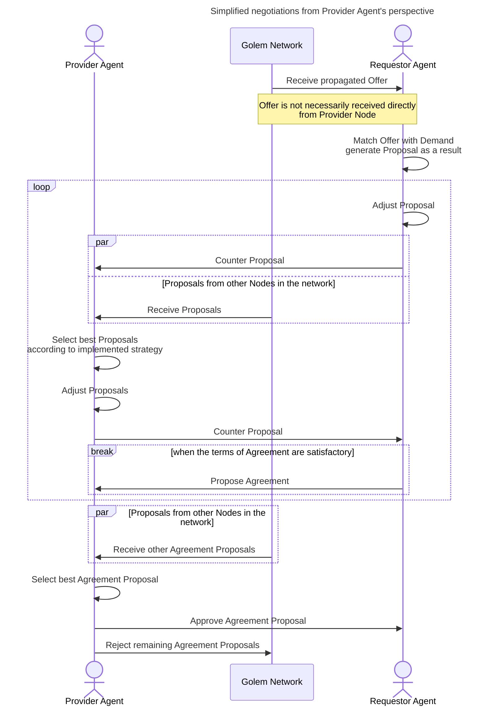
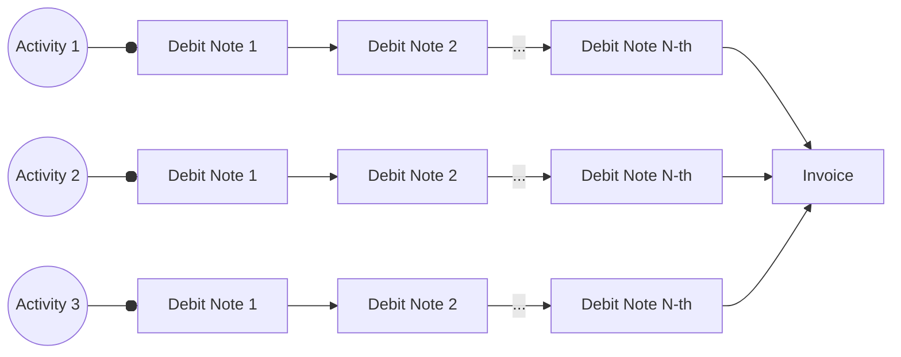
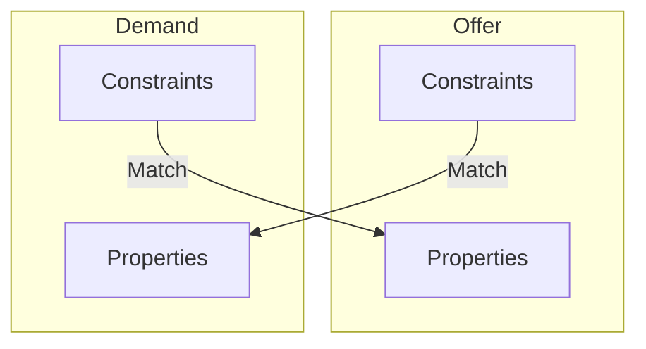
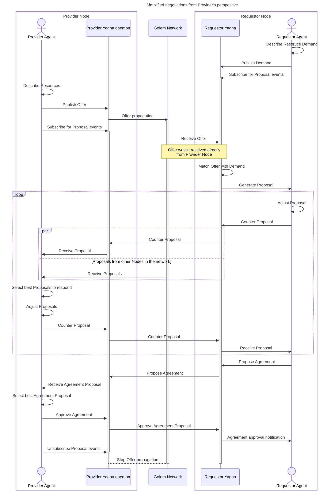
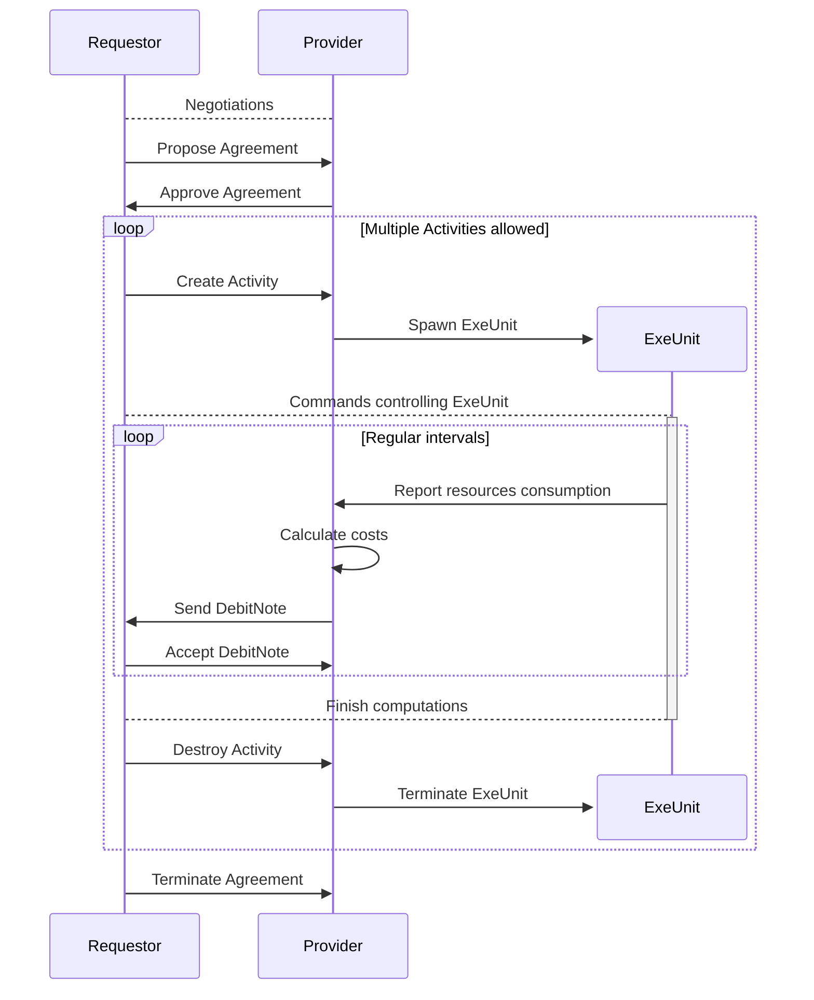

# Golem — current architecture

Authors: Witold Dzięcioł, Przemysław Rekucki, Marek Dopiera,
\<YOUR NAME GOES HERE\>
Reviewers: Maciej Maciejowski, Paweł Burgchardt
Status: WIP

# About this document

The goal of this document is to describe present Golem architecture in enough
detail for an outside person to understand how it works under the hood. The
intended audience is assumed to be technical but not necessarily have deep
expertise in the crypto world. The level of detail stops short of describing
code and its organization but describes key technologies used in order to
implement the needed functionalities.

The aim is not to dive deep into every integration, but to capture architectural
decisions and their consequences.

# Framework Concept

This section describes what comprises Golem network, namely the actors,
technical artifacts and activities they actors may perform on those activities.
The objective of this paragraph is to tie together all the terms and provide a
very high level description of what they are.

## What Golem is

## What Golem is not

## Actors

This section describes the actors using Golem Network and their role in the
system.

### Provider

### Requestor

Note: We use term Requestor not Requester.

### Developer

### End User

Consumer of resources can be different person than Requestor.
For example we can have web service which forwards computationally expensive jobs
to Golem Network. Example: [Deposits](https://github.com/golemfactory/golem-architecture/blob/master/specs/deposits.md)

#### Service Owner

#### Funder

#### Spender

## Activities

This section describes what actors can do to the system. The descriptions are
only as detailed as to explain how the actors control the artifacts. The goal is
to give the reader an overview of the terms introduced by Golem without any
details and establish a glossary to ensure consistency within the document.

### Selling on Golem platform

Golem Network allows buyers and sellers to connect and reach agreements. The market is designed to be asymmetrical:
the sellers ([Providers](#provider)) publish Offers, and the buyers ([Requestors](#requestor)) browse through these Offers.
When a Requestor finds a suitable Offer, they contact the Provider directly to negotiate the deal.

Typically, humans are not involved in the process of finding, matching, negotiating, or finalizing agreements. Instead,
users define their needs programmatically, allowing the [Provider Agent](#provider-agent) and [Requestor Agent](#requester-agent)
software to handle these tasks automatically.

It is the main goal of the [Provider Agent](#provider-agent) to implement logic for selling resources
in Golem Network. From high level perspective, Provider Agent application should do following things:

1. Describe Resources using property language to create an [Offer](#offer)
2. Publish the Offer in the market
3. Monitor incoming Proposals and negotiate an [Agreement](#agreement) with the most promising [Requestor](#requestor)
4. Allocate the promised Resources in accordance with the [Agreement](#agreement)
5. Monitor resources usage and charge Requestor Agent
6. Terminate the Agreement or await the Agreement termination event from the [Requestor](#requestor)
7. Send an [Invoice](#invoice) summarizing the total cost of the [Agreement](#agreement)
8. Wait until the payment for the [Invoice](#invoice) is settled and payment confirmed.

#### 1. Describe Resources using property language to create an [Offer](#offer)

While Golem is currently used for trading computational resources, it was designed to support the exchange of any type of
[resource](#resource). This means the Marketplace does not enforce strict standards on the goods being traded.
To enable this flexibility, Golem uses a generic [property and constraints language](#discovery-and-offersdemand-matching)
to describe the resources being offered.

The Core Network is agnostic to the specific properties used and can match Offers and Demands as long
as they adhere to the [language specification](#discovery-and-offersdemand-matching). However, the Core Network does not
interpret the semantics of the properties in the Offer, nor does its behavior depend on the negotiated Agreement.
It is the responsibility of the Provider Agent application to accurately interpret the semantics and implement
the agreed-upon behavior between the parties.

In this chapter, the term ["resource"](#resource) is used in a generic sense. However, illustrating a generic
example can be challenging. Therefore, we will focus on selling computational power in a virtual
machine (VM) to provide the reader with a clearer understanding.

In this case, the Offer should include the following key aspects:

- The type of [Execution Environment (ExeUnit)](#execution-environments) that will be used.
- [Hardware specifications](https://github.com/golemfactory/golem-architecture/blob/master/standards/cheat_sheet.md#goleminfcpu),
  including the number of CPU cores, RAM, and disk space.
- The price and the [pricing model](#payments-models) applied.
- The payment scheme, outlining how the agent application interacts with the payment system (e.g. in `pay-as-you-use` scheme,
  what is expected transaction frequency).
- The [Wallet](#wallet) address for receiving payments, along with the supported [payment platforms](#payment-platform).

#### 2. Publish the Offer in the market

Golem is a decentralized network of independent [Nodes](#yagna-node), with no central repository for [Offers](#offer) or any
central server to facilitate [Agreements](#agreement) between parties. As a result, offers must be propagated between nodes,
and transactions are conducted through direct communication.

Developers don’t need to worry about [offer propagation](#offer-propagation). The responsibility for propagating offers
lies with the Core Network. The only task for the Provider Agent is to publish the offer on the market and listen
for incoming [Proposals](#proposal).

#### 3. Monitor incoming Proposals and negotiate an Agreement with the most promising Requestor

The [Provider Agent](#provider-agent) plays a passive role in negotiations. Offers are propagated across the network and
received by [Requestors](#requestor). The offer is matched locally on the Requestor's node with a [Demand](#demand).
If the Requestor is interested, they respond by sending a [Proposal](#proposal) to the Provider Agent. This triggers a Proposal
event on the Provider Agent's [subscription](#subscription) endpoint.

[Negotiation](#process-of-negotiations-and-making-an-agreement) is the process of exchanging Proposals and adjusting their
terms until the [Requestor Agent](#requester-agent) proposes an Agreement. The structure of a Proposal is identical to
that of an Offer or Demand, using the same [property and constraints language](#discovery-and-offersdemand-matching) to
describe the Agreement's conditions. During negotiations, certain aspects of the Agreement can be modified. While Offers
and Demands represent the initial declaration of resources, terms, and conditions, the proposal exchange is a dynamic
process of refining these terms to reach an optimal [Agreement](#agreement) for both parties.

The negotiation stage serves several purposes:

- Ensures that the Provider Agent and Requestor Agent communicate before signing an Agreement (since offer propagation
  doesn’t require direct interaction between parties).
- Allows both the Provider Agent and Requestor Agent to implement different [strategies](#market-strategies) to maximize
  their benefits and select suitable partners.
- Provides an opportunity for the Provider Agent and Requestor Agent to negotiate additional terms that weren’t included
  in the initial [Proposals](#proposal). This is possible through protocols built on top of the property language.

Both the Provider Agent and Requestor Agent negotiate with multiple nodes simultaneously. The Requestor Agent initiates
the Agreement by proposing it to the Provider Agent, who can either accept or reject the Proposal. Once the Agreement is signed
by both parties, the Requestor Agent can begin using the resources. The Agreement remains valid until it is terminated by
either party. The terms of termination (e.g., duration of the Agreement and conditions under which it can be terminated) are
specified within the Agreement.



##### Example of negotiation

To better understand the [Negotiation](#process-of-negotiations-and-making-an-agreement) process, let’s consider an example
involving the negotiation of a [payment platform](#payment-platform). This will illustrate how agents can use different
strategies and what negotiation protocols can be built on top of the [property and language](#discovery-and-offersdemand-matching).

When declaring a payment platform in an [Offer](#offer), the Provider Agent lists [wallet](#wallet) addresses for each
platform it supports. It is the Requestor Agent's responsibility to choose the platform by specifying the appropriate
[property](#property) in their demand. The Requestor Agent can approach negotiations in two ways:

###### 1. Static Negotiations

Suppose the Requestor Agent prefers payments on the Polygon network. In this case, they require the Provider Agent to support
Polygon and will not select a Provider Agent that doesn’t.

Since the Requestor has a specific requirement, multiple negotiation stages aren't necessary. They can simply add
a [constraint](#constraint) to their [Demand](#demand), instructing the matching algorithm to filter out Providers that
don’t meet this requirement. In their Demand, they set the chosen platform as a fixed value.

###### 2. Dynamic Negotiations

Now imagine a Requestor Agent that can pay on multiple platforms but prioritizes them based on transaction fees. In this
scenario, the Requestor Agent has a larger pool of potential Providers since they don’t restrict the platform by adding
a constraint to their demand.

Instead, the Requestor Agent collects Proposals from the market and evaluates them based on estimated costs. In later stages
of Proposal exchange, they choose the platform by setting the relevant [property](#property) according to the Providers' scores,
which are based on potential [transaction](#transaction-on-blockchain) costs.

#### 4. Allocate the promised Resources in accordance with the Agreement

Once the [Agreement](#agreement) is signed, the Provider Agent is expected to reserve the promised [resources](#resource) for the
Requestor’s use. During this time, the Provider Agent cannot sell these resources to anyone else and must be prepared
to start the [Activity](#activity). For instance, if the Provider Agent is selling computing power through a [Virtual Machine Execution
Environment](#vm), they declared in the Agreement a specific amount of RAM and a certain number of threads to be allocated for the VM.
The Provider Agent can only sell any remaining RAM and cores to other Requestors.

Making an Agreement reserves the Provider's resources. To actually use these resources, the Requestor Agent must take
an additional step by creating an [Activity](#activity). Most parameters are already included in the Agreement, but some
additional parameters may be required and will be specified later using Activity commands. For example, if the Requestor Agent
wants to utilize the Provider's resources by running a virtual machine, details like the [image](#vm-image) to run, RAM, and the
number of cores are taken from the Agreement. However, to allocate an IP address or transfer necessary files, Activity
[commands](#controlling-exeunit-basic-concepts) are used. Further details on controlling an Activity from the Requestor's
perspective can be found in the["Running something"](#running-something) section.

From the Provider Agent's perspective, the primary focus is to listen for incoming Activity events and create an Activity
when requested by the Requestor Agent. Upon receiving an Activity creation event, the Provider Agent should spawn an
[ExeUnit](#exeunits) process (and a Virtual Machine in consequence). Conversely, receiving an Activity destruction event should trigger
the termination of the ExeUnit processes.

The Requestor Agent is allowed to spawn multiple Activities consecutively. In general, multiple Activities running
simultaneously may be permitted; however, this does not apply in the case of a [Virtual Machine](#vm), as hardware
resources can only be allocated once.

#### 5. Monitor resources usage and charge Requestor Agent

The [ExeUnit](#exeunits) is directly controlled by the Requestor Agent, with no intervention from the Provider Agent.
Communication happens solely between the Requestor Agent and the ExeUnit. However, this doesn't mean the Provider
Agent is inactive during this time. The Provider Agent's responsibility is limited to calculating the cost of resource usage
based on the pricing model defined in the Agreement and informing the Requestor Agent accordingly.

There are two types of payment documents used in the Golem Network: [Debit Notes](#debit-note) and [Invoices](#invoice).

Debit Notes are sent at regular intervals during the execution of an activity to inform the Requestor Agent of the
accumulating costs of the Agreement. These notes act as building blocks that support various payment schemes.
The handling of Debit Notes by Agents is governed by the terms negotiated in the Agreement. Generally, Debit Notes
serve the following purposes:

- Informing the Requestor Agent about resource usage and activity costs, and obtaining explicit acceptance of these costs.
- Acting as a health check, allowing the Provider Agent to monitor if the Requestor Agent is still active and hasn’t
  abandoned the Agreement, helping avoid not getting paid.
- Facilitating [mid-agreement payments](#mid-agreement-payments).

Invoices are issued after the Agreement is terminated, providing a summary of the total costs. They allow the Provider
Agent to include any additional costs not covered in the Debit Notes, as the final Debit Note doesn’t have to be sent
immediately after the activity ends.



Both Debit Notes and Invoices can be either accepted or rejected by the other party. Acceptance signals that the
Requestor Agent agrees to pay the specified amount. Rejection, on the other hand, indicates refusal to pay the
non-accepted amount. However, it’s important to note that a rejection does not absolve the Requestor Agent from paying
for all previously accepted Debit Notes. The conditions under which rejection is allowed should be defined in the
Agreement. Currently, no payment scheme permits rejections.

Accepting a Debit Note or Invoice does not result in immediate payment for a few reasons.
Debit Notes can be classified as payable or non-payable, with payable Debit Notes identified by the due date included
in the document. While payable Debit Notes are scheduled for processing upon acceptance, this still does not necessitate
immediate payment. The payment mechanism allows for the [batching of payments](#payments-batching) or delaying them
to accommodate additional Debit Notes or [Invoices](#invoice), thereby reducing [transaction](#transaction-on-blockchain) costs on the blockchain.

The consequence of delaying payments is that they are not guaranteed. However, this design opens the possibility of
implementing mechanisms that can mitigate or eliminate the risk of non-payment. For instance, a payment platform
could be developed using a deposit or escrow contract, or by integrating payment channels into the Core Network.

It’s important to note that, regardless of the payment scheme or platform used, Golem Factory does not act as an
intermediary for payments. Since transactions occur on the blockchain, and due to the decentralized nature of blockchain
technology, Golem Factory has no control over these transactions.

#### 6. Terminate the Agreement or await the Agreement termination event from the Requestor Agent

The [Agreement](#agreement) can be terminated when either party chooses to end it. Core Network doesn't enforce any
specific termination rules, so the Agreement should clearly define the conditions under which termination is
permitted. Below is a non-exhaustive list of possible reasons for termination:

- The Agreement expires if it was established for a fixed duration.
- The Requestor Agent no longer needs the [resources](#resource) or has completed the computations.
- One of the parties violates the terms of the Agreement, such as:
  - The Requestor Agent fails to accept [Debit Notes](#debit-note) within the agreed timeframe.
  - The Provider Agent issues Debit Notes more frequently than agreed.
  - The Requestor Agent fails to make timely payments, particularly in cases involving [mid-agreement payments](#mid-agreement-payments).

It is the Agent—whether Requestor or Provider—who decides to terminate the Agreement. The Agent is also responsible for
detecting if the other party has terminated the Agreement and taking the appropriate action in response.

Provider Agent has the option to attach additional information outlining the reasons for termination when ending the
Agreement. While this is not mandatory, it is encouraged as it can provide valuable context for the other party,
serving as diagnostic information or for other purposes.

#### 7. Send an Invoice summarizing the total cost of the Agreement

Once the Agreement is terminated, the Provider Agent should send an [Invoice](#invoice) to the Requestor Agent summarizing
the total costs incurred throughout the Agreement. This Invoice should reflect the cumulative costs from all [Activities](#activity).
In response, the Requestor Agent must either accept or reject the Invoice. However, regardless of the acceptance status,
payment is mandatory for the total amount indicated by the accepted [Debit Notes](#debit-note), as their acceptance constitutes
a binding commitment to pay.

#### 8. Wait until the payment for the Invoice is settled and payment confirmed.

It's important for the Provider to monitor payments after the Agreement is completed. This is when the Provider Agent
should adjust its market strategy to ensure profitability. Since the Core Network doesn't guarantee payment delivery,
the Provider Agent should implement measures to prevent being exploited by Requestors. One example is rejecting
non-paying Requestors and prioritizing those with a good reputation. Lack of payment isn't the only reason for
declining a Requestor in the future. The Provider Agent may also choose to reject subsequent Agreements with
Requestors who break the Agreement conditions.

Payment confirmation is received by the Provider Agent from the Requestor once the transaction is confirmed on the
blockchain. This confirmation specifies which Activities and Agreements are covered by the transaction. There is no
1-to-1 relationship between transactions and Activities or Agreements. A single blockchain transaction can cover
multiple Activities or Agreements, while each Activity or Agreement may also be covered by multiple transactions.

### Searching on market

### Buying on golem platform

### Running something

## Layers

decomposition into layers. responsibility of the layers.

### Golem Node

### Business logic

### Execution

## Functional modules

decomposition into functional areas and scopes of responsibility of these layers.

### Market

### Payment

### Activity

### Identity

### Net

## Applications/Exe-Units

a brief overview of sample applications.

### WASM Runtime

### VM Runtime

### GH/AI Runtime

### HTTP Auth Runtime

## Artifacts

This section describes the artifacts, i.e. the terms introduced in Golem Network
on which actors can act. They are organized by respective aspects of Golem
Network. The descriptions describe their function rather than their
implementation.

Section should serve as dictionary to be linked by other chapters.

### Participating entities

#### Core Network

#### Yagna daemon

#### Yagna Node

#### Provider agent

#### Requester agent

### Marketplace

#### Offer

##### Property

##### Constraint

#### Demand

#### Subscription

This word is used to describe Offer/Demand put on market, so we should mention it.

#### Proposal

#### Negotiation

#### Agreement

### Execution system

#### Resource

#### Activity

#### Execution environment (ExeUnit)

##### ExeUnit Batch

##### ExeUnit Command

##### VM

##### VM Image

##### WASM

##### WASM image

### VPN

#### Network

### Payment System

#### Payment Driver

#### Payment Platform

#### Token

#### Wallet

#### Allocation

#### Debit Note

#### Invoice

#### Payment

#### Transaction (on blockchain)

## Key architectural decisions

### GLM is built on XYZ

### GLM is used for clearing

### No centralized offer matching rules

### Only providers' offers are propagated

### Agreements are not stored on the blockchain

### Offline requestors are not supported

### Local storage (TODO: what role does the local DB play?)

## Technical view - components

This section describes key components of Golem Network, i.e. their
responsibilities, interfaces and which other components they utilize.

### Networking

* how it works that two separate Yagnas can talk to each other

#### Central net

#### Hybrid net

- Identification
- Relay
- Discovering Nodes
- P2P communication
- Relayed communication
- Cryptography
  - Node identity verification (challenges)
  - Communication encryption

### GSB

* what it is, how it works and how it imposes a code structure and how
  addressing works

### Market interactions

A description of the component responsible for making offers, counter-offers,
negotiations, etc.

#### Discovery and Offers/Demand matching

The fundamental feature of the Golem network and ecosystem is to enable Providers to offer their computing resources
for trade, and to enable Requestors to discover those Providers and their service offers. A key element of this ecosystem
is a generic specification language, which allows the expression of [Demand](#demand) and [Offer](#offer)
artifacts—fundamental entities in Golem.

The proposed 'language' needs to meet a broad set of requirements:

- **General**: The language must be applicable for specifying a wide range of imaginable Services or Applications traded
  via Golem.
- **Versatile**: The language must allow the description of an extensive set of conceivable Demand and Offer specifications
  (e.g., trading conditions, terms of business, etc.).
- **Scalable**: The language should be openly extensible in an intuitive way, allowing parties in the Golem ecosystem to
  easily add to it systematically.
- **Constrained**: The language must prevent abuse (e.g., it must not allow the specification of resource conditions that
  could result in endless resolution).
- **Open**: The language should be abstract, but its possible applications must be highlighted through examples and pattern
  repositories.

##### Properties

A Property can be understood as key-value pair following specific formats and conventions. Properties are used
to describe various aspects, such as resources offered, service details, node requirements, or protocol specifications.

The property language facilitates negotiations by providing a structured way to communicate these details. Additionally,
users of the ecosystem can define and implement custom [market negotiation protocols](#market-protocols). This capability
enables Golem to be extended and customized by users and the broader community.

###### Property naming

A property name may include any character apart from ‘special’ characters ([,],=,*,$). It is recommended that
properties follow a hierarchical namespace convention, such as `golem.node.cpu.cores`, which helps categorize property
names into specific 'topic areas' for better organization and clarity.

###### Property types

The properties are declared to be of a specific type, which is important as it has impact on how comparison operators
work with properties of different types. The type of property is inferred from the literal used to specify the value.
Following property types are supported:

- **String** - any value declared in quotes, eg: “sample text”
- **Bool** - any of following literals: true, True, TRUE, false, False, FALSE
- **Number** - any value which can be successfully parsed to a numeric constant, e.g. 12, 34.56, 12e-02
- **Decimal** - any value which can be successfully parsed to a decimal constant, e.g. 12, 34.56 (<prop_name>@d for
  JSON form and property references)
- **DateTime** - a date/time string in quotes, prefixed by character t, e.g. t”1985-04-12T23:20:50.52Z”
  (<prop_name>@t for JSON form and property references). DateTime timestamps must be expressed in RFC 3339 format.
- **Version** - a version number string in quotes, prefixed by character v, e.g. v”1.3.0”. The version number is
  expected to follow semantic versioning arithmetic. (<prop_name>@v for JSON form and property references)
- **List** - composite type indicated by syntax: “[“<item>(“,”<item>)*”]”, where <item> is a literal expressing
  a value of one of types mentioned earlier.
  All elements on the list have to be of the same type. If a List declaration contains literals indicating different
  types - a syntax error must be signalled by the parser.

###### Property example

To get idea of what properties are currently used, this [property list](./../standards/cheat_sheet.md) can be used (not exhaustive).

This example demonstrates how properties can be used to describe an Offer for a virtual machine execution environment:

```json
{
  "golem.inf.cpu.cores": 4,
  "golem.inf.cpu.threads": 8,
  "golem.inf.cpu.architecture": "x86_64",
  "golem.inf.cpu.model": "Stepping 10 Family 6 Model 158",
  "golem.inf.cpu.vendor": "GenuineIntel",
  "golem.inf.cpu.capabilities": ["sse3"],
  "golem.inf.ram.gib": 16,
  "golem.inf.storage.gib": 100,
  "golem.runtime.capabilities": ["vpn"],
  "golem.runtime.name": "vm",
  "golem.runtime.version": "0.2.10"
}
```

###### Properties flat representation vs. json

The [example](#property-example) showed properties in a flattened representation, where each key is a single string with dot
separators. The Golem marketplace also supports other formats. One option is to use nested properties, which results in
a JSON format:

```json
{
  "golem": {
    "inf": {
      "cpu": {
        "architecture": "x86_64",
        "cores": 4,
        "threads": 8,
        "model": "Stepping 10 Family 6 Model 158",
        "vendor": "GenuineIntel",
        "capabilities": [
          "sse3"
        ]
      },
      "ram": {
        "gib": 16
      },
      "storage": {
        "gib": 100
      }
    },
    "runtime": {
      "capabilities": ["vpn"],
      "name": "vm",
      "version": "0.2.10"
    }
  }
}
```

Formats that combine these two forms are also allowed, meaning that some keys can be partially flattened while still
incorporating nested sub-properties:

```json
{
  "golem.runtime": {
    "capabilities": ["vpn"],
    "name": "vm",
    "version": "0.2.10"
  }
}
```

###### “Value-less” property

In Demand/Offer negotiation scenarios it may be required to indicate that a property is supported by a node, but
specifying its value is not possible/practical, e.g.:

- A Provider wishes to reveal a property value only to a specific Requestor/Demand, but in a public market it wants
  to indicate that the property is supported.
- A property is “dynamic”, i.e. its value depends on external factors, like Requestor’s identity, current network
  configuration, Requestor’s specific constraints, etc. So an open Offer would only indicate that a property is
  supported, and the actual value would be returned on specific request, e.g. to a specific targeted Demand.

The value-less property would be indicated in property set by:

- In flat-form: A mention of property name only, with no ‘=’ operator and no value
- In JSON-form: A property field initialized to null value.

##### Constraints

Properties describe specific parameters of an Offer, Demand, or potential Agreement. To fully unlock the
language's capabilities, we need the ability to express queries. This is the primary reason for the existence
of Constraints. Constraints allow us to specify the required values certain properties should have when an
Agent is searching the market.

The Golem ecosystem utilizes constraint language derived from [LDAP filter expressions](https://ldap.com/ldap-filters/).

###### Property referencing

In the Constraint expressions, the properties are referenced using following grammar:
`<name>(“@”<typecode>)?<operator><value>?`

Specifying no aspect means we are referencing the property value.

`@<typecode>` is optional in property reference and implies a specific type of constraint value (this determines the
behaviour of operators). If a type code is not specified, the type of property as declared in Demand/Offer determines
the [operator](#operators) behaviour. Type codes are indicated in [Property types](#property-types) section.

Example constraints for properties defined in [section](#property-example):

```
(&
  (golem.inf.ram.gib>=16)
  (golem.inf.cpu.architecture=x86_64)
  (golem.inf.cpu.cores>=4)
)
```

###### Operators

The subset of LDAP Search Filter notation includes following features:

- AND, OR, NOT logical operators
- Comparison of property values ("=", "<", ">", “>=”, “<=” operators)
- Presence operator (“=*”) - check if a property is defined

The only operator applicable to List is ‘=’ (which is equivalent to “contains”), in 2 variants:

- ‘=’ with a scalar value is resolved as “contains” (does a list contain one particular element)
- ‘=’ with a list verifies if the property contains a list identical to the one specified in constraint expression

**Example:**

```
(&
  (|
    (golem.com.payment.platform.erc20-holesky-tglm.address=*)
    (golem.com.payment.platform.erc20-goerli-tglm.address=*)
  )
  (golem.runtime.name=vm)
  (golem.runtime.capabilities=vpn)
)
```

A constraint expresses the requirement that all of the following criteria must be met:

- The Provider must list an address on at least one of the platforms: `erc20-holesky-tglm` or `erc20-goerli-tglm`
  (using the presence operator and logical OR).
- The Provider must offer a VM runtime (using the string equality operator).
- The runtime must support VPN connectivity (using the list equality operator with 'contains' semantics).

##### Offer/Demand matching

Constraints serve as a query language to request Offers that match the [Requestor Agent's](#requester-agent) needs.
In reality, not only the Requestor Agent, but both parties, include constraints in their Offers and Demands.

After a Demand is published on the market, the Golem Node attempts to match it with all Offers available locally and any
incoming ones later. A detailed description of Offer propagation is placed [here](#offer-propagation); this chapter
assumes that has already occurred.

Each present or incoming [Offer](#offer) is matched with the [Demand](#demand). The matching process compares the
Demand's constraints against the properties in the Offer and vice versa.



###### When to use constraints?

[Requestor](#requester-agent) and [Provider Agents](#provider-agent) don’t have to use constraints. They can choose to avoid them 
and postpone the decision about filtering Proposals according to their requirements until the [negotiation phase](#process-of-negotiations-and-making-an-agreement).
This approach requires them to manually reject some Offers or Demands, instead of using built-in mechanisms, but it
allows them to receive a broader set of potential [Proposals](#proposal) to choose from.

On the other hand, using constraints minimizes the number of Proposals that need to be evaluated. Filtering Offers at
the [Golem Node](#golem-node) level could potentially be more efficient and scale better.

Another fact to consider is that, in a very large network with thousands or millions of Nodes, it would be impossible
to collect every available Offer. This scale is our goal. This means that our future target for the [Offers propagation
algorithm](#offer-propagation) could be based only on gradual sampling of the network. A well-defined set of constraints
could be crucial for efficient market searching.

The good rule for using constraints would be to apply them when the Requestor or Provider Agent has a requirement that
must necessarily be met. A good example could be the [runtime](#exeunit-runtime) choice. A Requestor who has prepared a
[VM image](#vm-image) likely won't make use of a Provider offering a [wasm runtime](#wasm-runtime). Setting the constraint
`(golem.runtime.name=vm)` will filter out a large portion of Offers that would otherwise be rejected.

On the other hand, the number of CPUs or the amount of RAM might be a more flexible requirement (except for rare use
cases). Not setting constraints would allow the Requestor Agent to rank Proposals during negotiations and gain insight
into what's available on the market.

###### Strong vs. weak matching

TODO: Left for later, to decide if it is important to mention at all.

#### Market negotiation protocols

[The Golem Node](#golem-node) doesn’t interpret the meaning of properties and constraints (with a few exceptions). This 
responsibility is delegated to the [business layer](#business-logic) and Agent applications. This design allows Golem to support 
the creation of new protocols for market interactions without requiring modifications to the Golem Protocol itself.

During market negotiations, the Provider and Requestor Agents exchange [Proposals](#proposal) until both parties agree on 
the terms of the [Agreement](#agreement). Throughout this exchange, both Agents can add, remove, or change the value of
[properties](#properties). The negotiation protocol is defined as a set of rules that governs the actions required to 
reach an agreement on a specific aspect of the negotiations. Multiple aspects can be negotiated simultaneously by the
Agents; for example, payment details can be negotiated independently from internet access for the Virtual Machine.

Each protocol specification must define how entities signal their understanding of a given protocol. This can be 
achieved in various ways, including:
- The mere presence of specific properties may signal that an Agent understands the protocol. Some properties are 
  simple factual statements, like the existence of certain features, and a Requestor not understanding them is 
  harmless. An example is [reporting transfers progress](#example-2---exeunit-progress-events).
- When a protocol requires two parties not to match, constraints may be necessary to enforce this behavior. This is 
  illustrated in the [subnets example](#subnets).
- In more complex scenarios, a schema URL may be included in the Offer/Demand to indicate conformance to a specific 
  standard, as seen in ([Node descriptors](../gaps/gap-31_node_descriptor/gap-31_node_descriptor.md) and
  [Golem certificates](../gaps/gap-25_golem_certificates).
- Another approach is requiring a property to be repeated in both Provider and Requestor Proposals to finalize 
  negotiations, as used with [negotiable properties](#negotiable-properties).
  
##### Example protocols

The following chapters will provide examples of how the [property language](#discovery-and-offersdemand-matching) can be
used to define negotiation protocols.
These examples will be based on real cases that have already been solved in the current implementation.

###### Subnets

This is the simplest example that doesn’t require multiple phases of Proposal exchanges. Subnets are a debugging
mechanism used to isolate specific [Nodes](#golem-node) from the rest of the network. They are useful when testing new 
features or debugging, as they provide full control over the participating Nodes, making it easier to analyze logs.

It's important to understand that subnets operate at the market level, meaning the Nodes aren't truly separated from
the network. Instead, only the Offers from other Nodes are excluded from being matched with the Demands.

| Provider Proposal                         | Requestor Proposal                        |
|:------------------------------------------|:------------------------------------------|
| "golem.node.debug.subnet": "private-1234" | "golem.node.debug.subnet": "private-1234" |
| (golem.node.debug.subnet=private-1234)    | (golem.node.debug.subnet=private-1234)    |

Both parties select a name and set the subnet  [property](#properties) and [constraint](#constraints) to the same 
value simultaneously. Even if one side fails to adhere to the protocol by omitting the constraint in their Offer or
Demand, the other party's constraint ensures protection, preventing them from being matched with the non-compliant Agent.

###### Negotiable properties

[Negotiable properties](../standards/README.md#-fact--vs--negotiable--properties) is a negotiation scheme and property
naming convention that enables the Provider and Requestor Agents to negotiate the value of a single parameter.
As an example, the negotiation of the `golem.com.payment.debit-notes.accept-timeout?` property, which indicates how long
the Requestor Agent has to accept a Debit Note, will be demonstrated.

Both agents begin by setting their initial preferred timeout values. With each turn, they adjust the value until 
they either agree on a specific value or one party rejects the proposals, ending the negotiation.

| Provider Proposal                                    |                          | Requestor Proposal                                   |
|:-----------------------------------------------------|--------------------------|:-----------------------------------------------------|
| "golem.com.payment.debit-notes.accept-timeout?": 600 | Initial Offer/Demand     | "golem.com.payment.debit-notes.accept-timeout?": 240 |
|                                                      | &larr; Counter Proposal  | "golem.com.payment.debit-notes.accept-timeout?": 300 |
| "golem.com.payment.debit-notes.accept-timeout?": 450 | Counter Proposal &rarr;  |                                                      |
|                                                      | &larr; Counter Proposal  | "golem.com.payment.debit-notes.accept-timeout?": 400 |
| "golem.com.payment.debit-notes.accept-timeout?": 400 | Counter Proposal &rarr;  |                                                      |
|                                                      | &larr; Propose Agreement | "golem.com.payment.debit-notes.accept-timeout?": 400 |

Placing the property in the Offer or Demand signals to the other party that the Agent recognizes and understands the
property. If one of the Agents does not include the property, the other party should remove it from their Proposal.
Negotiations are complete when both parties include the property in their Proposal with the same agreed-upon value.

###### Mid-agreement payments

A more complex example of negotiation are [mid-agreement payments](#mid-agreement-payments-1).
[The Specification](../gaps/gap-3_mid_agreement_payments/gap-3_mid_agreement_payments.md)
of mid-agreement payments covers not only the negotiation protocol but also defines the behavior of Agents after the 
Agreement is signed and computations are in progress. Mid-agreement payments demonstrate how to specify and 
implement various aspects of Golem behavior, such as different payment schemes.

##### Capabilities approach

The Golem design is built around components that implement different capabilities. This is also reflected in the
Offer/Demand model and resource descriptions. Each [Provider](#provider) or [Requestor](#requestor) can have their own 
implementation of the Golem Protocol, which may support only a subset of the features specified by Golem Factory.
For this reason, the properties reflect the capabilities of the implementation rather than the software version.

An effort is being made to collect possible capabilities and identify which components maintained by Golem Factory
support them. Although the list is far from complete, it is valuable to continue expanding:
- [List of capabilities](../specs/capabilities.md) required for communication between [Golem Nodes](#golem-node) and Agents
- [Capabilities](https://github.com/golemfactory/yagna/blob/master/docs/yagna/capabilities.md) supported by yagna daemon
- [Capabilities](https://github.com/golemfactory/yagna/blob/master/docs/provider/capabilities.md#provider-agent-capabilities-list)
  supported by [Provider Agent](#provider-agent)
- ExeUnit Supervisor [capabilities](https://github.com/golemfactory/yagna/blob/master/docs/provider/capabilities.md#exeunit)
- ExeUnit Runtime [capabilities](../standards/0-commons/golem/runtime.md#golemruntimecapabilities--liststring-)

###### Example 1 - VM runtime GPU capability

Various implementations of the VM runtime can be envisioned—some may include GPU access, while others may not. When
searching on the market, the Requestor Agent should focus on specifying the required capabilities to find all
implementations that meet those conditions.

For this purpose, the `golem.runtime.capabilities` property can be used to specify the capabilities of the
[VM runtime](#vm-runtime-1). For example, [a Requestor Agent](#requester-agent) needing GPU access should set the
[constraint](#constraints) `(golem.runtime.capabilities=!exp:gpu)`. This constraint specifies the required 
capabilities without enforcing any particular implementation of the VM runtime.

A list of different [Runtime](#exeunit-runtime) capabilities (not exhaustive) can be found
[here](../standards/0-commons/golem/runtime.md#golemruntimecapabilities--liststring-).

###### Example 2 - ExeUnit progress events

The same approach of using [capabilities](#capabilities-approach) can be applied to seamlessly adding new features. Golem Factory doesn’t 
control which version of the [Golem Node](#golem-node) is used by Providers. When a new feature is introduced, it takes time 
for Node operators to update their software. If a Requestor Agent wants to use this new feature, they may encounter the 
issue that only a subset of Nodes supports it.

One solution could be to introduce versioning in Offers. However, strictly binding Offers to specific software versions
would reduce the number of Providers available to take on the work. Requestors using newer SDK versions, but not
necessarily utilizing new features, would miss potential opportunities to hire Providers.

The solution chosen by Golem is to introduce a new capability for each new feature. An example of this approach is the
ExeUnit progress reporting feature. The [specification](../specs/command-progress.md) outlines the
properties added for this feature:

| Property                                            | Description                                    |
|:----------------------------------------------------|:-----------------------------------------------|
| "golem.activity.caps.transfer.report-progress=true" | ExeUnit can report `transfer` command progress |
| "golem.activity.caps.deploy.report-progress=true"   | ExeUnit can report `deploy` command progress   |

The Requestor Agent can filter Providers based on these capabilities by using constraints.

###### Problems with capabilities-based approach - versioning

[The capabilities-based approach](#capabilities-approach) has some limitations. For instance, if a known bug exists in one of the 
implementations and is later fixed, Requestor Agents may want to filter out Providers with the buggy implementation.
However, with pure capabilities, this is not possible. Including software versioning would force Requestor Agents 
to bind their code to specific implementations, which is undesirable.

One potential solution is to introduce versioning for capabilities. However, this would mean the version is updated
not when the protocol changes, but when one of its implementations does. This approach isn't ideal either.

At present, there is no perfect solution to this problem.

##### Backward compatibility

The Golem Protocol must accommodate numerous individual Nodes running various software versions, many of which Golem
Factory neither controls nor tracks. The protocol was designed to support workloads that weren't directly considered
during its initial development and can be implemented by the community.

This is the core challenge Golem is trying to address, and measures must be taken to mitigate the issues that arise from
it. One key consideration is ensuring backward compatibility within the protocol. Two important aspects should be
addressed:
- Breaking changes can fragment the network, disrupting communication between newer and older software versions.
- Seemingly compatible new features might silently break existing implementations, causing unexpected failures.

While the first problem may seem more important, the second is actually more dangerous. Breaking the network should be
avoided whenever possible, but given that Golem is still in its early stages of development, it would be unrealistic to
exert excessive effort to maintain compatibility at all costs. Each instance of breaking changes should be considered
individually, with potential risks, impact, and the value of new features carefully evaluated.

The second problem is more critical because carelessly introducing new features can lead to silent failures in the later
stages of an Agreement, making them difficult to diagnose or detect. This can increase maintenance costs. While in the
first case we can choose whether to preserve compatibility or not, in this case, there is no choice but to implement
measures to avoid potential issues.

###### Negotiation protocols compatibility

Negotiation protocols are the most critical area where compatibility issues should be addressed. The simplest solution
is to prevent incompatible Provider and Requestor Agents from signing an Agreement. This requires careful discipline in
the design of market interactions, such as:
- The semantics of properties should never change. Altering semantics leads to Agents interpreting the protocol
  differently, yet still signing Agreements.
- When necessary, new properties should be introduced rather than modifying existing ones.
- New negotiation protocol specifications should ensure that they are designed in a way that prevents Nodes following
  the new specification from signing Agreements with Nodes that don't understand it.

###### Example - payment protocol version

[The payment protocol version](../specs/payment-version.md) is a good example of how to introduce changes and protect
Nodes from incompatibilities. A new payment driver implementation altered the way payments are processed, which could
have caused Providers to be unable to validate transactions. The introduction of the `golem.com.payment.protocol.version`
property along with the corresponding constraint prevents Agents from signing Agreements with incompatible Nodes, ensuring smooth 
interactions.

##### Managing protocols specifications

Since the protocol is open to extensions and contributions from outside Golem Factory, certain issues may arise.
Introducing new properties could conflict with existing protocols, leading to naming clashes when multiple parties
introduce them simultaneously.

Currently, Golem has no formal strategy for managing these conflicts. Although solutions such as
[experimental features](../gaps/gap-32_experimental_features) have been proposed (mainly for internal purposes), a
more comprehensive process for managing protocols would be necessary if Golem reaches full decentralization. However,
at this moment, the problem remains non-existent.

#### Offer propagation

- Link to design [decision](#only-providers-offers-are-propagated)
- Algorithm overview
- Plans for future algorithm with sharding

#### Process of negotiations and making an agreement

- Initial Proposal
- Countering Proposal
- What can change in counter proposal (protocols based on property language)?
- Provider Agent possible Proposal responses (counter, reject)
- Requestor Agent possible Proposal responses (counter, reject, propose Agreement)
- Provider Agent possible Agreement responses (accept, reject)
- Requestor possibility of Agreement Proposal cancellation
- Restarting negotiations (who can, who can't and how?)



#### Market strategies

#### Agreement termination

- Who is allowed to terminate? In what situation?
- What is specified by protocol and what is left to future specifications?
- Termination reason concept

### Payments

* a description of current payment driver, its modes of operations and how it
  can be extended

#### Payments models

- Describe generic model which is open for new implementations
- Payment model specification in Offer/Demand language
- Linear Payment model as an example

#### Payments flow during Agreement

- Negotiating payment platform and other payment details
- Testnet(s) vs. mainnet(s)
- Tokens
- Partial payments vs. payments after Agreement finish
- DebitNotes/Invoices interactions (acceptance, rejection, cancellation)
- How DebitNote/Invoice acceptance relates to payment on blockchain?
- Payment settlement and payment confirmation for Provider

##### Mid-Agreement payments

##### Post-Agreement payments

#### Payment drivers

- Abstract concept (independance from underlying payment mechanisms)
- How payment platform relates to payment driver?
- Examples: erc20 driver, zksync (?)

#### Payments batching

#### Deposits payments

- Overview of the concept
- Link to external documentation describing details

### ExeUnits



### Activity

* How the actions on behalf of the requestor are performed
* We should dive into each important and general implementation, i.e. WASM and
  VM

#### Abstract concept

- ExeUnit concept is generic enough to sell any kind of computation resources
- Generic ExeUnits (for example VM, WASM etc.) vs. specialized ExeUnits for specific tasks like:
  - [GamerHash](https://github.com/golemfactory/ya-runtime-ai)
  - [outbound gateway](https://github.com/golemfactory/ya-runtime-outbound)
  - [http authentication](https://github.com/golemfactory/ya-runtime-http-auth)
  - SGX variant of ExeUnit
  - These points are not meant to document those ExeUnits, rather show possible variaty based
    on these examples
- Interaction with yagna through GSB
- Control flow between Requestor and ExeUnit
- Extensible commands list (ExeUnit implementation dependent)

##### Controlling ExeUnit (basic concepts)

- Spawning ExeUnit (contract between Provider Agent and ExeUnit)
  - Self-test
  - Offer template
- Binding to GSB (addressing based on activity id)
- Requestor state control
- Commands and batches:
  - Deploy, Start, Transfer, Run, Terminate
  - Querying command/batch state, receiving results
  - Transfer methods ([GFTP](#gftp), http)

##### Usage counters

#### ExeUnit Supervisor

- Why splitting Supervisor and Runtime?
- Common functionalities provided by Supervisor

#### ExeUnit Runtime

#### GFTP

#### VM runtime

- Virtual machine desciption (so the reader knows what is there, but not details)
- Functionalities (outbound, VPN, process output capturing)
- VM images, gvmkit-build etc

#### WASM runtime

- WASM supported execution engines
- WASM images

### VPN

* The component responsible for creating a VPN between VMs

### Reputation

* a description of how it is evaluated, distributed and used

### SDK

* which of the logic useful to the user ends up in the SDK

## Technical view - deployment

How the components are reflected in processes, where the processes are run, what
is their relation ship, etc.

## Technical view - flows & algorithms

This section documents how control and responsibility flows through the listed
components to achieve Golem's functionalities. Any non-trivial algorithms
spanning more than one component are also described here.

### Starting a provider and publishing an offer

### Receiving and executing work

### Finding a provider and requesting work

### Starting a cluster of VMs

### Creating a custom image

PR: this is part of the business logic layer. you would need to think about how to add objects from this layer and SDK implementations in different versions to this document. and the concept of building various reputation methods.

PR: ya-provider is also from this layer and you could write down what configurations it supports. e.g. node attestation, authorization certificates, etc.

## Key architectural shortcomings

This section contains known shortcomings of the implemented architecture —
irrespective of whether they were intentional or unintentional.

- [Problem with capabilities-based approach](#problems-with-capabilities-based-approach---versioning)

### Preexisting two categories of actors

The preexisting categories of actors (providers and requesters) and their
asymmetric roles are limiting in certain scenarios. FIXME FIXME FIME

### TODO
