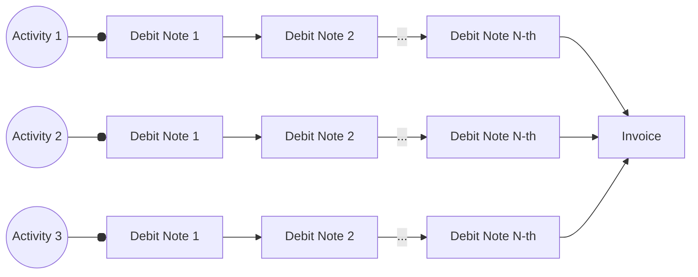

# Golem — current architecture
Authors: Witold Dzięcioł, Przemysław Rekucki, Marek Dopiera,
\<YOUR NAME GOES HERE\>\
Reviewers: Maciej Maciejowski, Paweł Burgchardt\
Status: WIP

# About this document
The goal of this document is to describe present Golem architecture in enough
detail for an outside person to understand how it works under the hood. The
intended audience is assumed to be technical but not necessarily have deep
expertise in the crypto world. The level of detail stops short of describing
code and its organization but describes key technologies used in order to
implement the needed functionalities.

The aim is not to dive deep into every integration, but to capture architectural
decisions and their consequences.

# Framework Concept

This section describes what comprises Golem network, namely the actors,
technical artifacts and activities they actors may perform on those activities.
The objective of this paragraph is to tie together all the terms and provide a
very high level description of what they are.

## What Golem is

## What Golem is not

## Actors
This section describes the actors using Golem Network and their role in the
system.
### Provider
### Requestor
Note: We use term Requestor not Requester.
### Developer
### End User
Consumer of resources can be different person than Requestor.
For example we can have web service which forwards computationally expensive jobs
to Golem Network. Example: [Deposits](https://github.com/golemfactory/golem-architecture/blob/master/specs/deposits.md)

#### Service Owner
#### Funder
#### Spender

## Activities
This section describes what actors can do to the system. The descriptions are
only as detailed as to explain how the actors control the artifacts. The goal is
to give the reader an overview of the terms introduced by Golem without any
details and establish a glossary to ensure consistency within the document.

### Selling on Golem platform

Even though currently Golem is used for trading computational resources, it has been decided
that it can theoretically be used to trade anything. This means that the Marketplace does not
enforce any standards on goods traded, making it conceptually more similar to [craigslist](https://craigslist.org/) than
to a stock exchange. As a consequence, direct interaction between buyer and seller is required
to make a transaction.

It is the main goal of the [Provider Agent](#provider-agent) to implement logic for selling resources
in Golem Network. From high level perspective, Agent application should do following things: 
1. Describe Resources using property language to create an [Offer](#offer)
2. Publish the Offer in the market
3. Monitor incoming Proposal events and negotiate an [Agreement](#agreement) with the most promising [Requestor](#requestor)
4. Allocate the promised Resources in accordance with the [Agreement](#agreement)
5. Send [DebitNotes](#debit-note) to notify [Requestor](#requestor) of updated costs
6. Terminate the Agreement or await the Agreement termination event from the [Requestor](#requestor)
7. Send an [Invoice](#invoice) summarizing the total cost of the [Agreement](#agreement)
8. Monitor Payment API events for [Invoice](#invoice) settlement and payment confirmation 

#### 1. Describe Resources using property language to create an [Offer](#offer)

The Golem design was created to support the sale of any type of computing resource.To achieve this,
Golem employs a generic [property and constraints language](#discovery-and-offersdemand-matching) to
describe the resources being offered. 

The [Yagna market](#market) is agnostic to the specific properties used and can match Offers and Demands as long
as they adhere to the language specification. However, the Yagna daemon does not interpret the semantics
of the properties in the Offer, nor does its behavior depend on the negotiated Agreement. It is the
responsibility of the Provider Agent application to accurately interpret the semantics and implement
the agreed-upon behavior between the parties.

In this chapter, the term "resource" is used in a generic sense. However, illustrating a generic
example can be challenging. Therefore, we will focus on selling computational power in a virtual
machine (VM) to provide the reader with a clearer understanding.

In this case, the Offer should include the following key aspects:
- The type of [Execution Environment (ExeUnit)](#execution-environments) that will be used.
- [Hardware specifications](https://github.com/golemfactory/golem-architecture/blob/master/standards/cheat_sheet.md#goleminfcpu),
  including the number of CPU cores, RAM, and disk space.
- The price and the [pricing model](#payments-models) applied.
- The payment scheme, outlining how the agent application interacts with the payment system (e.g. in `pay-as-you-use` scheme,
  what is expected transaction frequency).
- The [Wallet](#wallet) address for receiving payments, along with the supported [payment platforms](#payment-platform).

#### 2. Publish the Offer in the market

Golem is a decentralized network of independent [Nodes](#yagna-node), with no central repository for [Offers](#offer) or any
central server to facilitate [Agreements](#agreement) between parties. As a result, offers must be propagated between nodes,
and transactions are conducted through direct communication.

Developers don’t need to worry about [offer propagation](#offer-propagation). The responsibility for propagating offers
lies with the Yagna daemon, specifically its market module. The only task for the Provider Agent is to publish the offer
on the market using its REST API. The REST endpoint returns a [subscription](#subscription) ID, which can later be used
to listen for incoming [proposal](#proposal) events.

#### 3. Monitor incoming Proposal events and negotiate an Agreement with the most promising Requestor

The [Provider Agent](#provider-agent) plays a passive role in negotiations. Offers are propagated across the network and
received by [Requestors](#requestor). The offer is matched locally on the Requestor's node with a [Demand](#demand).
If the Requestor is interested, they respond by sending a [Proposal](#proposal) to the Provider. This triggers a Proposal
event on the Provider's [subscription](#subscription) endpoint.

Negotiation is the process of exchanging Proposals and adjusting their terms until the Requestor proposes an Agreement.
The structure of a Proposal is identical to that of an Offer or Demand, using the same property and constraint language
to describe the Agreement's conditions. During negotiations, certain aspects of the Agreement can be modified. While Offers
and Demands represent the initial declaration of resources, terms, and conditions, the proposal exchange is a dynamic
process of refining these terms to reach an optimal agreement for both parties.

The negotiation stage serves several purposes:
- Ensures that the Provider and Requestor communicate before signing an Agreement (since offer propagation doesn’t
  require direct interaction between parties).
- Allows both the Provider and Requestor to implement different strategies to maximize their benefits and select suitable partners.
- Provides an opportunity for the Provider and Requestor to negotiate additional terms that weren’t included in the  
  initial Proposals. This is possible through protocols built on top of the property language.

Both the Provider and Requestor negotiate with multiple nodes simultaneously. The Requestor initiates the Agreement by
proposing it to the Provider, who can either accept or reject the proposal. Once the Agreement is signed by both parties,
the Requestor can begin using the resources. The Agreement remains valid until it is terminated by either party. The terms
of termination (e.g., duration of the Agreement and conditions under which it can be terminated) are specified within the
Agreement itself, rather than being defined by the Golem protocol.

##### Example of negotiation

To better understand the negotiation process, let’s consider an example involving the negotiation of a payment platform.
This will illustrate how agents can use different strategies and what negotiation protocols can be built on top
of the property language.

When declaring a payment platform in an offer, the Provider lists wallet addresses for each platform it supports.
It is the Requestor's responsibility to choose the platform by specifying the appropriate property in their demand.
The Requestor can approach negotiations in two ways:

###### 1. Static Negotiations
Suppose the Requestor prefers payments on the Polygon network. In this case, they require the Provider to support
Polygon and will not select a Provider that doesn’t.

Since the Requestor has a specific requirement, multiple negotiation stages aren't necessary. They can simply add
a constraint to their demand, instructing the matching algorithm to filter out Providers that don’t meet this
requirement. In their demand, they set the chosen platform as a fixed value.

###### 2. Dynamic Negotiations
Now imagine a Requestor that can pay on multiple platforms but prioritizes them based on transaction fees. In this
scenario, the Requestor has a larger pool of potential Providers since they don’t restrict the platform by adding
a constraint to their demand.

Instead, the Requestor collects proposals from the market and evaluates them based on estimated costs. In later stages
of proposal exchange, they choose the platform by setting the relevant property according to the Providers' scores,
which are based on potential transaction costs.

#### 4. Allocate the promised Resources in accordance with the Agreement

Once the Agreement is signed, the Provider is expected to reserve the promised resources for the Requestor’s use.
During this time, the Provider cannot sell these resources to anyone else and must be prepared to start the Activity.
For instance, if the Provider is selling computing power through a Virtual Machine Execution Environment, they
declared in Agreement a specific amount of RAM and a certain number of threads to be allocated for the VM.
Provider can only sell any remaining RAM and cores to other Requestors.

Resource access always occurs within the context of an Activity. Creating an Activity is synonymous with starting an
execution environment. The Activity module enables the Requestor to control the execution environment and monitor
its state. Further details on controlling an Activity from the Requestor's perspective can be found in
the ["Running something"](#running-something) section.

From the Provider's perspective, the primary focus is to listen for incoming Activity events and create an Activity
when requested by the Requestor. Upon receiving an Activity creation event, the Provider should spawn an ExeUnit process
(and a Virtual Machine in consequence). Conversely, receiving an Activity destruction event should trigger the termination
of the ExeUnit processes.

The Requestor is allowed to spawn multiple Activities consecutively. In general, multiple Activities running
simultaneously may be permitted; however, this does not apply in the case of a Virtual Machine, as hardware
resources can only be allocated once.

#### 5. Send DebitNotes to notify Requestor of updated costs

The ExeUnit is directly controlled by the Requestor Agent, with no intervention from the Provider. Communication
happens solely between the Yagna daemon and the ExeUnit process. The Provider's responsibility is limited to calculating
the cost of resource usage based on the pricing model defined in the Agreement and informing the Requestor accordingly.
The ExeUnit tracks resource consumption, while the Provider Agent computes and communicates the cost to the Requestor
via Debit Notes. The Provider Agent must also monitor the acceptance of these Debit Notes, as it signifies
the Requestor's commitment to pay the specified amount.

Debit Notes are formal documents used to notify the Requestor of the costs incurred. Each note details the amount owed 
for a specific activity up to the time the note is issued. As each subsequent Debit Note reflects the updated costs,
it effectively supersedes the previous one.

The frequency of sending Debit Notes and the acceptance deadlines are outlined in the Agreement. It is important to note
that accepting a Debit Note does not trigger immediate payment. Debit Notes can be classified as payable or non-payable,
with payable Debit Notes identified by the due date included in the document. While payable Debit Notes are scheduled
for processing upon acceptance, this does not necessitate immediate payment. The payment mechanism allows for the batching
of payments or delaying them to accommodate additional Debit Notes or Invoices, thereby reducing transaction costs on
the blockchain. Consequently, while payments are not immediate, they must be completed before the due date specified
in the Agreement.

#### 6. Terminate the Agreement or await the Agreement termination event from the Requestor

The Agreement can be terminated when either party chooses to end it. The reasons for termination are outlined in the
Agreement, and different market negotiation protocols may permit termination for various reasons. Below is
a non-exhaustive list of potential causes for termination:
- The Agreement expires if it was established for a fixed duration.
- The Requestor no longer needs the resources or has completed the computations.
- One of the parties violates the terms of the Agreement, such as:
  - The Requestor fails to accept Debit Notes within the agreed timeframe.
  - The Provider issues Debit Notes more frequently than agreed.
  - The Requestor fails to make timely payments, particularly in cases involving mid-agreement payments.

An Agent can terminate the Agreement using the market's REST API. It should also monitor Agreement events
to detect if the other party terminates the Agreement.

An Agent has the option to attach additional information outlining the reasons for termination when ending the
Agreement. While this is not mandatory, it is encouraged as it can provide valuable context for the other party,
serving as diagnostic information or for other purposes.

#### 7. Send an Invoice summarizing the total cost of the Agreement

Once the Agreement is terminated, the Provider Agent should send an Invoice to the Requestor summarizing the total costs
incurred throughout the Agreement. This Invoice should reflect the cumulative costs from all Activities. In response,
the Requestor must either accept or reject the Invoice. However, regardless of the acceptance status, payment is mandatory
for the total amount indicated by the accepted Debit Notes, as their acceptance constitutes a binding commitment to pay.

#### 8. Monitor Payment API events for Invoice settlement and payment confirmation

As previously mentioned, payments are not immediate for several reasons: they are not scheduled right away, and batching 
may occur. Furthermore, blockchain transactions are not immediate and may take time to process. Therefore, the Provider
Agent should monitor Payment events. This can be done by listening for status changes to Settled on Invoice and Debit Note
events, or by tracking payment events to receive notifications for each transaction.

It's important to note that, depending on the terms of the Agreement, payments may occur after the entire Agreement is
completed or at various points during the Agreement, particularly in the case of mid-agreement payments. Monitoring
payment events will provide insight into all payments progressively settling under the Agreement.

### Searching on market
### Buying on golem platform
### Running something

## Layers

decomposition into layers. responsibility of the layers.

### Golem Node

### Business logic

### Execution

## Functional modules

decomposition into functional areas and scopes of responsibility of these layers.

### Market
### Payment
### Activity
### Identity
### Net

## Applications/Exe-Units

a brief overview of sample applications.

### WASM Runtime

### VM Runtime

### GH/AI Runtime

### HTTP Auth Runtime 

## Artifacts

This section describes the artifacts, i.e. the terms introduced in Golem Network
on which actors can act. They are organized by respective aspects of Golem
Network. The descriptions describe their function rather than their
implementation.

Section should serve as dictionary to be linked by other chapters.

### Participating entities

#### Yagna daemon
#### Yagna Node
#### Provider agent
#### Requester agent

### Marketplace
#### Offer
#### Demand
#### Subscription
This word is used to describe Offer/Demand put on market, so we should mention it.
#### Proposal
#### Negotiation
#### Agreement

### Execution system
#### Activity
#### Execution environment (ExeUnit)
##### ExeUnit Batch
##### ExeUnit Command
##### VM
##### VM Image
##### WASM
##### WASM image

### VPN
#### Network

### Payment System
#### Payment Driver
#### Payment Platform
#### Token
#### Wallet
#### Allocation
#### Debit Note
#### Invoice
#### Payment
#### Transaction (on blockchain)

## Key architectural decisions
### GLM is built on XYZ
### GLM is used for clearing
### No centralized offer matching rules
### Only providers' offers are propagated
### Agreements are not stored on the blockchain
### Offline requestors are not supported 
### Local storage (TODO: what role does the local DB play?)

## Technical view - architecture layers

Bottom-up description of different layers of Golem that impose structure on how
we split components and facilitate communication between them. Golem is not
monolithic and division of responsibility is not arbitrary.

The goal of this chapter is to sketch general idea, rather than describe
specifics.
### Network layer
### GSB layer
RPC-like communication layer providing a way to call other modules or other
nodes in unified way.
### Specialized modules layer (market, payment, activity, vpn etc.)
#### Market negotiation protocols
Offers/Demands property and constraint language is used to build subprotocols
for negotiating certain aspects of Agreements.
### Execution environments
There are a few ways to implement an execution environment. We have a few APIs
here:
* Bind and handle GSB messages directly
* Implement RuntimeSDK and use ExeUnit binary for common functionalities
* Command specification which can be executed by ExeUnit is flexible enough that
  higher level protocols could be created here.
### API layer
Each specialized module exposes some APIs to users. It is either REST API, yagna
cli or set of GSB endpoints for communication between modules and nodes.
#### REST API
#### CLI
#### GSB API (communication between modules)
### SDKs layer (python and js SDK)
#### Agent application (Requestor script, Provider Agent)
### Higher level SDKs
#### Golem compose
#### Ray on Golem

## Technical view - functional aspects
This section dives into aspects of Golem network architecture to explain how
they work under the hood. The level of detail does not include code structure,
interfaces nor data structures but names key components and interaction between
them.

### Market interactions
#### Discovery and Offers/Demand matching
- Offer/Demand properties and constraint langauge
- Yagna is property agnostic - doesn't understand semantic of properties, only agent do
- Some examples of properties and costraints and how it works
- Links to more detailed docs for properties langauge and properties sepcification (?)
#### Offer propagation
- Link to design [decision](#only-providers-offers-are-propagated)
- Algorithm overview
#### Process of negotiations and making an agreement
- Initial Proposal
- Countering Proposal
- What can change in counter proposal (protocols based on property langauge)?
- Provider Agent possible Proposal responses (counter, reject)
- Requestor Agent possible Proposal responses (counter, reject, propose Agreement)
- Provider Agent possible Agreement responses (accept, reject)
- Requestor possbility of Agreement Proposal cancallation
- Restarting negotiations (who can, who can't and how?)
#### Agreement termination
- Who is allowed to terminate? In what situation?
- What is specified by protocol and what is left to future specifications?
- Termination reason concept

### Communication between nodes
#### Central net
#### Hybrid net
- Identification
- Relay
- Discovering Nodes
- P2P communication
- Relayed communication
- Cryptography
  - Node identity verification (challenges)
  - Communication encryption
#### GSB communication through Net
- Communication is independent from net implementation
- GSB addressing

### Payments & Clearing
#### Payments models
- Describe generic model which is open for new implementations
- Payment model specification in Offer/Demand language
- Linear Payment model as an example
#### Payments flow during Agreement
- Negotiating payment platform and other payment details
- Testnet(s) vs. mainnet(s)
- Tokens
- Partial payments vs. payments after Agreement finish
- DebitNotes/Invoices interactions (acceptance, rejection, cancellation)
- How DebitNote/Invoice acceptance relates to payment on blockchain?
- Payment settlement and payment confirmation for Provider
#### Payment drivers
- Abstract concept (independance from underlying payment mechanisms)
- How payment platform relates to payment driver?
- Examples: erc20 driver, zksync (?)
#### Payments batching
#### Deposits payments
- Overview of the concept
- Link to external documentation describing details

### ExeUnits
#### Abstract concept
- ExeUnit concept is generic enough to sell any kind of computation resources
- Generic ExeUnits (for example VM, WASM etc.) vs. specialized ExeUnits for specific tasks like:
  - [GamerHash](https://github.com/golemfactory/ya-runtime-ai)
  - [outbound gateway](https://github.com/golemfactory/ya-runtime-outbound)
  - [http authentication](https://github.com/golemfactory/ya-runtime-http-auth)
  - SGX variant of ExeUnit
  - These points are not meant to document those ExeUnits, rather show possible variaty based
    on these examples
- Interaction with yagna through GSB
- Control flow between Requestor and ExeUnit
- Extensible commands list (ExeUnit implementation dependent)
##### Controlling ExeUnit (basic concepts)
- Spawning ExeUnit (contract between Provider Agent and ExeUnit)
  - Self-test
  - Offer template
- Binding to GSB (addressing based on activity id)
- Requestor state control
- Commands and batches:
  - Deploy, Start, Transfer, Run, Terminate
  - Querying command/batch state, receiving results
  - Transfer methods ([GFTP](#gftp), http)
#### ExeUnit Supervisor
- Why splitting Supervisor and Runtime?
- Common functionalities provided by Supervisor
#### ExeUnit Runtime
#### GFTP
#### VM runtime
- Virtual machine desciption (so the reader knows what is there, but not details)
- Functionalities (outbound, VPN, process output capturing)
- VM images, gvmkit-build etc
#### WASM runtime
- WASM supported execution engines
- WASM images

### VPN
### Processes and the responsibility split between them
#### IPC

### Reputation management

PR: this is part of the business logic layer. you would need to think about how to add objects from this layer and SDK implementations in different versions to this document. and the concept of building various reputation methods.

PR: ya-provider is also from this layer and you could write down what configurations it supports. e.g. node attestation, authorization certificates, etc.

## Key architectural shortcomings
This section contains known shortcomings of the implemented architecture —
irrespective of whether they were intentional or unintentional.

### Preexisting two categories of actors
The preexisting categories of actors (providers and requesters) and their
asymmetric roles are limiting in certain scenarios. FIXME FIXME FIME
### TODO

