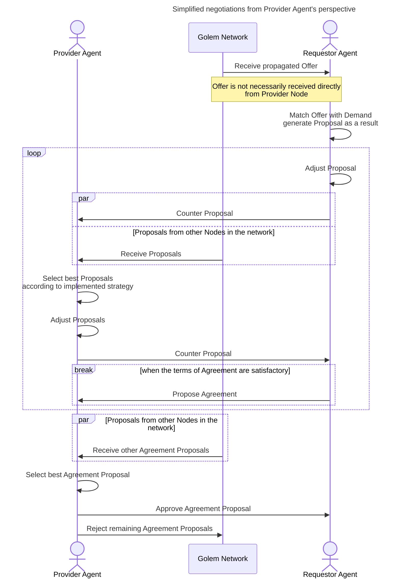
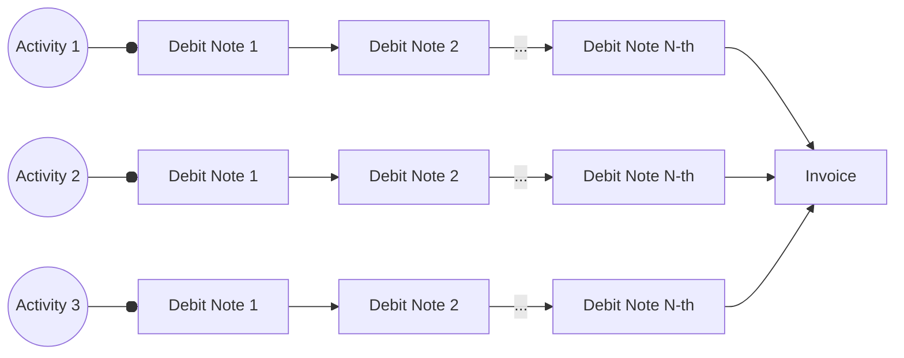
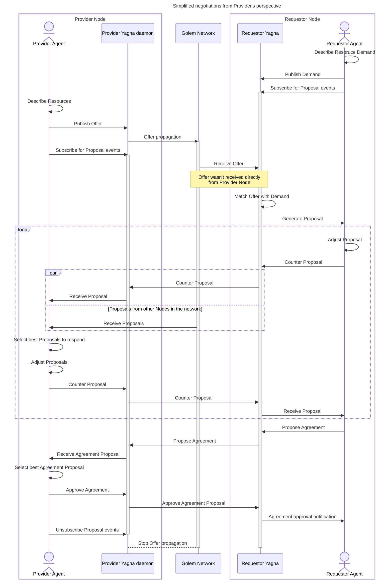
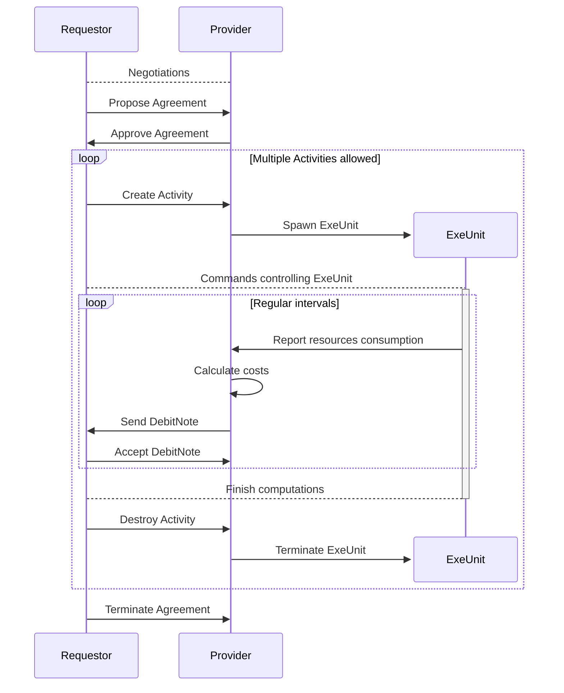

# Golem — current architecture
Authors: Witold Dzięcioł, Przemysław Rekucki, Marek Dopiera,
\<YOUR NAME GOES HERE\>\
Reviewers: Maciej Maciejowski, Paweł Burgchardt\
Status: WIP

# About this document
The goal of this document is to describe present Golem architecture in enough
detail for an outside person to understand how it works under the hood. The
intended audience is assumed to be technical but not necessarily have deep
expertise in the crypto world. The level of detail stops short of describing
code and its organization but describes key technologies used in order to
implement the needed functionalities.

The aim is not to dive deep into every integration, but to capture architectural
decisions and their consequences.

# Framework Concept

This section describes what comprises Golem network, namely the actors,
technical artifacts and activities they actors may perform on those activities.
The objective of this paragraph is to tie together all the terms and provide a
very high level description of what they are.

## What Golem is

## What Golem is not

## Actors
This section describes the actors using Golem Network and their role in the
system.
### Provider
### Requestor
Note: We use term Requestor not Requester.
### Developer
### End User
Consumer of resources can be different person than Requestor.
For example we can have web service which forwards computationally expensive jobs
to Golem Network. Example: [Deposits](https://github.com/golemfactory/golem-architecture/blob/master/specs/deposits.md)

#### Service Owner
#### Funder
#### Spender

## Activities
This section describes what actors can do to the system. The descriptions are
only as detailed as to explain how the actors control the artifacts. The goal is
to give the reader an overview of the terms introduced by Golem without any
details and establish a glossary to ensure consistency within the document.

### Selling on Golem platform

Golem Network allows buyers and sellers to connect and reach agreements. The market is designed to be asymmetrical:
the sellers ([Providers](#provider)) publish Offers, and the buyers ([Requestors](#Requestor)) browse through these Offers.
When a Requestor finds a suitable Offer, they contact the Provider directly to negotiate the deal.

Typically, humans are not involved in the process of finding, matching, negotiating, or finalizing agreements. Instead,
users define their needs programmatically, allowing the [Provider Agent](#provider-agent) and [Requestor Agent](#requester-agent)
software to handle these tasks automatically.

The [Provider Agent](#provider-agent) is primarily responsible for implementing the logic needed to sell resources on
the Golem Network. From high level perspective, Provider Agent application should do following things: 
1. Describe Resources using property language to create an [Offer](#offer)
2. Publish the Offer on the market
3. Monitor incoming Proposals and negotiate an [Agreement](#agreement) with the most promising [Requestor](#Requestor)
4. Allocate the promised Resources in accordance with the [Agreement](#agreement)
5. Monitor resources usage and charge Requestor Agent
6. Terminate the Agreement or await the Agreement termination event from the [Requestor](#Requestor)
7. Send an [Invoice](#invoice) summarizing the total cost of the [Agreement](#agreement)
8. Wait until the payment for the [Invoice](#invoice) is settled and payment confirmed. 

#### 1. Describe Resources using property language to create an [Offer](#offer)

While Golem is currently used for trading computational resources, it was designed to support the exchange of any type of
[resource](#resource). This means the Marketplace does not enforce strict standards on the goods being traded.
To enable this flexibility, Golem uses a generic [property and constraints language](#discovery-and-offersdemand-matching)
to describe the resources being offered. The Core Network does not interpret the semantics of the properties in the Offer,
nor does its behavior depend on the negotiated Agreement. It is the responsibility of the Provider Agent application to
accurately interpret the semantics and implement the agreed-upon behavior between the parties.

In this chapter, the term ["resource"](#resource) is used in a generic sense. However, illustrating a generic
example can be challenging. Therefore, we will focus on selling computational power in a virtual
machine (VM) to provide the reader with a clearer understanding.

In this case, the Offer should include the following key aspects:
- The type of [Execution Environment (ExeUnit)](#execution-environment-exeunit) that will be used. (The [VM](#vm-runtime)
  is an example of an execution environment. [WASM runtime](#wasm-runtime) is another)
- [Hardware specifications](https://github.com/golemfactory/golem-architecture/blob/master/standards/cheat_sheet.md#goleminfcpu),
  including the number of CPU cores, RAM, and disk space.
- The price and the [pricing model](#payments-models) applied.
- The payment scheme, outlining how the agent application interacts with the payment system (e.g. in `pay-as-you-use` scheme,
  what is expected transaction frequency).
- The [Wallet](#wallet) address for receiving payments, along with the supported [payment platforms](#payment-platform).

#### 2. Publish the Offer on the market

Golem is a decentralized network of independent [Nodes](#yagna-node), with no central repository for [Offers](#offer) or any
central server to facilitate [Agreements](#agreement) between parties. As a result, offers must be propagated between nodes,
and transactions are conducted through direct communication.

Developers don’t need to worry about [offer propagation](#offer-propagation). The responsibility for propagating offers
lies with the Core Network. The only task for the Provider Agent is to publish the offer on the market and listen
for incoming [Proposals](#proposal).

#### 3. Monitor incoming Proposals and negotiate an Agreement with the most promising Requestor

The [Provider Agent](#provider-agent) plays a passive role in negotiations. Offers are propagated across the network and
received by [Requestors](#Requestor). The offer is matched locally on the Requestor's node with a [Demand](#demand).
If the Requestor is interested, they respond by sending a [Proposal](#proposal) to the Provider Agent.

[Negotiation](#process-of-negotiations-and-making-an-agreement) is the process of exchanging Proposals and adjusting their
terms until the [Requestor Agent](#requester-agent) proposes an Agreement. The structure of a Proposal is identical to
that of an Offer or Demand, using the same [property and constraints language](#discovery-and-offersdemand-matching) to 
describe the Agreement's conditions. During negotiations, certain aspects of the Agreement can be modified. While Offers
and Demands represent the initial declaration of resources, terms, and conditions, the proposal exchange is a dynamic
process of refining these terms to reach an optimal [Agreement](#agreement) for both parties.

The negotiation stage serves several purposes:
- Ensures that the Provider Agent and Requestor Agent communicate before signing an Agreement (since offer propagation
  doesn’t require direct interaction between parties).
- Allows both the Provider Agent and Requestor Agent to implement different [strategies](#market-strategies) to maximize
  their benefits and select suitable partners.
- Provides an opportunity for the Provider Agent and Requestor Agent to negotiate additional terms that weren’t included
  in the initial [Proposals](#proposal). This is possible through protocols built on top of the property language.

Both the Provider Agent and Requestor Agent negotiate with multiple Agents simultaneously. The Requestor Agent initiates
the Agreement by proposing it to the Provider Agent, who can either accept or reject the Proposal. Once the Agreement is signed
by both parties, the Requestor Agent can begin using the resources. The Agreement remains valid until it is terminated by
either party. The terms of termination (e.g., duration of the Agreement and conditions under which it can be terminated) are
specified within the Agreement.

##### Example of negotiation

To better understand the [Negotiation](#process-of-negotiations-and-making-an-agreement) process, let’s consider an example 
involving the negotiation of a [payment platform](#payment-platform). This will illustrate how agents can use different
strategies and what negotiation protocols can be built on top of the [property and language](#discovery-and-offersdemand-matching).

When declaring a payment platform in an [Offer](#offer), the Provider Agent lists [wallet](#wallet) addresses for each
platform it supports. It is the Requestor Agent's responsibility to choose the platform by specifying the appropriate
[property](#property) in their demand. The Requestor Agent can approach negotiations in two ways:

###### 1. Static Negotiations
Suppose the Requestor Agent prefers payments on the Polygon network. In this case, they require the Provider Agent to support
Polygon and will not select a Provider Agent that doesn’t.

Since the Requestor has a specific requirement, multiple negotiation stages aren't necessary. They can simply add
a [constraint](#constraint) to their [Demand](#demand), instructing the matching algorithm to filter out Providers that
don’t meet this requirement. In their Demand, they set the chosen platform as a fixed value.

###### 2. Dynamic Negotiations
Now imagine a Requestor Agent that can pay on multiple platforms but prioritizes them based on transaction fees. In this
scenario, the Requestor Agent has a larger pool of potential Providers since they don’t restrict the platform by adding
a constraint to their demand.

Instead, the Requestor Agent collects Proposals from the market and evaluates them based on estimated costs. In later stages
of Proposal exchange, they choose the platform by setting the relevant [property](#property) according to the Providers' scores,
which are based on potential [transaction](#transaction-on-blockchain) costs.

#### 4. Allocate the promised Resources in accordance with the Agreement

Once the [Agreement](#agreement) is signed, the Provider Agent is expected to reserve the promised [resources](#resource) for the
Requestor’s use. During this time, the Provider Agent cannot sell these resources to anyone else and must be prepared
to start the [Activity](#activity). For instance, if the Provider Agent is selling computing power through a [Virtual Machine Execution
Environment](#vm), they declared in the Agreement a specific amount of RAM and a certain number of threads to be allocated for the VM.
The Provider Agent can only sell any remaining RAM and cores to other Requestors.

Making an Agreement reserves the Provider's resources. To actually use these resources, the Requestor Agent must take
an additional step by creating an [Activity](#activity). Most parameters are already included in the Agreement, but some
additional parameters may be required and will be specified later using Activity commands. For example, if the Requestor Agent
wants to utilize the Provider's resources by running a virtual machine, details like the [image](#vm-image) to run, RAM, and the
number of cores are taken from the Agreement. However, to allocate an IP address or transfer necessary files, Activity
[commands](#controlling-exeunit-basic-concepts) are used. Further details on controlling an Activity from the Requestor's
perspective can be found in the["Running something"](#running-something) section.

From the Provider Agent's perspective, the primary focus is to listen for incoming Activity events and create an Activity
when requested by the Requestor Agent. Upon receiving an Activity creation event, the Provider Agent should spawn an
[ExeUnit](#exeunits) process (and a Virtual Machine in consequence). Conversely, receiving an Activity destruction event should trigger
the termination of the ExeUnit processes.

The Requestor Agent is allowed to spawn multiple Activities consecutively. In general, multiple Activities running
simultaneously may be permitted; however, this does not apply in the case of a [Virtual Machine](#vm), as hardware
resources can only be allocated once.

#### 5. Monitor resources usage and charge Requestor Agent

The [ExeUnit](#exeunits) is directly controlled by the Requestor Agent, with no intervention from the Provider Agent.
Communication happens solely between the Requestor Agent and the ExeUnit. However, this doesn't mean the Provider
Agent is inactive during this time. The Provider Agent's responsibility is limited to calculating the cost of resource usage
based on the pricing model defined in the Agreement and informing the Requestor Agent accordingly.

There are two types of payment documents used in the Golem Network: [Debit Notes](#debit-note) and [Invoices](#invoice).

Debit Notes are sent at regular intervals during the execution of an activity to inform the Requestor Agent of the
accumulating costs of the Agreement. These notes act as building blocks that support various payment schemes.
The handling of Debit Notes by Agents is governed by the terms negotiated in the Agreement. Generally, Debit Notes
serve the following purposes:
- Informing the Requestor Agent about resource usage and activity costs, and obtaining explicit acceptance of these costs.
- Acting as a health check, allowing the Provider Agent to monitor if the Requestor Agent is still active and hasn’t
  abandoned the Agreement, helping avoid not getting paid.
- Facilitating [mid-agreement payments](#mid-agreement-payments).

Invoices are issued after the Agreement is terminated, providing a summary of the total costs. They allow the Provider
Agent to include any additional costs not covered in the Debit Notes, as the final Debit Note doesn’t have to be sent
immediately after the activity ends.

Both Debit Notes and Invoices can be either accepted or rejected by the other party. Acceptance signals that the
Requestor Agent agrees to pay the specified amount. Rejection, on the other hand, indicates refusal to pay the
non-accepted amount. However, it’s important to note that a rejection does not absolve the Requestor Agent from paying
for all previously accepted Debit Notes. The conditions under which rejection is allowed should be defined in the
Agreement. Currently, no payment scheme permits rejections.

Accepting a Debit Note or Invoice does not result in immediate payment for a few reasons.
Debit Notes can be classified as payable or non-payable, with payable Debit Notes identified by the due date included
in the document. While payable Debit Notes are scheduled for processing upon acceptance, this still does not necessitate
immediate payment. The payment mechanism allows for the [batching of payments](#payments-batching) or delaying them
to accommodate additional Debit Notes or [Invoices](#invoice), thereby reducing [transaction](#transaction-on-blockchain) costs on the blockchain.

The consequence of delaying payments is that they are not guaranteed. However, this design opens the possibility of
implementing mechanisms that can mitigate or eliminate the risk of non-payment. For instance, a payment platform
could be developed using a deposit or escrow contract, or by integrating payment channels into the Core Network.

It’s important to note that, regardless of the payment scheme or platform used, Golem Factory does not act as an
intermediary for payments. Since transactions occur on the blockchain, and due to the decentralized nature of blockchain
technology, Golem Factory has no control over these transactions.

#### 6. Terminate the Agreement or await the Agreement termination event from the Requestor Agent

The [Agreement](#agreement) can be terminated when either party chooses to end it. Core Network doesn't enforce any
specific termination rules, so the Agreement should clearly define the conditions under which termination is
permitted. Below is a non-exhaustive list of possible reasons for termination:
- The Agreement expires if it was established for a fixed duration.
- The Requestor Agent no longer needs the [resources](#resource) or has completed the computations.
- One of the parties violates the terms of the Agreement, such as:
  - The Requestor Agent fails to accept [Debit Notes](#debit-note) within the agreed timeframe.
  - The Provider Agent issues Debit Notes more frequently than agreed.
  - The Requestor Agent fails to make timely payments, particularly in cases involving [mid-agreement payments](#mid-agreement-payments).

It is the Agent—whether Requestor or Provider—who decides to terminate the Agreement. The Agent is also responsible for
detecting if the other party has terminated the Agreement and taking the appropriate action in response.

Provider Agent has the option to attach additional information outlining the reasons for termination when ending the
Agreement. While this is not mandatory, it is encouraged as it can provide valuable context for the other party,
serving as diagnostic information or for other purposes.

#### 7. Send an Invoice summarizing the total cost of the Agreement

Once the Agreement is terminated, the Provider Agent should send an [Invoice](#invoice) to the Requestor Agent summarizing
the total costs incurred throughout the Agreement. This Invoice should reflect the cumulative costs from all [Activities](#activity).
In response, the Requestor Agent must either accept or reject the Invoice. However, regardless of the acceptance status,
payment is mandatory for the total amount indicated by the accepted [Debit Notes](#debit-note), as their acceptance constitutes
a binding commitment to pay.

#### 8. Wait until the payment for the Invoice is settled and payment confirmed.

It's important for the Provider to monitor payments after the Agreement is completed. This is when the Provider Agent
should adjust its market strategy to ensure profitability. Since the Core Network doesn't guarantee payment delivery,
the Provider Agent should implement measures to prevent being exploited by Requestors. One example is rejecting
non-paying Requestors and prioritizing those with a good reputation. Lack of payment isn't the only reason for
declining a Requestor in the future. The Provider Agent may also choose to reject subsequent Agreements with
Requestors who break the Agreement conditions.

Payment confirmation is received by the Provider Agent from the Requestor once the transaction is confirmed on the
blockchain. This confirmation specifies which Activities and Agreements are covered by the transaction. There is no
1-to-1 relationship between transactions and Activities or Agreements. A single blockchain transaction can cover
multiple Activities or Agreements, while each Activity or Agreement may also be covered by multiple transactions.

### Searching on market
### Buying on golem platform
### Running something

## Layers

decomposition into layers. responsibility of the layers.

### Golem Node

### Business logic

### Execution

## Functional modules

decomposition into functional areas and scopes of responsibility of these layers.

### Market
### Payment
### Activity
### Identity
### Net

## Applications/Exe-Units

a brief overview of sample applications.

### WASM Runtime

### VM Runtime

### GH/AI Runtime

### HTTP Auth Runtime 

## Artifacts

This section describes the artifacts, i.e. the terms introduced in Golem Network
on which actors can act. They are organized by respective aspects of Golem
Network. The descriptions describe their function rather than their
implementation.

Section should serve as dictionary to be linked by other chapters.

### Participating entities

#### Core Network
#### Yagna daemon
#### Yagna Node
#### Provider agent
#### Requester agent

### Marketplace
#### Offer
##### Property
##### Constraint
#### Demand
#### Subscription
This word is used to describe Offer/Demand put on market, so we should mention it.
#### Proposal
#### Negotiation
#### Agreement

### Execution system
#### Resource
#### Activity
#### Execution environment (ExeUnit)
##### ExeUnit Batch
##### ExeUnit Command
##### VM
##### VM Image
##### WASM
##### WASM image

### VPN
#### Network

### Payment System
#### Payment Driver
#### Payment Platform
#### Token
#### Wallet
#### Allocation
#### Debit Note
#### Invoice
#### Payment
#### Transaction (on blockchain)

## Key architectural decisions
### GLM is built on XYZ
### GLM is used for clearing
### No centralized offer matching rules
### Only providers' offers are propagated
### Agreements are not stored on the blockchain
### Offline Requestors are not supported 
### Local storage (TODO: what role does the local DB play?)

## Technical view - components
This section describes key components of Golem Network, i.e. their
responsibilities, interfaces and which other components they utilize.

### Networking
* how it works that two separate Yagnas can talk to each other
#### Central net
#### Hybrid net
- Identification
- Relay
- Discovering Nodes
- P2P communication
- Relayed communication
- Cryptography
  - Node identity verification (challenges)
  - Communication encryption

### GSB
* what it is, how it works and how it imposes a code structure and how
  addressing works

### Offer / negotiation
A description of the component responsible for making offers, counter-offers,
negotiations, etc.

### Market interactions
#### Discovery and Offers/Demand matching
- Offer/Demand properties and constraint language
- Yagna is property agnostic - doesn't understand semantic of properties, only agent do
- Some examples of properties and constraints and how it works
- Links to more detailed docs for properties language and properties specification (?)
#### Offer propagation
- Link to design [decision](#only-providers-offers-are-propagated)
- Algorithm overview
#### Process of negotiations and making an agreement
- Initial Proposal
- Countering Proposal
- What can change in counter proposal (protocols based on property language)?
- Provider Agent possible Proposal responses (counter, reject)
- Requestor Agent possible Proposal responses (counter, reject, propose Agreement)
- Provider Agent possible Agreement responses (accept, reject)
- Requestor possibility of Agreement Proposal cancellation
- Restarting negotiations (who can, who can't and how?)

#### Market strategies

#### Agreement termination
- Who is allowed to terminate? In what situation?
- What is specified by protocol and what is left to future specifications?
- Termination reason concept

### Offer propagation
* a description of how it happens that offers are visible to reqestors
* Link to design [decision](#only-providers-offers-are-propagated)
* Algorithm overview

### Payments
#### Important terms
- Payment Driver – a component responsible for executing and confirming
  transactions.
- Payment Platform – a 3-part identifier uniquely describing a mode of
  exchanging funds. It is composed of 3 fields:
  - driver – Determines which driver to select, see below for details.
  - network – Defined by the driver.
  - token – Defined by the driver.

  The payment platform is opaque to Golem and is only relevant for payments.
  It is serialized as `{dirver}-{network}-{token}`.
- Allocation – a budget definition in the Golem Node. It is not part of the
  protocol and is only used for internal bookkeeping for the convenience
  of Requestors. One can create an Allocation via REST API which defines the
  following constraints:
    - Payment Platform
      - Must match exactly
    - Payee address
      - Must match exactly
    - Amount of token
      - Cannot be exceeded
    - Lifetime (via a UTC timestamp)
      - The allocation will cease to exist the moment it passes
  
  The allocation is neccessary for all operations that may lead to expending
  funds and it is transparently checked at all relevant points. If any of the
  constraints are not satisfied, the operation will fail. Allocations *DO NOT* affect semantics of the Golem Network and can be considered an implementation detail.
#### Payments models
A payment model is an algorithm for determining the amount due based on resource usage (AKA Usage Counters, see [ExeUnits section](#ExeUnits)).

The linear Payment Model is the only one currently in use. It multiplies usage
counters by constant coefficients and adds a constant on top of that, thus
forming a linear function. The counters used today by yagna are cpu-time
and total run-time.

The model parameters (for example coefficients of the linear Payment Model) are
declared by the provider in the offer. Based on those, the Requestor can make
an informed decision about whether to enter such an agreement or not.

Because Payment Models operate on ExeUnit-defined Usage Counters, they are
ExeUnit-dependent, but one Payment Model may work for multiple ExeUnits
assuming they define interchangeable counters.

#### Negotiation
A Payment Model must be negotiated between the Provider and Requestor to
estimate pricing before the agreement is signed.

- Offer shall expose a property `golem.com.pricing.model` which is a string
    containing the model name, e.g. `linear`, as well as
    `golem.com.pricing.model.{model_name}` which is an object containing
    model-specific parameters.
- Demand may put constraints on those properties in order to limit spending.

#### Payments flow during the lifetime of the Agreement
##### Negotiation
Provider and Requestor must establish the mechanics of payments (Payment Driver,
its parameters, Payment Model) during the agreement Negotiation. This is
achieved as follows:
- Offer defines properties `golem.com.payment.platform.<platform>.address`
  of the form which identify the recipients of funds for the given platform.
  Note that in case of blockchain payments this adress need not be the same
  as the Node ID. One can operate multiple provider nodes and have them all
  collect payments to a single account.
- The demand puts a constraint requiring that at least one such entry exisits
  for the payment platforms it itself supports.
  e.g. `(golem.com.payment.platform.erc20-polygon-glm.address=*)`.

In order to make experimentation on Golem Network simple, a pool of Providers is made available to users at no cost. It has been decided that the best way of achieving it is by utilising different payment platforms on the same network.
- For-profit providers will declare platforms that are used for actual funds,
  e.g. `erc20-mainnet-glm` and `erc20-polygon-glm`. Those correspond to,
  respectivelly, Ethereum Mainnet and Polygon L2, on both of which no new GLM
  tokens can be minted.
- Non-profit providers will declare platforms on which GLM tokens can be
  minted, and native tokens can be obtained from faucets, such as
  `erc20-amoy-tglm` or `erc20-holesky-tglm`.
- As there's currently only one driver in use and it requires a 1-to-1
  relationship between properties `token` and `network` of the payment platform,
  one usually refers to networks instead of the entire platforms. This has
  resulted in terms Mainnet(s) (for-profit) and Testnet(s) (non-profit).

##### Payable documents
A provider will send to the Requestor two kinds of documents relating
to payments - DebitNotes and Invoices. Those documents are used for accounting
and are persistent (retained in the database even after the agreement concludes)
which makes them useful for statistics and long-term debugging.
- DebitNotes are emitted while the agreement is still in effect, they contain
  the current amount due, the activity they relate to and optionally a deadline
  for payment for this amount (deducted by previous payments made for the
  given activity) to be made. If it is present, the DebitNote shall be called
  *payable*.
  - Payable DebitNotes frequency is negotiated by the property
    `golem.com.scheme.payu.debit-note.interval-sec?` and the duration between
    DebitNote creation and its due date by
    `golem.com.scheme.payu.payment-timeout-sec?`.
- Invoices are emitted after the agreement concludes, and they contain the
  total amount due for all activities.

##### Interaction between provider and Requestor
Whenever a provider sends a payment-related document, the Requestor may take one
of three actions:
- Accept the document (sending a message to Provider), obligating itself
  to pay the amount in case of invoices and payable DebitNotes.
- Reject the document (sending a message to Provider), signaling to the
  provider that it does not intend to make the payment. Will lead to
  termination of the agreement if it's a DebitNote.
- Ignore the document. Will lead to termination of agreement if it's
  a DebitNote.

##### Accepted documents
Accepting a document automatically schedules a payment to be made by
the Requestor. If the document specifies a deadline for the payment, it is
respected.
- Partial payments for DebitNotes should never exceed the final amount declared
  by the Invoice, as there is no mechanism for the provider to pay back the
  Requestor the surplus. It's not a problem for the current Linear Payment Model,
  as cpu-time and run-time counters are monotonically increasing.
- Whenever the Requestor makes a payment and considers it done (in practice by
  doing the same confirmation the provider would), it sends a driver-defined
  blob to the Provider so that the other node can confirm the payment itself.
    - *Confirmation* pertains to verifying whether a specific transaction from
      the Requestor (identified by its Transaction ID that the Requestor
      sends to the Provider) has been processed and that it's parameters
      (notably amount of token sent, token address and receiver address) all
      match what the Provider expects. Due to the nature of Blockchain this
      process is not completely deterministic, but conservative assumptions
      made in the current implementation of the Golem Node offer acceptable
      level of certainty.
- If the provider cannot confirm the payment, the result is the same as if no
  payment has been made.

#### Payment drivers
##### Abstract idea
A Payment Driver is intended to be an abstraction of an arbitrary mode
of payments. It must expose a collection of capabilities defined by
the implementation of the Golem Node, thus not being subject to network or
REST API backwards compatibility concerns. The current implementation requires
the following capabilities:
- Handling account events (locked / unlocked).
  - An account (private Ethereum key) on the Golem Node may be either accessible
    or encrypted. In the latter case it cannot be used for signing transactions,
    so the driver must be kept up-to-date with the status of all accounts.
- Listing RPC endpoints*.
  - Accessing Ethereum is done via servers commonly called RPC endpoints.
    A faulty endpoint could cause issues with transaction processing, so the
    driver exposes them with some metadata to allow checking whether they work. 
- Reporting account balance*.
  - For proper operation of the node one needs both Gas (native token) and GLM,
    this method yields the amount of both.
- Reporting its name.
  - Driver's name is a unique UTF-8 identifier. For the erc20 driver it'
    `"erc20"`.
- Reporting the default network.
  - Drivers have a preferred payment network for operation, which is to be used
    when the network is not supplied (some REST endpoints allow that).
- Reporting the list of supported networks.
  - Drivers can list all networks they can interact with.
- Initialization.
  - Drivers may need to carry out certain tasks specific to them before they
    can begin working. This method is called before any transactions
    are scheduled.
- Reporting the need for initialization for confirming incoming payments.
  - If the driver needs to also do work before confirming payments, it can
    report that via this method – then initialization will be called before
    any confirmation requests as well.
- Funding – automatic obtaining funds for for Testnets.
  - Some Testnets allow obtaining funds (both native token and GLM)
    programmatically. This method does this if possible.
- Transfers – transfering funds to a given address at a given platform
  w/o an allocation.
- Scheduling payments – transfering funds to a given address at a given
  platform with an allocation.
- Confirming payments.
  - A driver defines a heuristic for deciding whether a payment has been done
    correctly and is to be trusted.
- Verifying allocations.
  - Drivers ensure that an allocation cannot be created beyond the available
    funds and that the account tied to the allocation is usable. If the
    allocation contains a deposit, it is also validated. See the Deposit
    Payments section.
- Releasing deposits.
  - See the Deposit Payments section.
- Reporting its status*.
  - Drivers may encounter problems during their operations. The interface
    requires that drivers expose any errors encountered via a list of problems.
    An empty list implies that the driver is functioning 100% correctly.

Points marked with `*` leak information about the underlying mode of payments
necessarily being a blockchain or using the ERC20 standard.

##### Examples of payment drivers
- erc20 – Considers the currency to be a token defined by an ERC20-compliant
  Smart Contract on an EVM-compatible blockchain. The address at which this
  contract resides is preconfigured as part of the Payment Driver and not
  subject to negotiation.
- zksync – Now obsolete, another Payment Driver build on Ethereum

##### Current Erc20 Payment Driver
- Requires tokens to be compliant with the ERC20 standard.
- Only accepts `glm` token value for Mainnets and `tglm` for Testnets.
- Optimizes gas usage:
  - Use a multi-payment contract when available (hardcoded into the driver
    for each network) to execute multiple transfers within a single transaction.
  - Adds multiple transfers to a single account together.

##### Payments Batching
Payments Batching refers to collecting multiple transactions into one to optimize
gas usage. The only currently used Payment Driver implements this, [see this
section](#Current-Erc20-Payment-Driver).

#### Deposits payments
Detailed specification is in [golem-architecture](https://github.com/golemfactory/golem-architecture/blob/master/specs/deposits.md).

Deposits are a means for Requestor to pay with funds of external clients without
ever keeping them on their accounts. This is enabled by a smart contract on
the blockchain to which the 3rd parties may Deposit their funds and allow
a specific address (the Requestor's account) to transfer them out of the Deposit.

Terms:
- Funder – 3rd party creating the Deposit.
- Spender – Requestor permitted to spend the funds from a given Deposit.

This ties into existing concepts as follows:
- After the Funder creates a Deposit, they send the Deposit ID to the Spender.
  - Typically the creation of the Deposit would be done via a service operated
    by the spender.
- The Spender creates an allocation with the Deposit ID attached, this allows
  the Payment Driver to validate the allocation parameters against the deposit
  instead of the funds of the Spender themselves.
- Whenever a payment is scheduled, the Payment Driver will be able to transfer
  the funds directly from the deposit to the provider.

### ExeUnits

### Activity
* How the actions on behalf of the Requestor are performed
* We should dive into each important and general implementation, i.e. WASM and
  VM

#### Abstract concept
- ExeUnit concept is generic enough to sell any kind of computation resources
- Generic ExeUnits (for example VM, WASM etc.) vs. specialized ExeUnits for specific tasks like:
  - [GamerHash](https://github.com/golemfactory/ya-runtime-ai)
  - [outbound gateway](https://github.com/golemfactory/ya-runtime-outbound)
  - [http authentication](https://github.com/golemfactory/ya-runtime-http-auth)
  - SGX variant of ExeUnit
  - These points are not meant to document those ExeUnits, rather show possible variaty based
    on these examples
- Interaction with yagna through GSB
- Control flow between Requestor and ExeUnit
- Extensible commands list (ExeUnit implementation dependent)
##### Controlling ExeUnit (basic concepts)
- Spawning ExeUnit (contract between Provider Agent and ExeUnit)
  - Self-test
  - Offer template
- Binding to GSB (addressing based on activity id)
- Requestor state control
- Commands and batches:
  - Deploy, Start, Transfer, Run, Terminate
  - Querying command/batch state, receiving results
  - Transfer methods ([GFTP](#gftp), http)
##### Usage counters
#### ExeUnit Supervisor
- Why splitting Supervisor and Runtime?
- Common functionalities provided by Supervisor
#### ExeUnit Runtime
#### GFTP
#### VM runtime
- Virtual machine desciption (so the reader knows what is there, but not details)
- Functionalities (outbound, VPN, process output capturing)
- VM images, gvmkit-build etc
#### WASM runtime
- WASM supported execution engines
- WASM images

### VPN
* The component responsible for creating a VPN between VMs

### Reputation
* a description of how it is evaluated, distributed and used

### SDK
* which of the logic useful to the user ends up in the SDK

## Technical view - deployment
How the components are reflected in processes, where the processes are run, what
is their relation ship, etc.

## Technical view - flows & algorithms
This section documents how control and responsibility flows through the listed
components to achieve Golem's functionalities. Any non-trivial algorithms
spanning more than one component are also described here.

### Starting a provider and publishing an offer
### Receiving and executing work
### Finding a provider and requesting work
### Starting a cluster of VMs
### Creating a custom image

PR: this is part of the business logic layer. you would need to think about how to add objects from this layer and SDK implementations in different versions to this document. and the concept of building various reputation methods.

PR: ya-provider is also from this layer and you could write down what configurations it supports. e.g. node attestation, authorization certificates, etc.

## Key architectural shortcomings
This section contains known shortcomings of the implemented architecture —
irrespective of whether they were intentional or unintentional.

### Preexisting two categories of actors
The preexisting categories of actors (providers and requesters) and their
asymmetric roles are limiting in certain scenarios. FIXME FIXME FIME
### TODO

