# Golem — current architecture
Authors: Witold Dzięcioł, Przemysław Rekucki, Marek Dopiera,
\<YOUR NAME GOES HERE\>\
Reviewers: Maciej Maciejowski, Paweł Burgchardt\
Status: WIP

# About this document
The goal of this document is to describe present Golem architecture in enough
detail for an outside person to understand how it works under the hood. The
intended audience is assumed to be technical but not necessarily have deep
expertise in the crypto world. The level of detail stops short of describing
code and its organization but describes key technologies used in order to
implement the needed functionalities.

The aim is not to dive deep into every integration, but to capture architectural
decisions and their consequences.

# General Concept

This section outlines the components of the Golem Network, including the actors,
technical artifacts, and the activities these actors may perform. The goal is to
provide a high-level overview that ties together all key terms, offering a clear
understanding of the network’s ecosystem.

## What Golem Network Is

Golem Network is an open-source, decentralized platform for trading and
utilizing computing power.

The following comparisons help build an intuitive understanding of Golem
Network. While each of them has its limitations, together they provide a first
approximation of what the Golem Network is.

### A Decentralized Compute Cloud

Golem Network can be compared to traditional cloud platforms like AWS or GCP, as
it enables users to run workloads on machines owned by others. However, there
are key differences:

* AWS and GCP own the infrastructure, whereas Golem Network relies on users
  renting out their own machines to others.
* Amazon and Google act as central authorities, but Golem gives no additional
  power to any single entity (including itself). Users can fork, modify, or
  build on top of the platform.
* Golem is not a service provider; it simply provides the tools for sellers and
  buyers to find each other and exchange resources for value.
* The range of predefined "services" on Golem is far smaller compared to
  traditional cloud providers.

### A Decentralized eBay or Craigslist for Compute Resources

Golem Network can also be likened to eBay or Craigslist, but for compute
resources. It allows users to publish unstandardized offers, negotiate, and
finalize deals. However, there are notable differences:

* Golem does not take a cut of the transaction price.
* Instead of humans, machines are the ones browsing offers, negotiating, and
  sealing deals.
* Offers are structured rather than free-form text.
* Golem provides mechanisms to execute deals, such as running workloads on
  remote machines.

### libp2p for Utilizing Third-Party Resources

Golem Network is comparable to [libp2p](https://libp2p.io), as it consists of
open-source frameworks and libraries that collectively form a P2P network stack.
The key differences include:

* Golem focuses on a decentralized marketplace for compute resources rather than
  being generic.
* Providers can begin using Golem without writing code, thanks to ready-made
  binaries for both selling compute power. Requestors can either utilize
  [declarative
  DSL](https://docs.golem.network/docs/creators/dapps/creating-golem-dapps) or
  utulize SDKs for obtaining resources.

## What Golem Is Not

To further clarify what Golem Network is, it may help to define what it is not.

### A Compute Resource Provider

Golem Network does not own the compute resources available on the market.
Transactions occur directly between buyers and sellers.

### A Middleman or Market Maker

Golem does not mediate or participate in the buying and selling of compute
resources. Deals are made directly between the involved parties.

### A Blockchain-Based Hosting Service

Just like Golem is not a cloud provider it is also not a higher level services
provider (e.g. Wordpress or web hosting).

While such services can be built on top of Golem (e.g.,
[modelserve.ai](https://modelserve.ai/)), the network itself is not
intended to offer this directly.

## Actors

In Golem Network, there are two primary types of actors. While this is a
simplification, it is sufficient to grasp the core abstractions introduced by
the Golem Network.

### Provider

A **Provider** is a seller, someone who rents out their computing resources.
This could be as simple as renting out a personal laptop, or as extensive as
offering the resources of an entire data center.

The Provider sets the price for their resources, selects preferred payment
methods, and configures the necessary software, either provided by or built on
top of the Golem Network, to run on their machines. Once set up, these resources
can be utilized by others, and the Provider is compensated for their usage.

### Requestor

A **Requestor** is buyer, someone who wants to borrow computing resources. They
might do this to experiment with hardware they don’t own, to speed up
computations that would take too long on a single machine, or even to build a
service powered by resources from multiple Providers.

The Requestor needs to have a certain level of technical knowledge to interact
with Golem Network's APIs (e.g., using the Python or Node.js SDKs). Through
these APIs, they specify what resources they require and how they intend to pay
for them.

## Activities
This section describes what actors can do to the system. The descriptions are
only as detailed as to explain how the actors control the artifacts. The goal is
to give the reader an overview of the terms introduced by Golem without any
details and establish a glossary to ensure consistency within the document.

### Selling on Golem platform

Golem Network allows buyers and sellers to connect and reach agreements. The market is designed to be asymmetrical:
the sellers ([Providers](#provider)) publish Offers, and the buyers ([Requestors](#Requestor)) browse through these Offers.
When a Requestor finds a suitable Offer, they contact the Provider directly to negotiate the deal.

Typically, humans are not involved in the process of finding, matching, negotiating, or finalizing agreements. Instead,
users define their needs programmatically, allowing the [Provider Agent](#provider-agent) and [Requestor Agent](#requester-agent)
software to handle these tasks automatically.

The [Provider Agent](#provider-agent) is primarily responsible for implementing the logic needed to sell resources on
the Golem Network. From high level perspective, Provider Agent application should do following things: 
1. Describe Resources using property language to create an [Offer](#offer)
2. Publish the Offer on the market
3. Monitor incoming Proposals and negotiate an [Agreement](#agreement) with the most promising [Requestor](#Requestor)
4. Allocate the promised Resources in accordance with the [Agreement](#agreement)
5. Monitor resources usage and charge Requestor Agent
6. Terminate the Agreement or await the Agreement termination event from the [Requestor](#Requestor)
7. Send an [Invoice](#invoice) summarizing the total cost of the [Agreement](#agreement)
8. Wait until the payment for the [Invoice](#invoice) is settled and payment confirmed. 

#### 1. Describe Resources using property language to create an [Offer](#offer)

While Golem is currently used for trading computational resources, it was designed to support the exchange of any type of
[resource](#resource). This means the Marketplace does not enforce strict standards on the goods being traded.
To enable this flexibility, Golem uses a generic [property and constraints language](#discovery-and-offersdemand-matching)
to describe the resources being offered. The Core Network does not interpret the semantics of the properties in the Offer,
nor does its behavior depend on the negotiated Agreement. It is the responsibility of the Provider Agent application to
accurately interpret the semantics and implement the agreed-upon behavior between the parties.

In this chapter, the term ["resource"](#resource) is used in a generic sense. However, illustrating a generic
example can be challenging. Therefore, we will focus on selling computational power in a virtual
machine (VM) to provide the reader with a clearer understanding.

In this case, the Offer should include the following key aspects:
- The type of [Execution Environment (ExeUnit)](#execution-environment-exeunit) that will be used. (The [VM](#vm-runtime)
  is an example of an execution environment. [WASM runtime](#wasm-runtime) is another)
- [Hardware specifications](https://github.com/golemfactory/golem-architecture/blob/master/standards/cheat_sheet.md#goleminfcpu),
  including the number of CPU cores, RAM, and disk space.
- The price and the [pricing model](#payments-models) applied.
- The payment scheme, outlining how the agent application interacts with the payment system (e.g. in `pay-as-you-use` scheme,
  what is expected transaction frequency).
- The [Wallet](#wallet) address for receiving payments, along with the supported [payment platforms](#payment-platform).

#### 2. Publish the Offer on the market

Golem is a decentralized network of independent [Nodes](#yagna-node), with no central repository for [Offers](#offer) or any
central server to facilitate [Agreements](#agreement) between parties. As a result, offers must be propagated between nodes,
and transactions are conducted through direct communication.

Developers don’t need to worry about [offer propagation](#offer-propagation). The responsibility for propagating offers
lies with the Core Network. The only task for the Provider Agent is to publish the offer on the market and listen
for incoming [Proposals](#proposal).

#### 3. Monitor incoming Proposals and negotiate an Agreement with the most promising Requestor

The [Provider Agent](#provider-agent) plays a passive role in negotiations. Offers are propagated across the network and
received by [Requestors](#Requestor). The offer is matched locally on the Requestor's node with a [Demand](#demand).
If the Requestor is interested, they respond by sending a [Proposal](#proposal) to the Provider Agent.

[Negotiation](#process-of-negotiations-and-making-an-agreement) is the process of exchanging Proposals and adjusting their
terms until the [Requestor Agent](#requester-agent) proposes an Agreement. The structure of a Proposal is identical to
that of an Offer or Demand, using the same [property and constraints language](#discovery-and-offersdemand-matching) to 
describe the Agreement's conditions. During negotiations, certain aspects of the Agreement can be modified. While Offers
and Demands represent the initial declaration of resources, terms, and conditions, the proposal exchange is a dynamic
process of refining these terms to reach an optimal [Agreement](#agreement) for both parties.

The negotiation stage serves several purposes:
- Ensures that the Provider Agent and Requestor Agent communicate before signing an Agreement (since offer propagation
  doesn’t require direct interaction between parties).
- Allows both the Provider Agent and Requestor Agent to implement different [strategies](#market-strategies) to maximize
  their benefits and select suitable partners.
- Provides an opportunity for the Provider Agent and Requestor Agent to negotiate additional terms that weren’t included
  in the initial [Proposals](#proposal). This is possible through protocols built on top of the property language.

Both the Provider Agent and Requestor Agent negotiate with multiple Agents simultaneously. The Requestor Agent initiates
the Agreement by proposing it to the Provider Agent, who can either accept or reject the Proposal. Once the Agreement is signed
by both parties, the Requestor Agent can begin using the resources. The Agreement remains valid until it is terminated by
either party. The terms of termination (e.g., duration of the Agreement and conditions under which it can be terminated) are
specified within the Agreement.

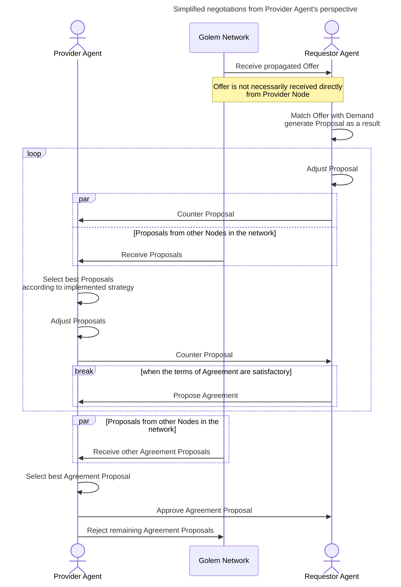
```mermaid
---
title: Simplified negotiations from Provider Agent's perspective
---
sequenceDiagram
  actor ProviderAgent as Provider Agent
  participant GolemNetwork as Golem Network
  actor RequestorAgent as Requestor Agent

  GolemNetwork->>RequestorAgent: Receive propagated Offer
  Note over GolemNetwork,RequestorAgent: Offer is not necessarily received directly<br/> from Provider Node
  RequestorAgent->>RequestorAgent: Match Offer with Demand <br/>generate Proposal as a result

  loop
    RequestorAgent->>RequestorAgent: Adjust Proposal
    
    par
      RequestorAgent->>ProviderAgent: Counter Proposal
    and Proposals from other Nodes in the network
      GolemNetwork->>ProviderAgent: Receive Proposals    
    end

    ProviderAgent->>ProviderAgent: Select best Proposals <br/>according to implemented strategy
    ProviderAgent->>ProviderAgent: Adjust Proposals
    ProviderAgent->>RequestorAgent: Counter Proposal

    break when the terms of Agreement are satisfactory
      RequestorAgent->>ProviderAgent: Propose Agreement
    end
  end
  
  par Proposals from other Nodes in the network
    GolemNetwork->>ProviderAgent: Receive other Agreement Proposals
  end
  ProviderAgent->>ProviderAgent: Select best Agreement Proposal
  ProviderAgent->>RequestorAgent: Approve Agreement Proposal
  ProviderAgent->>GolemNetwork: Reject remaining Agreement Proposals
```

##### Example of negotiation

To better understand the [Negotiation](#process-of-negotiations-and-making-an-agreement) process, let’s consider an example 
involving the negotiation of a [payment platform](#payment-platform). This will illustrate how agents can use different
strategies and what negotiation protocols can be built on top of the [property and language](#discovery-and-offersdemand-matching).

When declaring a payment platform in an [Offer](#offer), the Provider Agent lists [wallet](#wallet) addresses for each
platform it supports. It is the Requestor Agent's responsibility to choose the platform by specifying the appropriate
[property](#property) in their demand. The Requestor Agent can approach negotiations in two ways:

###### 1. Static Negotiations
Suppose the Requestor Agent prefers payments on the Polygon network. In this case, they require the Provider Agent to support
Polygon and will not select a Provider Agent that doesn’t.

Since the Requestor has a specific requirement, multiple negotiation stages aren't necessary. They can simply add
a [constraint](#constraint) to their [Demand](#demand), instructing the matching algorithm to filter out Providers that
don’t meet this requirement. In their Demand, they set the chosen platform as a fixed value.

###### 2. Dynamic Negotiations
Now imagine a Requestor Agent that can pay on multiple platforms but prioritizes them based on transaction fees. In this
scenario, the Requestor Agent has a larger pool of potential Providers since they don’t restrict the platform by adding
a constraint to their demand.

Instead, the Requestor Agent collects Proposals from the market and evaluates them based on estimated costs. In later stages
of Proposal exchange, they choose the platform by setting the relevant [property](#property) according to the Providers' scores,
which are based on potential [transaction](#transaction-on-blockchain) costs.

#### 4. Allocate the promised Resources in accordance with the Agreement

Once the [Agreement](#agreement) is signed, the Provider Agent is expected to reserve the promised [resources](#resource) for the
Requestor’s use. During this time, the Provider Agent cannot sell these resources to anyone else and must be prepared
to start the [Activity](#activity). For instance, if the Provider Agent is selling computing power through a [Virtual Machine Execution
Environment](#vm), they declared in the Agreement a specific amount of RAM and a certain number of threads to be allocated for the VM.
The Provider Agent can only sell any remaining RAM and cores to other Requestors.

Making an Agreement reserves the Provider's resources. To actually use these resources, the Requestor Agent must take
an additional step by creating an [Activity](#activity). Most parameters are already included in the Agreement, but some
additional parameters may be required and will be specified later using Activity commands. For example, if the Requestor Agent
wants to utilize the Provider's resources by running a virtual machine, details like the [image](#vm-image) to run, RAM, and the
number of cores are taken from the Agreement. However, to allocate an IP address or transfer necessary files, Activity
[commands](#controlling-exeunit-basic-concepts) are used. Further details on controlling an Activity from the Requestor's
perspective can be found in the["Running something"](#running-something) section.

From the Provider Agent's perspective, the primary focus is to listen for incoming Activity events and create an Activity
when requested by the Requestor Agent. Upon receiving an Activity creation event, the Provider Agent should spawn an
[ExeUnit](#exeunits) process (and a Virtual Machine in consequence). Conversely, receiving an Activity destruction event should trigger
the termination of the ExeUnit processes.

The Requestor Agent is allowed to spawn multiple Activities consecutively. In general, multiple Activities running
simultaneously may be permitted; however, this does not apply in the case of a [Virtual Machine](#vm), as hardware
resources can only be allocated once.

#### 5. Monitor resources usage and charge Requestor Agent

The [ExeUnit](#exeunits) is directly controlled by the Requestor Agent, with no intervention from the Provider Agent.
Communication happens solely between the Requestor Agent and the ExeUnit. However, this doesn't mean the Provider
Agent is inactive during this time. The Provider Agent's responsibility is limited to calculating the cost of resource usage
based on the pricing model defined in the Agreement and informing the Requestor Agent accordingly.

There are two types of payment documents used in the Golem Network: [Debit Notes](#debit-note) and [Invoices](#invoice).

Debit Notes are sent at regular intervals during the execution of an activity to inform the Requestor Agent of the
accumulating costs of the Agreement. These notes act as building blocks that support various payment schemes.
The handling of Debit Notes by Agents is governed by the terms negotiated in the Agreement. Generally, Debit Notes
serve the following purposes:
- Informing the Requestor Agent about resource usage and activity costs, and obtaining explicit acceptance of these costs.
- Acting as a health check, allowing the Provider Agent to monitor if the Requestor Agent is still active and hasn’t
  abandoned the Agreement, helping avoid not getting paid.
- Facilitating [mid-agreement payments](#mid-agreement-payments).

Invoices are issued after the Agreement is terminated, providing a summary of the total costs. They allow the Provider
Agent to include any additional costs not covered in the Debit Notes, as the final Debit Note doesn’t have to be sent
immediately after the activity ends.

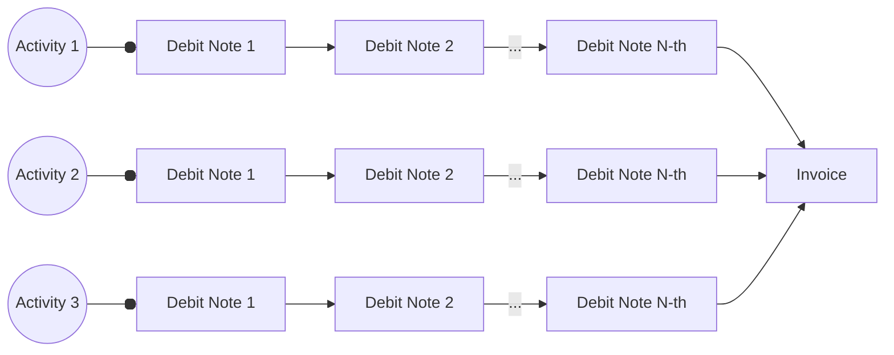
```mermaid
flowchart LR
Activity1((Activity 1)) --o D11[Debit Note 1] --> D12[Debit Note 2] -->|...| D13[Debit Note N-th] --> Invoice[Invoice]
Activity2((Activity 2)) --o D21[Debit Note 1] --> D22[Debit Note 2] -->|...| D23[Debit Note N-th] --> Invoice[Invoice]
Activity3((Activity 3)) --o D31[Debit Note 1] --> D32[Debit Note 2] -->|...| D33[Debit Note N-th] --> Invoice[Invoice]
```

Both Debit Notes and Invoices can be either accepted or rejected by the other party. Acceptance signals that the
Requestor Agent agrees to pay the specified amount. Rejection, on the other hand, indicates refusal to pay the
non-accepted amount. However, it’s important to note that a rejection does not absolve the Requestor Agent from paying
for all previously accepted Debit Notes. The conditions under which rejection is allowed should be defined in the
Agreement. Currently, no payment scheme permits rejections.

Accepting a Debit Note or Invoice does not result in immediate payment for a few reasons.
Debit Notes can be classified as payable or non-payable, with payable Debit Notes identified by the due date included
in the document. While payable Debit Notes are scheduled for processing upon acceptance, this still does not necessitate
immediate payment. The payment mechanism allows for the [batching of payments](#payments-batching) or delaying them
to accommodate additional Debit Notes or [Invoices](#invoice), thereby reducing [transaction](#transaction-on-blockchain) costs on the blockchain.

The consequence of delaying payments is that they are not guaranteed. However, this design opens the possibility of
implementing mechanisms that can mitigate or eliminate the risk of non-payment. For instance, a payment platform
could be developed using a deposit or escrow contract, or by integrating payment channels into the Core Network.

It’s important to note that, regardless of the payment scheme or platform used, Golem Factory does not act as an
intermediary for payments. Since transactions occur on the blockchain, and due to the decentralized nature of blockchain
technology, Golem Factory has no control over these transactions.


Invoices are issued after the Agreement is terminated, providing a summary of the total costs. They allow the Provider
Agent to include any additional costs not covered in the Debit Notes, as the final Debit Note doesn’t have to be sent
immediately after the activity ends.


```mermaid
flowchart LR
Activity1((Activity 1)) --o D11[Debit Note 1] --> D12[Debit Note 2] -->|...| D13[Debit Note N-th] --> Invoice[Invoice]
Activity2((Activity 2)) --o D21[Debit Note 1] --> D22[Debit Note 2] -->|...| D23[Debit Note N-th] --> Invoice[Invoice]
Activity3((Activity 3)) --o D31[Debit Note 1] --> D32[Debit Note 2] -->|...| D33[Debit Note N-th] --> Invoice[Invoice]
```

Both Debit Notes and Invoices can be either accepted or rejected by the other party. Acceptance signals that the
Requestor Agent agrees to pay the specified amount. Rejection, on the other hand, indicates refusal to pay the
non-accepted amount. However, it’s important to note that a rejection does not absolve the Requestor Agent from paying
for all previously accepted Debit Notes. The conditions under which rejection is allowed should be defined in the
Agreement. Currently, no payment scheme permits rejections.

Accepting a Debit Note or Invoice does not result in immediate payment for a few reasons.
Debit Notes can be classified as payable or non-payable, with payable Debit Notes identified by the due date included
in the document. While payable Debit Notes are scheduled for processing upon acceptance, this still does not necessitate
immediate payment. The payment mechanism allows for the [batching of payments](#payments-batching) or delaying them
to accommodate additional Debit Notes or [Invoices](#invoice), thereby reducing [transaction](#transaction-on-blockchain) costs on the blockchain.

The consequence of delaying payments is that they are not guaranteed. However, this design opens the possibility of
implementing mechanisms that can mitigate or eliminate the risk of non-payment. For instance, a payment platform
could be developed using a deposit or escrow contract, or by integrating payment channels into the Core Network.

It’s important to note that, regardless of the payment scheme or platform used, Golem Factory does not act as an
intermediary for payments. Since transactions occur on the blockchain, and due to the decentralized nature of blockchain
technology, Golem Factory has no control over these transactions.

#### 6. Terminate the Agreement or await the Agreement termination event from the Requestor Agent

The [Agreement](#agreement) can be terminated when either party chooses to end it. Core Network doesn't enforce any
specific termination rules, so the Agreement should clearly define the conditions under which termination is
permitted. Below is a non-exhaustive list of possible reasons for termination:
- The Agreement expires if it was established for a fixed duration.
- The Requestor Agent no longer needs the [resources](#resource) or has completed the computations.
- One of the parties violates the terms of the Agreement, such as:
  - The Requestor Agent fails to accept [Debit Notes](#debit-note) within the agreed timeframe.
  - The Provider Agent issues Debit Notes more frequently than agreed.
  - The Requestor Agent fails to make timely payments, particularly in cases involving [mid-agreement payments](#mid-agreement-payments).

It is the Agent—whether Requestor or Provider—who decides to terminate the Agreement. The Agent is also responsible for
detecting if the other party has terminated the Agreement and taking the appropriate action in response.

Provider Agent has the option to attach additional information outlining the reasons for termination when ending the
Agreement. While this is not mandatory, it is encouraged as it can provide valuable context for the other party,
serving as diagnostic information or for other purposes.

The [Agreement](#agreement) can be terminated when either party chooses to end it. Core Network doesn't enforce any
specific termination rules, so the Agreement should clearly define the conditions under which termination is
permitted. Below is a non-exhaustive list of possible reasons for termination:
- The Agreement expires if it was established for a fixed duration.
- The Requestor Agent no longer needs the [resources](#resource) or has completed the computations.
- One of the parties violates the terms of the Agreement, such as:
  - The Requestor Agent fails to accept [Debit Notes](#debit-note) within the agreed timeframe.
  - The Provider Agent issues Debit Notes more frequently than agreed.
  - The Requestor Agent fails to make timely payments, particularly in cases involving [mid-agreement payments](#mid-agreement-payments).

It is the Agent—whether Requestor or Provider—who decides to terminate the Agreement. The Agent is also responsible for
detecting if the other party has terminated the Agreement and taking the appropriate action in response.

Provider Agent has the option to attach additional information outlining the reasons for termination when ending the
Agreement. While this is not mandatory, it is encouraged as it can provide valuable context for the other party,
serving as diagnostic information or for other purposes.

#### 7. Send an Invoice summarizing the total cost of the Agreement

Once the Agreement is terminated, the Provider Agent should send an [Invoice](#invoice) to the Requestor Agent summarizing
the total costs incurred throughout the Agreement. This Invoice should reflect the cumulative costs from all [Activities](#activity).
In response, the Requestor Agent must either accept or reject the Invoice. However, regardless of the acceptance status,
payment is mandatory for the total amount indicated by the accepted [Debit Notes](#debit-note), as their acceptance constitutes
a binding commitment to pay.


```mermaid
flowchart LR
Activity1((Activity 1)) --o D11[Debit Note 1] --> D12[Debit Note 2] -->|...| D13[Debit Note N-th] --> Invoice[Invoice]
Activity2((Activity 2)) --o D21[Debit Note 1] --> D22[Debit Note 2] -->|...| D23[Debit Note N-th] --> Invoice[Invoice]
Activity3((Activity 3)) --o D31[Debit Note 1] --> D32[Debit Note 2] -->|...| D33[Debit Note N-th] --> Invoice[Invoice]
```


Once the Agreement is terminated, the Provider Agent should send an [Invoice](#invoice) to the Requestor Agent summarizing
the total costs incurred throughout the Agreement. This Invoice should reflect the cumulative costs from all [Activities](#activity).
In response, the Requestor Agent must either accept or reject the Invoice. However, regardless of the acceptance status,
payment is mandatory for the total amount indicated by the accepted [Debit Notes](#debit-note), as their acceptance constitutes
a binding commitment to pay.

#### 8. Wait until the payment for the Invoice is settled and payment confirmed.

It's important for the Provider to monitor payments after the Agreement is completed. This is when the Provider Agent
should adjust its market strategy to ensure profitability. Since the Core Network doesn't guarantee payment delivery,
the Provider Agent should implement measures to prevent being exploited by Requestors. One example is rejecting
non-paying Requestors and prioritizing those with a good reputation. Lack of payment isn't the only reason for
declining a Requestor in the future. The Provider Agent may also choose to reject subsequent Agreements with
Requestors who break the Agreement conditions.

Payment confirmation is received by the Provider Agent from the Requestor once the transaction is confirmed on the
blockchain. This confirmation specifies which Activities and Agreements are covered by the transaction. There is no
1-to-1 relationship between transactions and Activities or Agreements. A single blockchain transaction can cover
multiple Activities or Agreements, while each Activity or Agreement may also be covered by multiple transactions.

Payments are not immediate for several reasons: they are not scheduled right away, and batching 
may occur. Furthermore, blockchain transactions are not immediate and may take time to process. Therefore, the Provider
Agent should monitor Payment events. This can be done by listening for status changes to Settled on Invoice and Debit Note
events, or by tracking payment events to receive notifications for each transaction.

Payment confirmation is received by the Provider Agent from the Requestor once the transaction is confirmed on the
blockchain. This confirmation specifies which Activities and Agreements are covered by the transaction. There is no
1-to-1 relationship between transactions and Activities or Agreements. A single blockchain transaction can cover
multiple Activities or Agreements, while each Activity or Agreement may also be covered by multiple transactions.

### Searching on market

Providers or Requestors on Golem don’t always aim to buy or sell resources. Sometimes, they simply want to observe the market.
There are several possible reasons for this:
- Checking which resources are available on the network
- Estimating potential computation costs
- Gathering insights to better adjust negotiation strategies
- Collecting statistics about the network

The approach to observing the market is similar to the methods described in the chapters on buying and selling resources.
An agent specifies their Offer or Demand using a property and constraints specification language.
The key difference is that they are not required to negotiate with other agents, nor must they provide all necessary
information in their Offer or Demand. This is a more lightweight approach compared to going through the full negotiation
process.

### Buying on golem platform.

Buying on Golem Network, just like [selling](#selling-on-golem-platform),
involves the [Requestor](#requestor) specifying what one needs in a formal
language, letting the platform match Offers and a [Requestor
Agent](#requester-agent) software negotiate and seal the deal.

More specifically, the the Requestor and Requestor Agent need to:
1. Configure and fund the Wallet
1. Allocate funds
1. Create a Demand
1. Negotiate and Agreement
1. Activate the service and supervise the Agreement 
1. Closure the Agreement

#### 1. Configure and fund the Wallet

Before the Requestor begins, they must secure appropriate funds. To do this,
they should have funds on the wallet address from which they will pay, on one of
the two supported blockchains: Ethereum or Polygon. It is strongly recommended
to use the Polygon network.

The Requestor buys GLM tokens on the Polygon network (address:
0x0B220b82F3eA3B7F6d9A1D8ab58930C064A2b5Bf), for example, using the
Quickswap application, and transfers them to the key address generated during
wallet configuration.

They can also purchase funds via credit card through the onboarding portal.

#### 2. Allocate funds

Since multiple applications using the same wallet can run on a single node, it
is required to reserve funds for a task to reduce potential issues before
creating an order. The reservation can be expanded or reduced as execution
progresses. Such a reservation is called Allocation.

Creating an Allocation verifies that:

- There are sufficient funds on the given wallet and network.
- There is proper communication with the blockchain node.
- The sum of allocations does not exceed the account balance.

#### 3. Create a Demand

The Requestor (a person) does not browse through all Providers' Offers on their
own. Instead, the Requestor Agent is used to programmatically specify which
Offers are acceptable. Such a specification is called a Demand in the Golem
nomenclature. The Requestor Agent doesn't send a Demand anywhere - it is its
internal, ephemeral way of filtering the Offers.

A requestor can specify the same things in a Demand, which the Provider's can in
an Offer. This was described in detail in the [section about
selling](#1-describe-resources-using-property-language-to-create-an-offer).

#### 4. Negotiate and Agreement

As Offers are propagated through Golem Network, the matching ones are delivered
to the Requestor Agent. The section on [Selling on
Golem](#3-monitor-incoming-proposals-and-negotiate-an-agreement-with-the-most-promising-requestor)
describes this process in detail.

#### 5. Activate the service and supervise the Agreement 

With an active Agreement, the Requestor activates the service by creating an
Activity. For a more detailed description defer to the section on [Selling on
Golem](#5-monitor-resources-usage-and-charge-requestor-agent).

#### 6. Closure the Agreement

The Requestor is responsible for terminating the Agreement.  This notifies the
Provider to terminate all activities associated with that contract.  The
Requestor receives an Invoice summarizing the expenses from all Activities
active under the agreement.  The Requestor confirms that the amount is correct.
After some time, Golem transfers tokens to Provider's wallet as payment for the
service.

## Layers

Golem Network's applications are unknown in advance. Therefore, based on past
experience, a decision was made to design the architecture flexible enough to
swap out key components. This resulted in a three-layer architecture.

### Core Network

The Core Network is the lowermost layer and represents the core of Golem
Network. It connects machines to form a decentralized network of independent
agents trading resources. In particular, the following aspects of Golem Network
fall into this layer:
 - Communication between Nodes
 - Discovering Offers in the network
 - The mechanics of negotiations (i.e. the structure and flow of Offers and
   counter-Offers, but not the negotiation strategies nor the semantics of what
   is being negotiated)
 - Requesting payments for services
 - Processing payments
 - Ability to transmit events leading to the start of Agreement execution

What is not part of the Core Network:
- File transfer (this needs to be addressed in other layers)
- VPN and other substitutes for direct communication like HTTP proxies, etc.

This layer is divided into fundamental areas:
- Network: Determines how Nodes find each other and provides means for them to
  communicate with each other
- Identity: Managing identity in the network. Provides other modules with
  access to keys identifying the Nodes
- Market: Includes functions for searching for offers, broadcasting offers,
  negotiating Agreements and notifications about the start and end of an
  Agreement.
- Payment: Includes functions for reserving funds, notifying about costs,
  agreeing on settlements, and making payments.
- Activity: Introducing the state machine governing how services are performed
  by Providers, i.e. Activities.

### Execution

The Core Network only specifies a way to express abstract resources and
ExeUnits. Execution Layer is what gives those resources meanings, e.g. CPU, RAM,
GPU and ways to utilize them (e.g. through a VM or a WASM runtime). On top of
this, this layer provides all the necessary tools to allow higher layers to
build on top of it (e.g. transferring an VM image to a VM Provider to run). More
specifically, the following aspects fall into this layer:
- Downloading images needed to execute the task (e.g., AI models or VM images)
- Managing the cache of these images
- Transferring files using various protocols
- Launching processes and monitoring their state
- Monitoring resource usage
- Assigning and executing scripts with commands sent to providers
- Tools for local firewall management for outgoing traffic
- VPN mechanisms and other communication methods between running components
  (e.g., message queue server, HTTP proxy)

In this layer, there will be various execution engines such as:
- VM (launching workloads by starting a VM with a provided image)
- WASI (launching workloads by starting a WASM binary in a sandbox)
- GamerHash AI runtime (launching workloads on a specialized ExeUnit for AI
  inference using one of three curated inference frameworks)
- Outbound gateway (only routing traffic to the outside world)

### Application logic

This layer utilizes components from the Core Network and Execution layers to
implement applications. The layer is delivered in the form of SDKs, which
enables developers to use the other layers in an idiomatic way. For some use
cases there are also binaries prepared (e.g. to buy or sell computing resoures
as virtual machines - a binary for expressing needs in a way similar to `docker
compose` and a binary to run in order to provide those resources as VMs to the
market.

These aspects of Golem Network fall into this layer:
* Determining what to sell/buy
* Negotiating Agreements terms:
  * what to buy/sell
  * for how much
  * on what terms (how long it will last, under what circumstances it can be
    terminated, what significance the attributes of the negotiated contract
    have)
  * to/from whom
* Determining reputation of other Golem participants
* Verification of whether the Activities performed by the other party are valid
* Determining whether the costs charged by Providers is valid


## Functional modules

decomposition into functional areas and scopes of responsibility of these layers.

### Market
### Payment
### Activity
### Identity
### Net

## Applications/Exe-Units

a brief overview of sample applications.

### WASM Runtime

### VM Runtime

### GH/AI Runtime

### HTTP Auth Runtime 

## Artifacts

This section describes the artifacts, i.e. the terms introduced in Golem Network
on which actors can act. They are organized by respective aspects of Golem
Network. The descriptions describe their function rather than their
implementation.

Section should serve as dictionary to be linked by other chapters.

### Participating entities

#### Yagna Node

Golem Node AKA Yagna daemon AKA simply Yagna is the building block of the Core
Network. It is a daemon which every participant needs to run in order to join
the Golem Network. The network of these daemons implements all the core
functionalities of Golem Network, i.e. offer propagation, payments, discovery,
etc.

#### Provider agent

A resource-selling application. It uses the Core Network to broadcast Offers
on the market and negotiate a Agreements. It is responsible for price
negotiations and issuing invoices for the used resources.

These are examples of Provider Agents:
* VM Provider - an application which is able to sell compute resources which
  will be delivered to buyers as virtual machines
* AI provider - an application which has a curated set of AI inference
  frameworks which can be bought to provide resources for that inference
* Ethereum node - an application which allows running an Ethereum node on the
  provided resources

#### Requester agent

A resource buying application. It uses the Core Network to find Offers on the
market and negotiate Agreements. It is responsible for price negotiations and
verifying costs during service agreement.

This can either be applications developers implement using Golem's SDKs or an
[application prepared by
Golem](https://docs.golem.network/docs/creators/dapps/creating-golem-dapps)
which buys and configures resouces as directed via a domain specific language,
similar to `docker-compose`.

### Marketplace

#### Offer
Offer is a document specifying Provider's capabilities.
##### Property
Property is a key-value pair present in Offers and Demands specifying properties
of the Node producing the document.
##### Constraint
Constraints describe the required values of properties during Agreement matching.
A constraint in an Offer will reject Demands that whose properties don't match
the constraint and vice-versa.
#### Demand
Demand is a document describing a need for computation used for filtering Offers.
#### Proposal
Proposal is formed when the Requestor Agent finds a suitable Offer matching a
Demand, and then sent to the Provider. In a happy path, this leads to creation
of an Agreement.
#### Negotiation
Negotiation is a process of augmenting negotiable properties if they don't match
the constraints.
#### Agreement
Agreement is a document that refers to matched Offer and Demand after the
Provider Agent accepts a Proposal. Performing work on the Provider requires
having an Agreement.

### Execution system
#### Resource
A Resource can be CPU-time, storage, total runtime or anything else that is
defined to be a resource by the Provider. This closely ties to Usage Counters,
see [ExeUnits section](#ExeUnits).
#### Activity
Activity is created by the Requestor Agent when they wish to actually perform
work within an Agreement. A successfully created Activity leads to spawning an
ExeUnit.
#### Execution environment (ExeUnit)
*An* ExeUnit is software that performs work on the Provider's machine on behalf
of the Requestor.
##### ExeUnit Command
ExeUnit Command is an instruction to the ExeUnit running within an activity.
This can pertain to transferring files or deploying an image.
##### ExeUnit Batch
ExeUnit Batch is a sequence of commands submitted to the ExeUnit at once.
##### VM
VM is the Virtual Machine created by the [VM Runtime](#vm-runtime) which
isolates Requestor's work from the Provider's machine.
##### VM Image
VM Image is a squashfs image with Golem-specific metadata.
##### WASM
WASM is a method of computation used by the [WASM Runtime](#wasm-runtime). This
too is sandboxed from the perspective of the machine running the Provider Agent.
##### WASM image
WASM Images are binaries compliant with the WASI standard to be executed by
Wasmtime.

### VPN
VPN is a kind of Virtual Private Network simulated on Golem Network. It allows
communication between the Requestor and instances of the VM Runtime as if they
were in a local network.
#### Network
TODO

### Payment System
#### Payment Driver
Payment Driver abstracts away the underlying payment mechanism and only exposes
a unified interface for the Payment Component of the Golem Node to consume.
#### Payment Platform
See `Important terms` in [Payments](#payments).
#### Token
Tokens are ERC20-compatible.
#### Wallet
Yagna serves as a blockchain wallet – it stores Ethereum private keys (see
[Identity](#identity)) and allows checking owned funds as well as making
transactions via a [Payment Driver](#payment-driver)
#### Allocation
An Allocation is a means of budgeting funds on the Golem Node.
#### Debit Note
Debit Note is an optionally payable document describing the amount due for
a given activity produced in regular intervals by the Provider Agent *before*
the Agreement is closed.
#### Invoice
An Invoice is a payable document produced by Provider Agent *after* the
Agreement concludes.
#### Payment
Payment is a transfer of funds from the Requestor to the Provider done via the
payment mechanism agreed upon in the Agreement.
#### Transaction (on blockchain)
Blockchain transactions are the only currently supported means of transferring
funds.

## Key architectural decisions
### GLM is built on XYZ
### GLM is used for clearing
### No centralized offer matching rules
### Only providers' offers are propagated
### Agreements are not stored on the blockchain
### Offline Requestors are not supported 
### Local storage (TODO: what role does the local DB play?)

## Technical view - components
This section describes key components of Golem Network, i.e. their
responsibilities, interfaces and which other components they utilize.

### Identity
Identity is a unique identifier of a Node in the Golem Network which is used to
name other nodes. This comes up in a number of cases:
- Sending a message to a node on the Golem Network requires the identity, so
  e.g. broadcasting Offers requires first discovering some Nodes as identified
  by their Identities.
- Documents such as Agreements, Invoices or DebitNotes refer to Nodes by their
  Identities.

The identities are stored and managed by the Identity module in Yagna. It allows
creation, deletion, exportion, importing and encrypting (locking) identities.
If an identity is locked, it cannot be used until the user enters the password.

### Identity Management
- The identities are managed via CLI commands implemented by the Identity Module.
- Exporting a locked identity requires it first be unlocked.
- Identities are exported either as encrypted secrets in a JSON file or plaintext
  private key, the second of which is mostly recommended for testing.

#### Cryptography
Golem Network relies on ECDSA keypairs created with the secp256k1 elliptic curve,
same as Ethereum. The first 20 bytes of the public key, encoded as a hex string
form the Identity. This string is, in fact, exactly equivalent to the public
address on Ethereum corresponding to the same private key.

#### Signing
The identity module implements message signing. It binds to the `Sign` GSB
message and signs arbitrary 32-byte messages as if they were Ethereum
Transactions. Thanks to this the private key is never leaked out of the Identity
module, which makes ensuring that it stays secure easier.

#### Application Keys
The identity module also manages Application Keys, multiple of which (or none)
may correspond to a single Identity. An Application Key must be passed in
headers of all REST API requests other than `/version/get`. This allows the
port on which the REST API services are served to be exposed to the internet
without the risk of a 3rd party misusing the Node. Additionally, this alllows
implementation of a proper permission system where a single Golem Node instance
is shared across a number of untrusted users in a manner in which they cannot
harm each other or the Operator of the Node.

The Application Key is also what determines which Identity is used in the case
that multiple exist.

#### Payments
Identities and Accounts are currently the same thing. When an Identity is
created, it can be used for Payments right away if it has sufficient funds.
Holding an App Key corresponding to the Identity is all that is needed to use
it for making transactions.

A piece of relevant historical context is that Yagna once managed Accounts
separately, the user had to run a specific CLI command to create an Account
corresponding to a specific Identity with permissions to send or receive funds.
The second one was mostly theoretical, as one cannot block others from sending
them funds, but the first one was very real – unless the Account with the
send-permission has been created manually, funds couldn't be expended from the
Ethereum accounts corresponding to the given Identity. This however turned out
to be more of a chore than a useful security mechanism, so Accounts became
equivalent to Identities.

### GSB

Golem Network is built using a custom distributed component model known as
the **Golem Service Bus** (GSB). Functionally, it is similar to technologies
like [Windows
DCOM](https://en.wikipedia.org/wiki/Distributed_Component_Object_Model),
[CORBA](https://en.wikipedia.org/wiki/CORBA), and
[UNO](https://en.wikipedia.org/wiki/Universal_Network_Objects). In a nutshell,
this model mans that:
* Applications are built by composing these self-contained components, which
  encapsulate specific functionality.
* Each component exposes a well-defined interface, enabling interaction with
  other components without exposing internal details.
* Components can be accessed and invoked using a consistent method, whether they
  are local or remote.
* The caller doesn’t need to know where the component resides (e.g., in the same
  process, on another machine) or manage its lifecycle directly.

Key characteristics of GSB include:
* **Language specificity**: GSB is not language-independent. While it is
  theoretically possible to create compatible implementations in other
  languages, only a Rust implementation currently exists. No formal effort has
  been made to specify or develop implementations beyond Rust.

* **Prefix-based component responsibility**: In GSB, components are addressed
  by paths. Components can be responsible not just for a single path but for all
  paths that share a certain prefix. This design allows the path itself to carry
  additional payload information, enabling flexible and dynamic routing. Users
  provide GSB with a path, and the process forwards the entire path to the
  component mapped to the matching prefix.

* **Absence of remote service concepts**: GSB does not distinguish between
  local and remote services. Instead, a dedicated component, called
  [Net](#networking), is responsible for forwarding traffic to remote targets.
  The target’s address is specified within the path, and the Net component
  [uses this address](#gsb-prefix-mappings) to direct the payload to the
  appropriate remote destination. It then removes the address prefix from the
  path before forwarding the remaining path (and payload) to the destination.

Except for the above, most intuitions from the listed similar technologies
should apply.

### Networking

The network layers aim to provide a developer-friendly interface for Node-to-Node communication within the Golem 
Network, abstracting the complexity of underlying network operations. Developers interact with the network layer via
[GSB (Golem Service Bus)](#gsb), allowing remote calls between Nodes to feel as seamless as local service calls.

The Network module offers the following core functionalities:
- Sending RPC messages to other Nodes (addressed by NodeId), with or without waiting for a response
- Sending RPC messages with a stream response
- Support for choosing between reliable and unreliable message delivery options.
- Forwarding network-received RPC messages to the appropriate modules listening on the GSB
- Introducing a network topology, i.e.
  - The concept of neighbors - a subset of nodes on the network which the topology considers closest
  - The ability to send messages to the nearest neighborhood; we call those "broadcast messages" and they are used
    by upper layers for broadcasting information across the network; these broadcast messages are sent for
    "topics" for convenience
  - Registering handlers for incoming broadcast messages based on specified topics

These requirements give rise to the following responsibilities that the Network module must address in its
implementation:
- **Node Discovery**: The Network module must locate Nodes by their NodeId to enable message delivery.
- **Creating Communication Channels**: The Network module must establish channels for two-way communication between
Nodes, accounting for Nodes that may be behind NAT or firewalls.
- **Defining Network Topology for Broadcasts**: The module determines which subset of Nodes will receive each
broadcast message.
- **Managing Broadcast Topics**: The module keeps track of broadcast topics and GSB handlers, which should be
triggered when a broadcast message is received.
- **Supporting Different Transport Types**: The underlying protocol must support both reliable message delivery and 
  a simpler, fire-and-forget mode.

The [Networking](#networking) chapter will focus on general networking concepts, while specific
implementations will be covered in the [Hybrid net](#hybrid-net) and [Central net](#central-net) chapters.

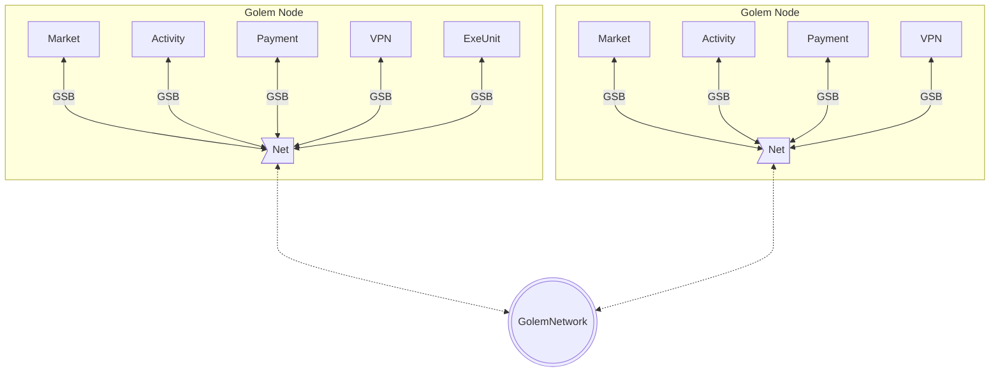
```mermaid
flowchart TB
  GolemNetwork(((GolemNetwork)))
  
  subgraph Node1[Golem Node]
      Net1>Net]
      Market1[Market] <--->|GSB| Net1
      Activity1[Activity] <--->|GSB| Net1
      Payment1[Payment] <--->|GSB| Net1
      VPN1[VPN] <--->|GSB| Net1
      ExeUnit1[ExeUnit] <--->|GSB| Net1
  end
  Net1 <-...-> GolemNetwork
  
  subgraph Node2[Golem Node]
    Net2>Net]
    Market2[Market] <--->|GSB| Net2
    Activity2[Activity] <--->|GSB| Net2
    Payment2[Payment] <--->|GSB| Net2
    VPN2[VPN] <--->|GSB| Net2
  end
  Net2 <-...-> GolemNetwork
```

##### GSB prefix mappings

The Net module follows specific GSB address naming conventions to enable cooperation with other modules. Addresses 
prefixed with `/net/{NodeId}` are reserved for the Net module, where it listens for incoming messages and forwards 
them to the Golem Network. Conversely, addresses starting with `/public/...` are available for yagna modules to expose 
public methods that can be called from other Nodes.

When the Net module receives a local incoming message, it extracts the NodeId from the address prefix and uses it to 
forward the message into the Golem Network. On the receiving end, messages coming from the Network are processed, 
and the address is checked to extract the NodeId. If the NodeId belongs to the recipient Node, the address is routed to 
the appropriate GSB handler registered under the `/public/...` address.

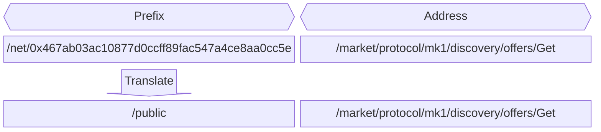
```mermaid
block-beta
    columns 2
    Prefix{{"Prefix"}}
    Address{{"Address"}}
    
    Prefix1["/net/0x467ab03ac10877d0ccff89fac547a4ce8aa0cc5e"]
    Address1["/market/protocol/mk1/discovery/offers/Get"]
    
    arrow1<["Translate"]>(down)
    space
    
    Prefix2["/public"]
    Address2["/market/protocol/mk1/discovery/offers/Get"]
```

##### Broadcasting

Message broadcasting in the Net module is organized around the concept of 'topics,' which can be thought of as 
message categories. Different modules can register a message handler with the Net module that gets triggered 
whenever a message for a specific topic is received.

To send a broadcast message, a module must send a GSB message to the Net module on the designated topic. The Net module 
then forwards this message to the network. Depending on the network's implementation, the message may be routed 
either to neighboring Nodes or to all Nodes across the network.

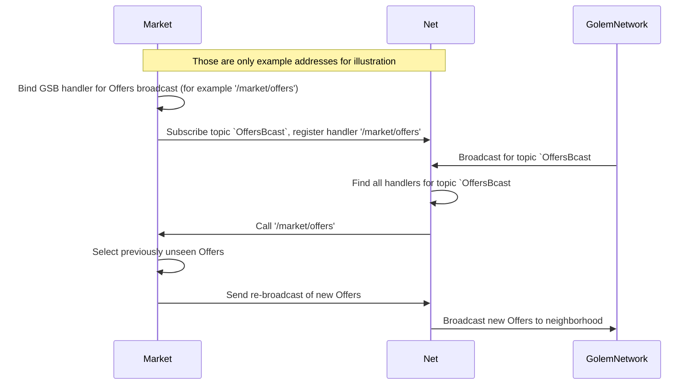
```mermaid
sequenceDiagram
    participant Market
    participant Net
    participant GolemNetwork
    
    Note over Market, Net: Those are only example addresses for illustration 
    Market->>Market: Bind GSB handler for Offers broadcast (for example '/market/offers')
    Market->>Net: Subscribe topic `OffersBcast`, register handler '/market/offers'
    GolemNetwork->>Net: Broadcast for topic `OffersBcast
    Net->>Net: Find all handlers for topic `OffersBcast
    Net->>Market: Call '/market/offers'
    Market->>Market: Select previously unseen Offers
    Market->>Net: Send re-broadcast of new Offers
    Net->>GolemNetwork: Broadcast new Offers to neighborhood
```

##### Handling identities

Each Golem Node can have multiple identities, with one of them (the default identity) used to identify the Node 
within the network. However, operations on a Golem Node can also be performed in the context of secondary identities.
The Net module must be able to handle messages sent to and from any of these identities. For more information on 
identification, refer to the chapter about the [identity module](#identity). This section focuses solely on the Net 
module interface.

In addition to the GSB endpoints bound to the `/net/{NodeId}` prefix, as described in the [GSB prefix 
mappings](#gsb-prefix-mappings), there is another prefix: `/from/{LocalId}/to/{RemoteId}`. This enables messages to 
be sent from a specific identity on one Node to a specific identity on a remote Node.

The Net module always checks if the target identity belongs to the local Node. If it does, the message is routed 
back to the local GSB instead of being sent over the network. This mechanism allows GSB calls to be handled 
uniformly by the calling code, regardless of whether the target is local or remote.

##### Reliable, unreliable and transfers transport types

The Net module provides various transport types for message transmission. The basic type provides reliable message 
delivery via GSB, which is used for most control messages between Nodes.

However, certain functionalities require different handling. For example, VPN embeds IP packets into GSB messages 
and routes them through the Golem Protocol. Although VPN users can choose any protocol, TCP is typically used 
because many higher-level protocols rely on it. Sending VPN messages through a reliable protocol would hurt 
performance, as this would essentially embed TCP within TCP (or another reliable protocol implemented in Net). To 
address this, the Net module also allows for sending messages in an unreliable manner without packet delivery 
guarantee.

The third option is the transfer transport type. Functionally, this transport is equivalent to first transport type.
The only reason for its existence is prioritization of control messages. It is desirable that control messages be sent
right away, while high-bandwidth workloads (e.g. transferring an image) can be delayed. By splitting the channels
we're avoiding a situation when a control message awaits to be sent behind a huge back-log of non-latency-sensitive
messages. The network layer may implement this transport type by having a second TCP connection to ensure that.

All transport types are accessible to other modules via GSB under the following prefixes:
- `/net/{RemoteId}`
- `/udp/net/{RemoteId}`
- `/transfer/net/{RemoteId}`

For messages sent from non-default identities, the prefixes are:
- `/from/{LocalId}/to/{RemoteId}`
- `/udp/from/{LocalId}/to/{RemoteId}`
- `/transfer/from/{LocalId}/to/{RemoteId}`

#### Hybrid Net

Hybrid Net was developed as an intermediate step towards decentralization, enabling peer-to-peer (P2P) communication 
between some of Golem Nodes. However, since most of the network operates behind NATs, P2P cannot be the sole 
communication method. To address this, the Net implementation supports communication forwarding through specialized 
component known as Relay.

An additional advantage of relay server is it's ability to expedite Node discovery. In a pure P2P network, Node
discovery can be slow, as no single Node has a complete view of the network, requiring multiple hops to find new Nodes.
Relay server can also facilitate P2P communication between Nodes when direct connections are not possible.

Although HybridNet remains centralized for node discovery and relaying communication between Nodes behind NATs, 
broadcasting has already been designed in a decentralized manner as a step toward full network decentralization.

##### Nodes identification

A Golem Node is identified by its NodeId, which is derived from its public key. This NodeId allows the Node to be 
located within the network, and the public key is used to verify the Node’s identity. This ensures that only one 
Node can claim a specific ID within the network.

Additionally, each Node may have multiple secondary identities, each associated with its own public/private key pair.
The Net module must be capable of locating a Golem Node based on these secondary identities as well as the primary 
identity.

##### Relay server

The Relay server is a core component of the networking layer in the Golem Network. All newly connected Nodes 
register with the Relay server, providing the necessary information for discovery and communication. The Relay server:
- Maintains a list of Nodes present in the network.
- Stores each Node's public key, [identity](#identity) derived from the public key, and associated IP address.
- Stores information about which secondary identities are associated with specific Nodes.
- Assists in establishing peer-to-peer (p2p) communication when possible.
- Routes traffic between Nodes if a p2p communication cannot be established.
- Checks if connecting Nodes have public IP port exposed
- Offers functions for:
  - Querying Node's information.
  - Retrieving a Node's neighborhood.

Communication with the Relay server is handled through a custom protocol built on top of UDP, defined using Protocol 
Buffers (protobuf). UDP was chosen for its lightweight nature, as it does not require maintaining open connections, 
which would consume more system resources compared to TCP. This makes it possible to handle a large number of Nodes 
concurrently, ensuring decent scalability.

###### Connecting to Relay server

The Hybrid Net protocol introduces the concept of a Session, which operates on top of the UDP protocol. All requests 
to the Relay server and network traffic routing occur within the context of a Session, with only one Session allowed 
at a time. To establish a Session with the Relay server, a Node must undergo a handshake process that serves several 
purposes:
1. Verifies that the Node presenting its NodeId possesses the private key corresponding to that NodeId.
2. Collects and verifies any secondary identities associated with the Node.
3. Gathers additional Node information, such as supported symmetric encryption algorithms.
4. Determines if the Node is behind a NAT or if it has a public IP address and exposed port. The public IP acquired in 
   this step may later be used by other Nodes to establish a peer-to-peer Session.

**Challenge**

Identity verification is performed via a challenge mechanism, where the Relay server sends random bytes to the Node, 
which must compute a hash with a specified number of leading zeros. The difficulty level, set by the Relay server, 
determines the number of leading zeros required. This computationally expensive task protects the Relay server from 
DDoS attacks by forcing the Node to complete a certain amount of work before establishing a Session.

The challenge response is cryptographically signed using the private key of each identity associated with the Node.
The Relay server can then recover the Node's identities and public keys from these signatures, verifying that the Node 
possesses the corresponding private keys. The recovered public keys are later made available to other Nodes that 
request information about the Node.

**Public IP check**

When a Node initiates a Session, an additional mechanism is required to determine whether the IP address from which 
the packets are received is behind a NAT. This is achieved by sending Ping packets (network protocol ping, not to be 
confused with the ICMP packet) from a different UDP port than the one used for receiving incoming Sessions. This 
ensures that any network devices between the Node and the Relay server won't recognize these Ping packets as part of 
the same communication stream. If the ports are not publicly exposed, the Ping packets will be dropped, confirming 
that the Node is behind a NAT.

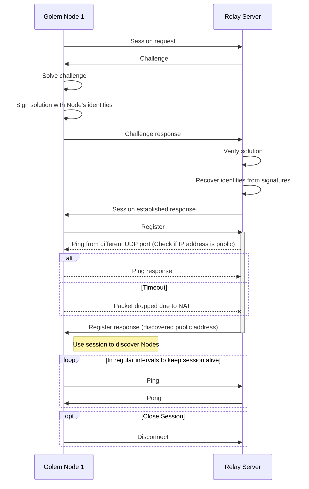
```mermaid
sequenceDiagram
    participant GolemNode as Golem Node 1
    participant RelayServer as Relay Server
    
    GolemNode->>RelayServer: Session request
    RelayServer->>GolemNode: Challenge
    GolemNode->>GolemNode: Solve challenge
    GolemNode->>GolemNode: Sign solution with Node's identities
    GolemNode->>RelayServer: Challenge response
    RelayServer->>RelayServer: Verify solution
    RelayServer->>RelayServer: Recover identities from signatures
    RelayServer->>GolemNode: Session established response
    
    GolemNode->>RelayServer: Register
    activate RelayServer
    RelayServer-->>GolemNode: Ping from different UDP port (Check if IP address is public)
    alt 
        GolemNode-->>RelayServer: Ping response
    else Timeout
        GolemNode--xRelayServer: Packet dropped due to NAT
    end
    RelayServer->>GolemNode: Register response (discovered public address)
    deactivate RelayServer

    Note right of GolemNode: Use session to discover Nodes 

    loop In regular intervals to keep session alive
        GolemNode->>RelayServer: Ping
        RelayServer->>GolemNode: Pong
    end
    
    opt Close Session
        GolemNode->>RelayServer: Disconnect
    end
```

Important note: The Relay server does not possess private keys, and its identity is not verified in the current 
implementation. This marks a significant distinction compared to the process of establishing peer-to-peer Sessions 
with regular Nodes.

##### Establishing Sessions between Nodes

Currently, a peer-to-peer (p2p) Session can be established in two scenarios. In the first, if the target Node has a 
public IP, the initiating Node can directly connect to it. In the second scenario, where the initiating Node has a 
public IP but the target Node is behind a NAT, the Session is facilitated by the Relay server. The initiating 
Node first sends a Reverse Connection message to the Relay server, which forwards it to the target Node. The target 
Node then attempts to establish a direct Session with the initiating Node. Whether the target Node has a public 
IP can be determined based on information returned by the Relay server.

Since the current Net implementation does not support NAT hole punching, if both Nodes are behind NAT, communication 
must be routed through the Relay server.

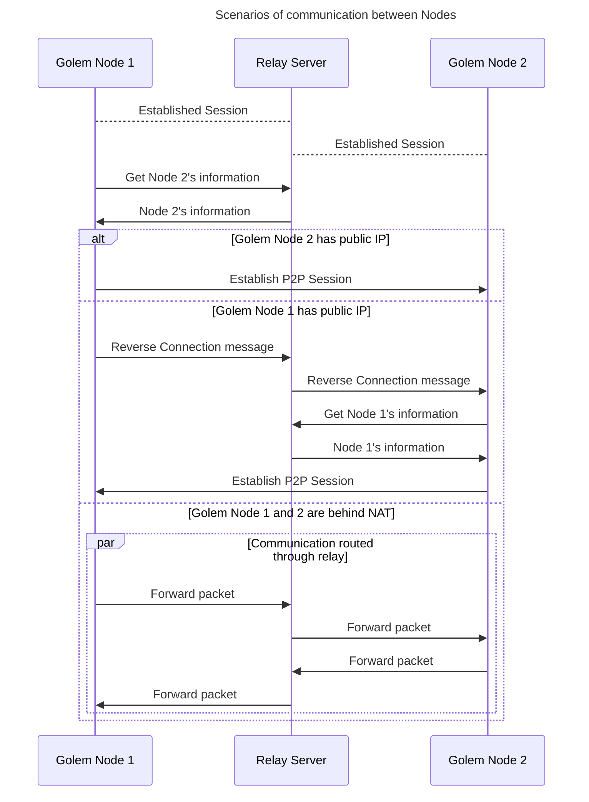
```mermaid
---
title: Scenarios of communication between Nodes   
---
sequenceDiagram
    participant GolemNode1 as Golem Node 1
    participant RelayServer as Relay Server
    participant GolemNode2 as Golem Node 2

    GolemNode1-->RelayServer: Established Session
    GolemNode2-->RelayServer: Established Session

    GolemNode1->>RelayServer: Get Node 2's information
    RelayServer->>GolemNode1: Node 2's information
    
    alt Golem Node 2 has public IP
        GolemNode1->>GolemNode2: Establish P2P Session
    else Golem Node 1 has public IP
        GolemNode1->>RelayServer: Reverse Connection message
        RelayServer->>GolemNode2: Reverse Connection message

        GolemNode2->>RelayServer: Get Node 1's information
        RelayServer->>GolemNode2: Node 1's information
        
        GolemNode2->>GolemNode1: Establish P2P Session
    else Golem Node 1 and 2 are behind NAT
        par Communication routed through relay
          GolemNode1->>RelayServer: Forward packet
          RelayServer->>GolemNode2: Forward packet
          GolemNode2->>RelayServer: Forward packet
          RelayServer->>GolemNode1: Forward packet 
        end
    end
```

**Peer-to-peer Session handshake**

Establishing a peer-to-peer (p2p) Session between Nodes is similar to the Relay server handshake but with a few 
key differences:
- Both Nodes must solve a challenge and prove their identities to each other.
- There is no registration step or public IP check, as the public IP of the Nodes is already known.
- The initiating Node sends a "Resume Forwarding" control message to the target Node, informing it that it can begin 
  sending packets. This step ensures that packets arriving too early are not dropped.

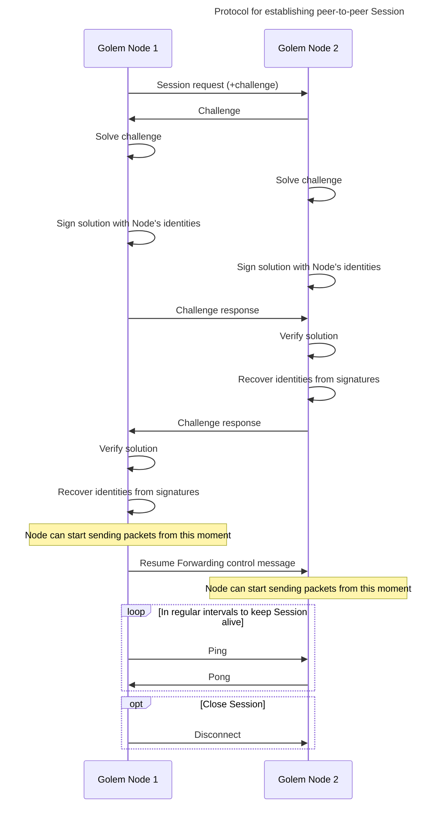
```mermaid
---
title: Protocol for establishing peer-to-peer Session   
---
sequenceDiagram
    participant GolemNode1 as Golem Node 1
    participant GolemNode2 as Golem Node 2
    
    GolemNode1->>GolemNode2: Session request (+challenge)
    GolemNode2->>GolemNode1: Challenge
    
    GolemNode1->>GolemNode1: Solve challenge
    GolemNode2->>GolemNode2: Solve challenge
    GolemNode1->>GolemNode1: Sign solution with Node's identities
    GolemNode2->>GolemNode2: Sign solution with Node's identities
    
    GolemNode1->>GolemNode2: Challenge response
    GolemNode2->>GolemNode2: Verify solution
    GolemNode2->>GolemNode2: Recover identities from signatures
    GolemNode2->>GolemNode1: Challenge response

    GolemNode1->>GolemNode1: Verify solution
    GolemNode1->>GolemNode1: Recover identities from signatures
    Note over GolemNode1: Node can start sending packets from this moment

    GolemNode1->>GolemNode2: Resume Forwarding control message
    Note over GolemNode2: Node can start sending packets from this moment

    loop In regular intervals to keep Session alive
        GolemNode1->>GolemNode2: Ping
        GolemNode2->>GolemNode1: Pong
    end
    
    opt Close Session
        GolemNode1->>GolemNode2: Disconnect
    end
```

##### Forwarding Network Traffic

The low-level abstraction provides a single message type for sending data: the `Forward` packet. This packet can be 
used to send arbitrary content between Nodes, either directly or through the Relay server. Like UDP, the Forward 
packet does not offer delivery guarantees. It is the responsibility of higher-level layers to ensure the correct and 
reliable delivery of data in case it is necessary.

##### Virtual TCP

To enable reliable data delivery, the hybrid Net utilizes an embedded TCP stack implementation. This stack takes an 
input data stream and generates IP packets, which are then sent using Forward packets. The receiving Node employs 
the TCP stack to decode incoming packets back into a message stream. These messages are subsequently dispatched as 
GSB messages and passed to the appropriate modules, as detailed in the [Address Translation chapter](#address-translation).

##### Reliable, unreliable and transfers transport types in Hybrid Net

Different transport types can be utilized to send messages, as explained in the [reliable, unreliable, and transfers 
channels chapter](#reliable-unreliable-and-transfers-channels). In the Hybrid Net, reliable and transfer transport 
types are distinguished by using separate TCP connections. This separation ensures that independent sender buffers 
are maintained, preventing messages in one channel from being blocked by messages in the other. Each transport type 
has its own single TCP connection. If multiple components within the same process need to use the transfer channel,
they will share a single TCP connection, competing for bandwidth. As there is no fair scheduling mechanism, one
component can easily starve another by producing messages at a sufficiently high rate.

The sender can also opt to use the unreliable transport, where GSB messages are sent directly as `Forward` packets 
without message fragmentation. A key implication of this is that large GSB messages could exceed the Maximum 
Transmission Unit (MTU) and may be dropped by network devices along the packet's route.

Transport channels are built on top of the underlying [sessions](#establishing-sessions-between-nodes). This means 
that regardless of the chosen transport, all incoming and outgoing packets are consistently sent through a single 
Session.

##### Broadcasting and neighborhood

Naively broadcasting information, where each Node contacts every other Node, poses significant scalability limitations.
Thus, a more efficient method of information dissemination is necessary. Hybrid Net's implementation draws inspiration
from the [Kademlia algorithm](https://pdos.csail.mit.edu/~petar/papers/maymounkov-kademlia-lncs.pdf), which utilizes distance metrics to minimize the number of control messages Nodes
need to exchange for discovery. While Kademlia serves a different purpose, Hybrid Net adapts its principles
by introducing the concept of a neighborhood.

**What is a Neighborhood?**

A neighborhood is a subset of Nodes that are considered closest to a given Node based on an abstract metric.
Each Node has its own neighborhood. This metric doesn't necessarily reflect the real-world proximity of Nodes.
For instance, two Nodes on opposite sides of the globe could be neighbors, while two Nodes within the same physical
network may be too distant in terms of this metric to be in the same neighborhood.

In peer-to-peer networks, the concept of Node distance is often used for efficient Node discovery. However, since 
the current Golem network layer relies on the Relay server for Node discovery, neighborhoods don't serve that 
purpose. Although it’s conceivable that a fallback, such as a Kademlia-like implementation, could be used in the 
event of a Relay server downtime, for now, the primary purpose of the neighborhood concept is broadcasting.

A technique used in various broadcasting algorithms ([example](https://docs.libp2p.io/concepts/pubsub/overview/))
involves disseminating information through the network by having each node send broadcast messages only to its 
neighbors, relying on those neighbors to forward the information further. HybridNet uses it as well. Its most 
significant application is in [the Offer Propagation algorithm](#offer-propagation). While the implementation of 
specific algorithms is handled by other modules, the network module provides the necessary operations as building 
blocks for these processes.

**Broadcasting**

HybridNet implements the broadcast operation via sending broadcast messages to the nearest neighborhood of the Node.
To query its neighbors, a Node can send a `Neighborhood` request to the Relay server. The Relay server then responds
with a list of Nodes that are closest to the querying Node, based on a predefined metric.

After receiving the list of neighbors, the Node attempts to establish Sessions with them, as described in the 
chapter on [communication](#establishing-sessions-between-nodes). The neighborhood algorithm does not 
differentiate between Nodes capable of establishing peer-to-peer Sessions and those that require relayed 
communication. Unlike IP-level broadcasts, Hybrid Net uses reliable channels for message transmission.

**Neighborhood - distance function**

To prevent clustering of Nodes and accidental splits in the network, where subsets of Nodes become unreachable, a proper
neighborhood function must be utilized. This function is defined by the network module, and the market relies on the
broadcast function, leaving it with no alternative in this regard.

Optimal guarantees can be achieved when two neighboring Nodes have distinctly different neighborhoods, minimizing their
number of common neighbors. Currently, in the Hybrid Net, neighborhood is determined based on the reversed Hamming
distance between Node IDs.

##### Encryption

The currently released version of Hybrid Net does not support encryption, but this feature is in progress. This 
chapter is important to help the reader understand the relationship between identities and how different keys will 
be used once encryption is implemented.

The [Nodes identification chapter](#nodes-identification) explains how identities are used within the Network. 
However, the public key pairs associated with these identities are only used to verify whether a Node accurately 
claims its identity. For encryption purposes, symmetric keys are employed, which are not related to the identity keys.

**Symmetric encryption algorithm choice**

The encryption algorithm chosen must meet the following criteria:
1. Independent Message Encryption: The algorithm must not assume an order for messages; each packet must be 
   encrypted independently. Since the entire network traffic between Nodes should be encrypted, and part of the 
   communication occurs over an unreliable channel, the encryption algorithm must be capable of handling individual 
   UDP packets. Some packets may be lost, while others could arrive out of order.
2. No Key Exchange Required: There should be no need for explicit key or information exchange between Nodes. In cases 
   where communication is relayed, there is no Session-establishing phase between parties sending relayed packets, 
   so key exchanges aren't feasible.

For these reasons, the AES-GCM-SIV variant of the AES algorithm was chosen.

**Symmetric keys derivation**

Hybrid Net employs Elliptic Curve Diffie-Hellman (ECDH) to derive symmetric encryption keys. Each Node generates a 
new private/public key pair, separate from its identity keys, which is specifically used for communication. The 
public key is exchanged during the [p2p handshake](#establishing-sessions-between-nodes), and a shared secret is 
derived from this key to enable AES encryption.

In cases of relayed communication, where no direct Session is established, the public key is retrieved from the 
Relay server. The shared secret is then derived using the Node's private key, enabling encrypted communication 
through the Relay. The recipient Node also requests the sender's public key from the Relay server and uses it to 
derive the shared secret, allowing it to decrypt the message. No special control packet exchanges are required 
between the sender and receiver.

#### Central net

### Market interactions
A description of the component responsible for making offers, counter-offers,
negotiations, etc.

#### Discovery and Offers/Demand matching

The fundamental feature of the Golem network and ecosystem is to enable Providers to offer their computing resources
for trade, and to enable Requestors to discover those Providers and their service offers. A key element of this ecosystem
is a generic specification language, which allows the expression of [Demand](#demand) and [Offer](#offer)
artifacts—fundamental entities in Golem.

The proposed 'language' needs to meet a broad set of requirements:
- **General**: The language must be applicable for specifying a wide range of imaginable Services or Applications traded
  via Golem.
- **Versatile**: The language must allow the description of an extensive set of conceivable Demand and Offer specifications
  (e.g., trading conditions, terms of business, etc.).
- **Scalable**: The language should be flexible enough to describe resources that are not known upfront, allowing for 
  extensions by participants within the Golem ecosystem to systematically add new elements easily.
- **Constrained**: The language must prevent abuse (e.g., it must not allow the specification of resource conditions that
  could result in endless evaluation).

##### Language

The language is composed of a set of [Properties](#properties), a set of [Constraints](#constraints), and a 
[matching algorithm](#offerdemand-matching). This algorithm enables the market engine to determine which Offers 
should be presented to a Requestor as a [Proposal](#proposal) in response to their [Demand](#demand). Each Demand 
and [Offer](#offer) includes its own set of properties and constraints. The matching algorithm cross-checks 
constraints against properties to pre-reject Offers that don't meet the Requestor's requirements.

##### Properties

A Property can be understood as key-value pair following specific formats and conventions. Properties are used
to describe various aspects, such as resources offered, service details, node requirements, or protocol specifications.

The property language facilitates negotiations by providing a structured way to communicate these details. Additionally,
users of the ecosystem can define and implement custom [market negotiation protocols](#market-negotiation-protocols).
This capability enables Golem to be extended and customized by users and the broader community.

###### Property naming

A property name may include any character apart from ‘special’ characters ([,],=,*,$). It is recommended that
properties follow a hierarchical namespace convention, such as `golem.node.cpu.cores`, which helps categorize property
names into specific 'topic areas' for better organization and clarity.

###### Property types
The properties are declared to be of a specific type, which is important as it has impact on how comparison operators
work with properties of different types. The type of property is inferred from the literal used to specify the value.
Following property types are supported:
- **String** - any value declared in quotes, eg: “sample text”, escaped according to
  [JSON rules](https://www.ietf.org/rfc/rfc4627.txt)
- **Bool** - any of following literals: true, True, TRUE, false, False, FALSE
- **Number** - any value which can be successfully parsed to a numeric constant, e.g. 12, 34.56, 12e-02
- **Decimal** - any value which can be successfully parsed to a decimal constant, e.g. 12, 34.56 (<prop_name>@d for
  JSON form and property references)
- **DateTime** - a date/time string in quotes, prefixed by character t, e.g. t”1985-04-12T23:20:50.52Z”
  (<prop_name>@t for JSON form and property references). DateTime timestamps must be expressed in
  [RFC 3339](https://www.ietf.org/rfc/rfc3339.txt) format.
- **Version** - a version number string in quotes, prefixed by character v, e.g. v”1.3.0”. The version number is
  expected to follow [semantic versioning](https://semver.org/) arithmetic. (<prop_name>@v for JSON form and property references)
- **Struct** - a composite type which can contain any number of properties of other types.
- **List** - composite type indicated by syntax: “[“<item>(“,”<item>)*”]”, where <item> is a literal expressing
  a value of one of types mentioned earlier.
  All elements on the list have to be of the same type. If a List declaration contains literals indicating different
  types - a syntax error must be signalled by the parser.

###### Property example

To get idea of what properties are currently used, this [property list](./../standards/cheat_sheet.md) can be used (not exhaustive).

This example demonstrates how properties can be used to describe an Offer for a virtual machine execution environment:

```json
{
  "golem.inf.cpu.cores": 4,
  "golem.inf.cpu.threads": 8,
  "golem.inf.cpu.architecture": "x86_64",
  "golem.inf.cpu.model": "Stepping 10 Family 6 Model 158",
  "golem.inf.cpu.vendor": "GenuineIntel",
  "golem.inf.cpu.capabilities": ["sse3"],
  "golem.inf.ram.gib": 16,
  "golem.inf.storage.gib": 100,
  "golem.runtime.capabilities": ["vpn"],
  "golem.runtime.name": "vm",
  "golem.runtime.version": "0.2.10",
  "golem.com.pricing.model": "linear",
  "golem.com.pricing.model.linear.coeffs": [
    0.0002777777777777778,
    0.001388888888888889,
    0.0
  ]
}
```

###### Properties flat representation vs. json

The [example](#property-example) showed properties in a flattened representation, where each key is a single string with dot
separators. The Golem marketplace also supports other formats. One option is to use nested properties, which results in
a JSON format:

```json
{
  "golem": {
    "inf": {
      "cpu": {
        "architecture": "x86_64",
        "cores": 4,
        "threads": 8,
        "model": "Stepping 10 Family 6 Model 158",
        "vendor": "GenuineIntel",
        "capabilities": [
          "sse3"
        ]
      },
      "ram": {
        "gib": 16
      },
      "storage": {
        "gib": 100
      }
    },
    "runtime": {
      "capabilities": ["vpn"],
      "name": "vm",
      "version": "0.2.10"
    },
    "com": {
      "pricing": {
        "model": {
          "@tag": "linear",
          "linear": {
            "coeffs": [
              0.0002777777777777778,
              0.001388888888888889,
              0.0
            ]
          }
        }
      }
    }
  }
}
```
The JSON representation has certain limitations. For instance, you cannot have both the `golem.com.pricing.model` 
property and the `golem.com.pricing.model.linear.coeffs` property simultaneously. To resolve this, the `@tag` field is 
used, enabling you to assign values to a property that includes both a direct value and nested properties, as shown 
in the example above.

**Mixed representation**

Formats that combine these two forms are also allowed, meaning that some keys can be partially flattened while still
incorporating nested sub-properties:

```json
{
  "golem.runtime": {
    "capabilities": ["vpn"],
    "name": "vm",
    "version": "0.2.10"
  }
}
```

###### “Value-less” property

In Demand/Offer negotiation scenarios it may be required to indicate that a property is supported by a node, but
specifying its value is not possible/practical, e.g.:

- A Provider wishes to reveal a property value only to a specific Requestor/Demand, but in a public market it wants
  to indicate that the property is supported.
- A property is “dynamic”, i.e. its value depends on external factors, like Requestor’s identity, current network
  configuration, Requestor’s specific constraints, etc. So an open Offer would only indicate that a property is
  supported, and the actual value would be returned on specific request, e.g. to a specific targeted Demand.

The value-less property would be indicated in property set by:

- In flat-form: A mention of property name only, with no ‘=’ operator and no value
- In JSON-form: A property field initialized to null value.

##### Constraints

Properties describe specific parameters of an Offer, Demand, or potential Agreement. To fully unlock the
language's capabilities, the ability to express queries is needed. This is the primary reason for the existence
of Constraints. Constraints allow us to specify the required values certain properties should have when an
Agent is searching the market.

The Golem ecosystem utilizes constraint language derived from [LDAP filter expressions](https://ldap.com/ldap-filters/).

###### Property referencing

In the Constraint expressions, the properties are referenced using following grammar:
`<name>(“@”<typecode>)?<operator><value>`

Additionally, in the case of the [existence operator](#operators) `=*`, the value can be omitted."

`@<typecode>` is optional in property reference and implies a specific type of constraint value (this determines the
behaviour of operators). If a type code is not specified, the type of property as declared in Demand/Offer determines
the [operator](#operators) behaviour. Type codes are indicated in [Property types](#property-types) section.

Example constraints for properties defined in [section](#property-example):

```
(&
  (golem.inf.ram.gib>=16)
  (golem.inf.cpu.architecture=x86_64)
  (golem.inf.cpu.cores>=4)
)
```

###### Operators

The subset of LDAP Search Filter notation includes following features:

- AND, OR, NOT logical operators
- Comparison of property values ("=", "<", ">", “>=”, “<=” operators)
- Presence operator (“=*”) - check if a property is defined

The only operator applicable to List is ‘=’ (which is equivalent to “contains”), in 2 variants:

- ‘=’ with a scalar value is resolved as “contains” (does a list contain one particular element)
- ‘=’ with a list verifies if the property contains a list identical to the one specified in constraint expression

**Example:**

```
(&
  (|
    (golem.com.payment.platform.erc20-holesky-tglm.address=*)
    (golem.com.payment.platform.erc20-goerli-tglm.address=*)
  )
  (golem.runtime.name=vm)
  (golem.runtime.capabilities=vpn)
)
```

A constraint expresses the requirement that all of the following criteria must be met:

- The Provider must list an address on at least one of the platforms: `erc20-holesky-tglm` or `erc20-goerli-tglm`
  (using the presence operator and logical OR).
- The Provider must offer a VM runtime (using the string equality operator).
- The runtime must support VPN connectivity (using the list equality operator with 'contains' semantics).

##### Offer/Demand matching

Constraints serve as a query language to request Offers that match the [Requestor Agent's](#requester-agent) needs.
In reality, not only the Requestor Agent, but both parties, include constraints in their Offers and Demands.

After a Demand is created on the market, the Golem Node attempts to match it with all Offers available locally and any
incoming ones later. A detailed description of Offer propagation is placed [here](#offer-propagation); this chapter
assumes that has already occurred.

Each present or incoming [Offer](#offer) is matched with the [Demand](#demand). The matching process compares the
Demand's constraints against the properties in the Offer and vice versa.

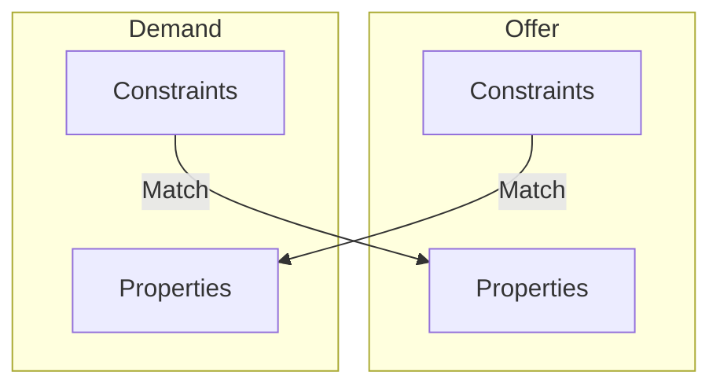
```mermaid
flowchart TB
  style OfferProperties text-align:left
  style DemandProperties text-align:left
  subgraph Offer
    direction TB
    OfferProperties[Properties]
    OfferConstraints[Constraints]
  end
  
  subgraph Demand
    direction TB
    DemandProperties[Properties]
    DemandConstraints[Constraints]
  end
  DemandConstraints --> |Match| OfferProperties
  OfferConstraints --> |Match| DemandProperties
```

###### When to use constraints?

[Requestor](#requester-agent) and [Provider Agents](#provider-agent) don’t have to use constraints. They can choose to avoid them 
and postpone the decision about filtering Proposals according to their requirements until the [negotiation phase](#process-of-negotiations-and-making-an-agreement).
This approach requires them to manually reject some Offers or Demands, instead of using built-in mechanisms, but it
allows them to receive a broader set of potential [Proposals](#proposal) to choose from.

On the other hand, using constraints minimizes the number of Proposals that need to be evaluated. Filtering Offers at
the [Golem Node](#golem-node) level could potentially be more efficient and scale better.

Another fact to consider is that, in a very large network with thousands or millions of Nodes, it would be impossible
to collect every available Offer. This scale is our goal. This means that our future target for the [Offers propagation
algorithm](#offer-propagation) could be based only on gradual sampling of the network. A well-defined set of constraints
could be crucial for efficient market searching.

The good rule for using constraints would be to apply them when the Requestor or Provider Agent has a requirement that
must necessarily be met. A good example could be the [runtime](#exeunit-runtime) choice. A Requestor who has prepared a
[VM image](#vm-image) likely won't make use of a Provider offering a [wasm runtime](#wasm-runtime). Setting the constraint
`(golem.runtime.name=vm)` will filter out a large portion of Offers that would otherwise be rejected.

On the other hand, the number of CPUs or the amount of RAM might be a more flexible requirement (except for rare use
cases). Not setting constraints would allow the Requestor Agent to rank Proposals during negotiations and gain insight
into what's available on the market.

###### Strong vs. weak matching

TODO: Left for later, to decide if it is important to mention at all.

#### Market negotiation protocols

[The Golem Node](#golem-node) doesn’t interpret the meaning of properties and constraints (with a few exceptions). This 
responsibility is delegated to the [business layer](#business-logic) and Agent applications. This design allows Golem to support 
the creation of new protocols for market interactions without requiring modifications to the Golem Protocol itself.

During market negotiations, the Provider and Requestor Agents exchange [Proposals](#proposal) until both parties agree on 
the terms of the [Agreement](#agreement). Throughout this exchange, both Agents can add, remove, or change the value of
[properties](#properties). The negotiation protocol is defined as a set of rules that governs the actions required to 
reach an agreement on a specific aspect of the negotiations. Multiple aspects can be negotiated simultaneously by the
Agents; for example, payment details can be negotiated independently from internet access for the Virtual Machine.

Each [protocol specification](#managing-protocols-specifications) must define how entities signal their 
understanding of a given protocol. This can be achieved in various ways, including:
- The mere presence of specific properties may signal that an Agent understands the protocol. Some properties are 
  simple factual statements, like the existence of certain features, and a Requestor not understanding them is 
  harmless. An example is [reporting transfers progress](#example-2---exeunit-progress-events).
- When a protocol requires two parties not to match, constraints may be necessary to enforce this behavior. This is 
  illustrated in the [subnets example](#subnets).
- In more complex scenarios, a schema URL may be included in the Offer/Demand to indicate conformance to a specific 
  standard, as seen in ([Node descriptors](../gaps/gap-31_node_descriptor/gap-31_node_descriptor.md) and
  [Golem certificates](../gaps/gap-25_golem_certificates).
- Another approach is requiring a property to be repeated in both Provider and Requestor Proposals to finalize 
  negotiations, as used with [negotiable properties](#negotiable-properties).
  
##### Example protocols

The following chapters will provide examples of how the [property language](#discovery-and-offersdemand-matching) can be
used to define negotiation protocols.
These examples will be based on real cases that have already been solved in the current implementation.

###### Subnets

This is the simplest example that doesn’t require multiple phases of Proposal exchanges. Subnets are a debugging
mechanism used to isolate specific [Nodes](#golem-node) from the rest of the network. They are useful when testing new 
features or debugging, as they provide full control over the participating Nodes, making it easier to analyze logs.

Subnets operate at the market level, meaning the Nodes aren't truly separated from
the network. Instead, only the Offers from other Nodes are excluded from being matched with the Demands.

|             | Provider Proposal                         | Requestor Proposal                        |
| ----------- | :---------------------------------------- | :---------------------------------------- |
| Properties  | "golem.node.debug.subnet": "private-1234" | "golem.node.debug.subnet": "private-1234" |
| Constraints | (golem.node.debug.subnet=private-1234)    | (golem.node.debug.subnet=private-1234)    |

Both parties select a name and set the subnet [property](#properties) and [constraint](#constraints) to the same 
value simultaneously. Even if one side fails to adhere to the protocol by omitting the constraint in their Offer or
Demand, the other party's constraint ensures protection, preventing them from being matched with the non-compliant Agent.
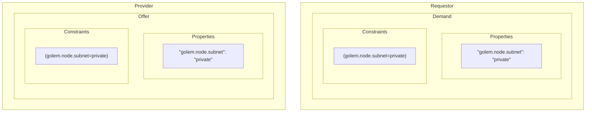
```mermaid
flowchart TB
    subgraph Requestor 
        subgraph Demand 
           subgraph PropertiesR[Properties]
             P1["#quot;golem.node.subnet#quot;: #quot;private#quot;"] 
           end
           subgraph ConstraintsR[Constraints]
             C1["(golem.node.subnet=private)"]   
           end
        end
    end
    
    subgraph Provider 
        subgraph Offer
          subgraph PropertiesP[Properties]
            P2["#quot;golem.node.subnet#quot;: #quot;private#quot;"]
          end
          subgraph ConstraintsP[Constraints]
            C2["(golem.node.subnet=private)"]
          end
        end
    end
    
```

###### Negotiable properties

[Negotiable properties](../standards/README.md#-fact--vs--negotiable--properties) is a negotiation scheme that 
enables the Provider and Requestor Agents to negotiate the value of a single parameter. As an example, the 
negotiation of the `golem.com.payment.debit-notes.accept-timeout?` property, which indicates how long
the Requestor Agent has to accept a Debit Note, will be demonstrated. Although the `?` symbol appears to be an 
operator, it holds no special meaning and is merely part of the property naming convention.

Both agents begin by setting their initial preferred timeout values. With each turn, they adjust the value until 
they either agree on a specific value or one party rejects the proposals, ending the negotiation.

| Provider Proposal                                    |                          | Requestor Proposal                                   |
| :--------------------------------------------------- | ------------------------ | :--------------------------------------------------- |
| "golem.com.payment.debit-notes.accept-timeout?": 600 | Initial Offer/Demand     | "golem.com.payment.debit-notes.accept-timeout?": 240 |
|                                                      | &larr; Counter Proposal  | "golem.com.payment.debit-notes.accept-timeout?": 300 |
| "golem.com.payment.debit-notes.accept-timeout?": 450 | Counter Proposal &rarr;  |                                                      |
|                                                      | &larr; Counter Proposal  | "golem.com.payment.debit-notes.accept-timeout?": 400 |
| "golem.com.payment.debit-notes.accept-timeout?": 400 | Counter Proposal &rarr;  |                                                      |
|                                                      | &larr; Propose Agreement | "golem.com.payment.debit-notes.accept-timeout?": 400 |

Placing the property in the Offer or Demand signals to the other party that the Agent recognizes and understands the
property. If one of the Agents does not include the property, the other party should remove it from their Proposal.
Negotiations are complete when both parties include the property in their Proposal with the same agreed-upon value.

###### Mid-agreement payments

A more complex example of negotiation are [mid-agreement payments](#mid-agreement-payments-1).
[The Specification](../gaps/gap-3_mid_agreement_payments/gap-3_mid_agreement_payments.md)
of mid-agreement payments covers not only the negotiation protocol but also defines the behavior of Agents after the 
Agreement is signed and computations are in progress. Mid-agreement payments demonstrate how to specify and 
implement various aspects of Golem behavior, such as different payment schemes.

##### Capabilities approach

The Golem design is built around components that implement different capabilities. This is also reflected in the
Offer/Demand model and resource descriptions. Each [Provider](#provider) or [Requestor](#requestor) can have their own 
implementation of the Golem Protocol, which may support only a subset of the features specified by Golem Factory.
For this reason, the properties reflect the capabilities of the implementation rather than the software version.

An effort is being made to collect possible capabilities and identify which components maintained by Golem Factory
support them. Although the list is far from complete, it is valuable to continue expanding:
- [List of capabilities](../specs/capabilities.md) required for communication between [Golem Nodes](#golem-node) and Agents
- [Capabilities](https://github.com/golemfactory/yagna/blob/master/docs/yagna/capabilities.md) supported by yagna daemon
- [Capabilities](https://github.com/golemfactory/yagna/blob/master/docs/provider/capabilities.md#provider-agent-capabilities-list)
  supported by [Provider Agent](#provider-agent)
- ExeUnit Supervisor [capabilities](https://github.com/golemfactory/yagna/blob/master/docs/provider/capabilities.md#exeunit)
- ExeUnit Runtime [capabilities](../standards/0-commons/golem/runtime.md#golemruntimecapabilities--liststring-)

###### Example 1 - VM runtime GPU capability

Various implementations of the VM runtime can be envisioned—some may include GPU access, while others may not. When
searching on the market, the Requestor Agent should focus on specifying the required capabilities to find all
implementations that meet those conditions.

For this purpose, the `golem.runtime.capabilities` property can be used to specify the capabilities of the
[VM runtime](#vm-runtime-1). For example, [a Requestor Agent](#requester-agent) needing GPU access should set the
[constraint](#constraints) `(golem.runtime.capabilities=!exp:gpu)`. This constraint specifies the required 
capabilities without enforcing any particular implementation of the VM runtime.

A list of different [Runtime](#exeunit-runtime) capabilities (not exhaustive) can be found
[here](../standards/0-commons/golem/runtime.md#golemruntimecapabilities--liststring-).

###### Example 2 - ExeUnit progress events

The same approach of using [capabilities](#capabilities-approach) can be applied to seamlessly adding new features. Golem Factory doesn’t 
control which version of the [Golem Node](#golem-node) is used by Providers. When a new feature is introduced, it takes time 
for Node operators to update their software. If a Requestor Agent wants to use this new feature, they may encounter the 
issue that only a subset of Nodes supports it.

One solution could be to introduce versioning in Offers. However, strictly binding Offers to specific software versions
would reduce the number of Providers available to take on the work. Requestors using newer SDK versions, but not
necessarily utilizing new features, would miss potential opportunities to hire Providers.

The solution chosen by Golem is to introduce a new capability for each new feature. An example of this approach is the
ExeUnit progress reporting feature. The [specification](../specs/command-progress.md) outlines the
properties added for this feature:

| Property                                            | Description                                    |
| :-------------------------------------------------- | :--------------------------------------------- |
| "golem.activity.caps.transfer.report-progress=true" | ExeUnit can report `transfer` command progress |
| "golem.activity.caps.deploy.report-progress=true"   | ExeUnit can report `deploy` command progress   |

The Requestor Agent can filter Providers based on these capabilities by using constraints.

###### Problems with capabilities-based approach - versioning

[The capabilities-based approach](#capabilities-approach) has some limitations. For instance, if a known bug exists in one of the 
implementations and is later fixed, Requestor Agents may want to filter out Providers with the buggy implementation.
However, with pure capabilities, this is not possible. Including software versioning would force Requestor Agents 
to bind their code to specific implementations, which is undesirable.

One potential solution is to introduce versioning for capabilities. However, this would mean the version is updated
not when the protocol changes, but when one of its implementations does. This approach isn't ideal either.

At present, there is no perfect solution to this problem.

##### Backward compatibility

The Golem Protocol must accommodate numerous individual Nodes running various software versions, many of which Golem
Factory neither controls nor tracks. The protocol was designed to support workloads that weren't directly considered
during its initial development and can be implemented by the community.

This is the core challenge Golem is trying to address, and measures must be taken to mitigate the issues that arise from
it. One key consideration is ensuring backward compatibility within the protocol. Two important aspects should be
addressed:
- Breaking changes can fragment the network, disrupting communication between newer and older software versions.
- Seemingly compatible new features might silently break existing implementations, causing unexpected failures.

While the first problem may seem more important, the second is actually more dangerous. Breaking the network should be
avoided whenever possible, but given that Golem is still in its early stages of development, it would be unrealistic to
exert excessive effort to maintain compatibility at all costs. Each instance of breaking changes should be considered
individually, with potential risks, impact, and the value of new features carefully evaluated.

The second problem is more critical because carelessly introducing new features can lead to silent failures in the later
stages of an Agreement, making them difficult to diagnose or detect. This can increase maintenance costs. While in the
first case we can choose whether to preserve compatibility or not, in this case, there is no choice but to implement
measures to avoid potential issues.

###### Negotiation protocols compatibility

Negotiation protocols are the most critical area where compatibility issues should be addressed. The simplest solution
is to prevent incompatible Provider and Requestor Agents from signing an Agreement. This requires careful discipline in
the design of market interactions, such as:
- The semantics of properties should never change. Altering semantics leads to Agents interpreting the protocol
  differently, yet still signing Agreements.
- When necessary, new properties should be introduced rather than modifying existing ones.
- New negotiation protocol specifications should ensure that they are designed in a way that prevents Nodes following
  the new specification from signing Agreements with Nodes that don't understand it.

###### Example - payment protocol version

[The payment protocol version](../specs/payment-version.md) is a good example of how to introduce changes and protect
Nodes from incompatibilities. A new payment driver implementation altered the way payments are processed, which could
have caused Providers to be unable to validate transactions. The introduction of the `golem.com.payment.protocol.version`
property along with the corresponding constraint prevents Agents from signing Agreements with incompatible Nodes, ensuring smooth 
interactions.

##### Managing protocols specifications

There is no single, comprehensive document listing all properties and protocols. However, specifications are stored
in several places:
- Some features are initially proposed through [Golem Amendment Proposals](../gaps/) (GAPs) and then implemented.
- Other features are documented after implementation in the [specs](../specs/) directory.
- Certain properties not tied to specific features can be found in the [standards](../standards) directory and the  
  corresponding entry in [cheat sheet](../standards/cheat_sheet.md).

Since the protocol is open to extensions and contributions from outside Golem Factory, certain issues may arise.
Introducing new properties could conflict with existing protocols, leading to naming clashes when multiple parties
introduce them simultaneously.

Currently, Golem has no formal strategy for managing these conflicts. Although solutions such as
[experimental features](../gaps/gap-32_experimental_features) have been proposed (mainly for internal purposes), a
more comprehensive process for managing protocols would be necessary if Golem reaches full decentralization. However,
at this moment, the problem remains non-existent.

#### Offer propagation

- Link to design [decision](#only-providers-offers-are-propagated)
- Algorithm overview
- Plans for future algorithm with sharding

#### Process of negotiations and making an agreement

- Initial Proposal
- Countering Proposal
- What can change in counter proposal (protocols based on property language)?
- Provider Agent possible Proposal responses (counter, reject)
- Requestor Agent possible Proposal responses (counter, reject, propose Agreement)
- Provider Agent possible Agreement responses (accept, reject)
- Requestor possibility of Agreement Proposal cancellation
- Restarting negotiations (who can, who can't and how?)

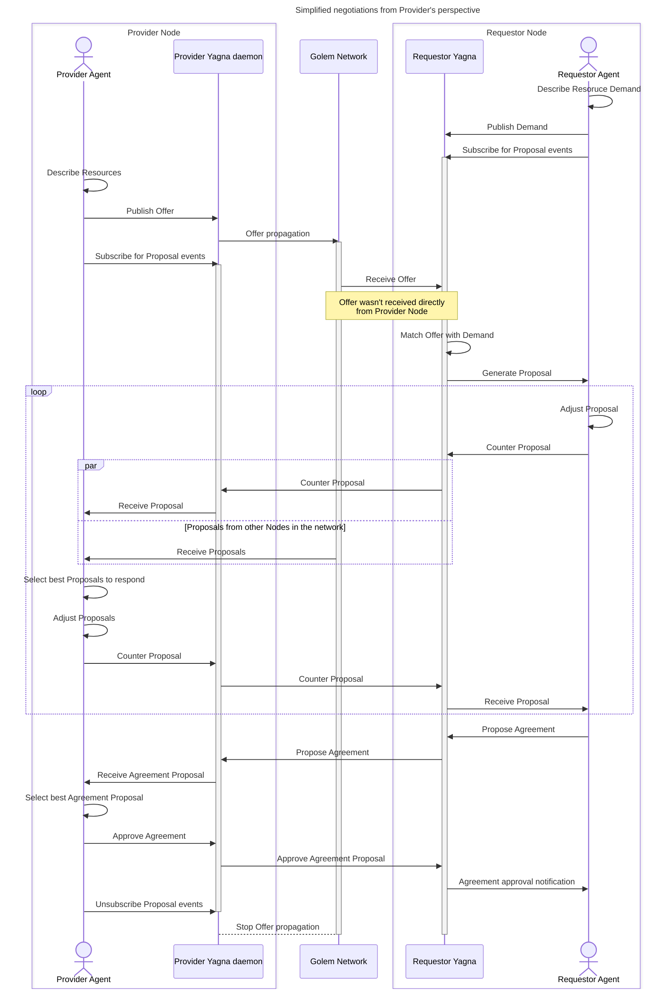
```mermaid
---
title: Simplified negotiations from Provider's perspective
---
sequenceDiagram
  box Provider Node
    actor ProviderAgent as Provider Agent
    participant ProviderYagna as Provider Yagna daemon
  end
  participant GolemNetwork as Golem Network
  box Requestor Node
    participant RequestorYagna as Requestor Yagna
    actor RequestorAgent as Requestor Agent
  end
  
  RequestorAgent->>RequestorAgent: Describe Resoruce Demand
  RequestorAgent->>RequestorYagna: Publish Demand
  RequestorAgent->>RequestorYagna: Subscribe for Proposal events
  activate RequestorYagna
  
  ProviderAgent->>ProviderAgent: Describe Resources
  ProviderAgent->>ProviderYagna: Publish Offer
  ProviderYagna->>GolemNetwork: Offer propagation
  activate GolemNetwork
  ProviderAgent->>ProviderYagna: Subscribe for Proposal events
  activate ProviderYagna
  

  GolemNetwork->>RequestorYagna: Receive Offer
  Note over GolemNetwork,RequestorYagna: Offer wasn't received directly<br/> from Provider Node 
  RequestorYagna->>RequestorYagna: Match Offer with Demand
  RequestorYagna->>RequestorAgent: Generate Proposal

  loop
    RequestorAgent->>RequestorAgent: Adjust Proposal
    RequestorAgent->>RequestorYagna: Counter Proposal
    
    par
      RequestorYagna->>ProviderYagna: Counter Proposal
      ProviderYagna->>ProviderAgent: Receive Proposal
    and Proposals from other Nodes in the network
      GolemNetwork->>ProviderAgent: Receive Proposals    
    end

    ProviderAgent->>ProviderAgent: Select best Proposals to respond
    ProviderAgent->>ProviderAgent: Adjust Proposals
    ProviderAgent->>ProviderYagna: Counter Proposal
    ProviderYagna->>RequestorYagna: Counter Proposal
    RequestorYagna->>RequestorAgent: Receive Proposal
  end

  RequestorAgent->>RequestorYagna: Propose Agreement
  RequestorYagna->>ProviderYagna: Propose Agreement
  ProviderYagna->>ProviderAgent: Receive Agreement Proposal
  ProviderAgent->>ProviderAgent: Select best Agreement Proposal
  ProviderAgent->>ProviderYagna: Approve Agreement
  ProviderYagna->>RequestorYagna: Approve Agreement Proposal
  RequestorYagna->>RequestorAgent: Agreement approval notification

  ProviderAgent->>ProviderYagna: Unsubscribe Proposal events
  deactivate ProviderYagna
  ProviderYagna-->GolemNetwork: Stop Offer propagation
  deactivate GolemNetwork
  deactivate RequestorYagna
```

#### Market strategies

#### Agreement termination
- Who is allowed to terminate? In what situation?
- What is specified by protocol and what is left to future specifications?
- Termination reason concept

### Offer propagation

One important [design decision](#only-providers-offers-are-propagated) in Golem's market protocol is that only Offers are
disseminated across the network, while Demands are not. This decision addresses an issue encountered in earlier versions
of Golem, where Requestors joining the network were flooded with work Offers from all Nodes. By focusing on disseminating
Offers, the system prevents overload and ensures smoother interactions.

The Golem market was planned to be implemented in different phases:
- Proof of Concept (PoC) version: A centralized market collects all Offers and is responsible for matching them with
  Demands.
- Decentralized version: Features network propagation and local Offers-Demands matching. Nodes maintain a full
  list of Offers in the network (this is the current stage).
- Fully scalable market: Implements Offer sharding, allowing each Node to store only a subset of Offers. Searching
  the market is done progressively and in a more probabilistic manner.

The phases of market development should not be confused with the centralization and decentralization of the Network Layer.
The implementation of the Network Layer is completely transparent and does not need to be known to the Market module.
There are a few exceptions where the market checks the type of network modules used, but this is primarily for network
traffic optimization and is not crucial for the protocol.

The market broadcasting protocol is built on top of the Network Layer and makes only a few assumptions about it:
- The Network Layer provides broadcasting functionality that disseminates messages to a subset of Nodes within the 
  network. The market does not need to be aware of the specific nodes involved.
- Upon receiving a message, the Market must be able to identify the sender's Node ID.
- The Market Layer can send and respond to GSB calls to and from other Nodes using their Node IDs.

#### Algorithm overview

There are three main triggers that can initiate Offer dissemination across the network for a Node:
- When an Offer is published on the market.
- At regular, randomized intervals after a certain amount of time has elapsed.
- When a new Node joins the network (via a NewNeighbor broadcast).

While each of these triggers has specific implementation details, the general concept remains consistent across all
cases. These details will be explained in later sections.

To minimize unnecessary data transfers, the propagation algorithm operates in two phases:
- In the first phase, only the Offer IDs are sent to subset of Nodes using Net broadcast operation.
- Second, details of any new, previously unseen Offers are requested based on the received IDs.

The market aims to collect all active Offers circulating in the network, with each Node storing new incoming Offers
in its local database. Although the algorithm doesn’t require Offers to be stored persistently across Node restarts,
for effective operation, all active Offers—those that haven’t expired or been explicitly removed by their
Provider—must be retained. Additionally, the market should keep at least the Offer IDs for any Offers that have been
unpublished by their creators.

##### Offers identification

A Node often receives an Offer indirectly, relayed through intermediary Nodes rather than directly from its publisher.
To mitigate potential risks and attacks from malicious Nodes, Offer and Demand IDs are derived from their content. This
approach offers several benefits:
- It reduces the likelihood of Offer ID collisions across the network. When requesting an Offer by its ID, the content
  received will always match.
- It ensures the integrity of Offers, as malicious Nodes cannot alter an Offer's content to disadvantage its owner.
  Any such changes are easily detectable.

Although Offers lack cryptographic signatures, which means that other Nodes could theoretically create Offers on behalf of
someone else, this type of fraud would be uncovered during the negotiation stage.

##### Algorithm in practise

Consider the following network topology:
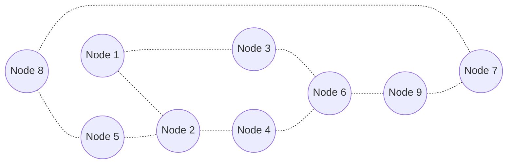
```mermaid
flowchart LR
  Node1((Node 1))
  Node2((Node 2))
  Node3((Node 3))
  Node4((Node 4))
  Node5((Node 5))
  Node6((Node 6))
  Node7((Node 7))
  Node8((Node 8))
  Node9((Node 9))
  
  Node1 -.- Node2
  Node1 -.- Node3
  Node2 -.- Node4
  Node3 -.- Node6
  Node4 -.- Node6
  Node5 -.- Node2
  Node6 -.- Node9
  Node8 -.- Node7
  Node8 -.- Node5
  Node9 -.- Node7
```
`Node 8` begins by sending Offers broadcast message to its direct neighbors:
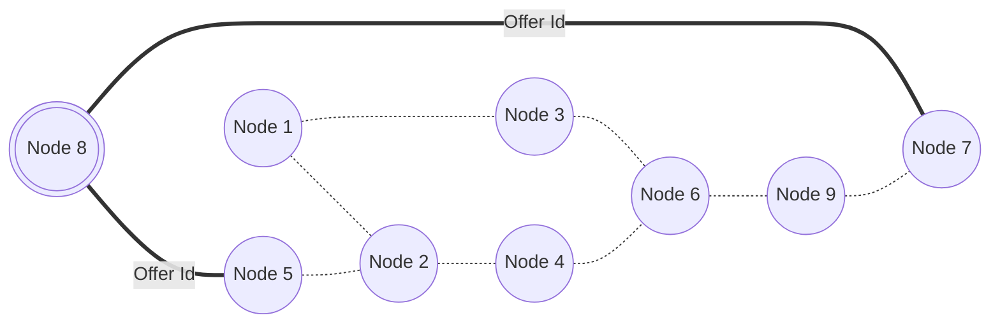
```mermaid
flowchart LR
  Node1((Node 1))
  Node2((Node 2))
  Node3((Node 3))
  Node4((Node 4))
  Node5((Node 5))
  Node6((Node 6))
  Node7((Node 7))
  Node8(((Node 8)))
  Node9((Node 9))
  
  Node1 -.- Node2
  Node1 -.- Node3
  Node2 -.- Node4
  Node3 -.- Node6
  Node4 -.- Node6
  Node5 -.- Node2
  Node6 -.- Node9
  Node8 === |Offer Id| Node7
  Node8 === |Offer Id| Node5
  Node9 -.- Node7
```
The Offer ID reaches `Node 5` and `Node 7`. Since neither has encountered this Offer before, they will disseminate
it further to their respective neighbors. Simultaneously, they will request the full Offer details from the source
Node that initially sent it.

As the original sender of the Offer, `Node 8` will reject any additional broadcast message, effectively halting
the dissemination process at this point.
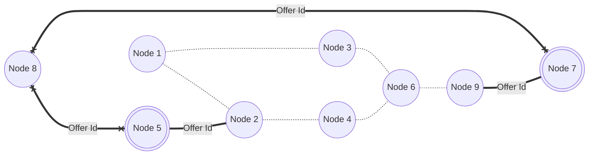
```mermaid
flowchart LR
  Node1((Node 1))
  Node2((Node 2))
  Node3((Node 3))
  Node4((Node 4))
  Node5(((Node 5)))
  Node6((Node 6))
  Node7(((Node 7)))
  Node8((Node 8))
  Node9((Node 9))
  
  Node1 -.- Node2
  Node1 -.- Node3
  Node2 -.- Node4
  Node3 -.- Node6
  Node4 -.- Node6
  Node5 === |Offer Id| Node2
  Node6 -.- Node9
  Node8 x===x |Offer Id| Node7
  Node8 x===x |Offer Id| Node5
  Node9 === |Offer Id| Node7
```
In the next iteration, `Node 2` and `Node 9` act as the sources for broadcast messages. Offers will be successfully
disseminated to `Node 1`, `Node 4`, and `Node 6`, while `Node 5` and `Node 7` will reject these messages.

Both `Node 2` and `Node 9` will retrieve the full Offer details from the Nodes they received the IDs from, rather
than attempting to reach the original source, `Node 8`.
 
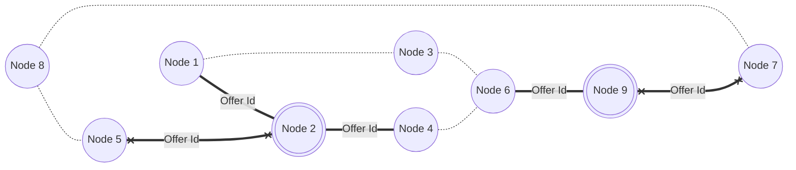
```mermaid
flowchart LR
  Node1((Node 1))
  Node2(((Node 2)))
  Node3((Node 3))
  Node4((Node 4))
  Node5((Node 5))
  Node6((Node 6))
  Node7((Node 7))
  Node8((Node 8))
  Node9(((Node 9)))
  
  Node1 === |Offer Id| Node2
  Node1 -.- Node3
  Node2 === |Offer Id| Node4
  Node3 -.- Node6
  Node4 -.- Node6
  Node5 x===x |Offer Id| Node2
  Node6 === |Offer Id| Node9
  Node8 -.- Node7
  Node8 -.- Node5
  Node9 x===x |Offer Id| Node7
```
The Offer successfully reaches the most distant Nodes within the network - `Node 3`.
Since two Nodes attempt to send the same Offer to `Node 3` simultaneously, only the first broadcast message will
be accepted.
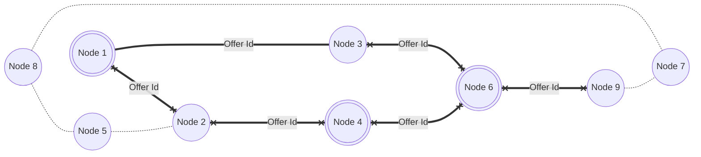
```mermaid
flowchart LR
  Node1(((Node 1)))
  Node2((Node 2))
  Node3((Node 3))
  Node4(((Node 4)))
  Node5((Node 5))
  Node6(((Node 6)))
  Node7((Node 7))
  Node8((Node 8))
  Node9((Node 9))
  
  Node1 x==x |Offer Id| Node2
  Node1 === |Offer Id| Node3
  Node2 x===x |Offer Id| Node4
  Node3 x===x |Offer Id| Node6
  Node4 x===x |Offer Id| Node6
  Node5 -.- Node2
  Node6 x===x |Offer Id| Node9
  Node8 -.- Node7
  Node8 -.- Node5
  Node9 -.- Node7
```
All neighbors of `Node 3` are already aware of the Offer, so the dissemination process concludes.
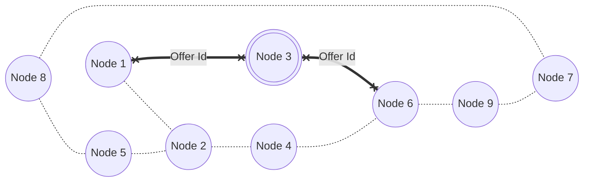
```mermaid
flowchart LR
  Node1((Node 1))
  Node2((Node 2))
  Node3(((Node 3)))
  Node4((Node 4))
  Node5((Node 5))
  Node6((Node 6))
  Node7((Node 7))
  Node8((Node 8))
  Node9((Node 9))
  
  Node1 -.- Node2
  Node1 x==x |Offer Id| Node3
  Node2 -.- Node4
  Node3 x==x |Offer Id| Node6
  Node4 -.- Node6
  Node5 -.- Node2
  Node6 -.- Node9
  Node8 -.- Node7
  Node8 -.- Node5
  Node9 -.- Node7
```

##### Neighborhood function

To prevent clustering of Nodes and accidental splits in the network, where subsets of Nodes become unreachable, a proper
neighborhood function must be utilized. This function is defined by the network module, and the market relies on the
broadcast operation, leaving it with no alternative in this regard.

Optimal guarantees can be achieved when two neighboring Nodes have distinctly different neighborhoods, minimizing their
number of common neighbors. Currently, in the Hybrid Net, neighborhood is determined based on the reversed Hamming
distance between Node IDs.

##### Central Net vs. Hybrid Net

The net module implementation is transparent for the market module, but certain details must be addressed for network
traffic optimization. The primary difference between Central and Hybrid Net from the market perspective is that
Hybrid Net broadcast messages to a subset of Nodes, while Central Net sends it to all Nodes.

Due to this distinction, different broadcasting settings are required—especially regarding broadcasting frequency—to
prevent overwhelming the network with excessive messages.

##### Broadcast triggers

All three broadcast triggers mentioned in the [previous chapter](#algorithm-overview) serve distinct purposes.

The first mechanism triggers a broadcast when a new Offer is published. However, this does not guarantee that new
Nodes joining the network afterward will receive the Offer. To address this, recurrent propagation was introduced.

Recurrent broadcasts are sent at random intervals, with a configurable mean time between broadcasts. The randomness 
ensures that if many Nodes are spawned using a script, the network will not experience spikes in bandwidth usage. 
Each recurrent broadcast includes all Offers owned by the Node, along with a random subset of other stored Offers. 
This mechanism provides an opportunity for new Nodes joining the network to receive the latest Offers.

The last mechanism, the new neighbor-triggered broadcast, was introduced after transitioning to the hybrid net 
implementation. When a new Requestor joins the network, they are not immediately visible to other Nodes. To minimize 
unnecessary network traffic, the network module does not query the relay server for neighborhood updates with each 
broadcast call. This can result in a delay in Offer delivery, meaning that, regardless of recurrent broadcast 
interval settings, a Node may not receive any Offers during the initial minutes of operation.

To address this, when a Node joins the network, it sends a notification to its neighbors to announce its presence.
In response, neighboring Nodes request updated neighborhood information from the Relay server and promptly send
a set of Offers.

#### Offers expiration and unsubscribing

Since each Node stores the full state of Offers within the network, it's crucial to protect the market from being overwhelmed.
Offers do not have an indefinite lifetime; they come with a predefined expiration. Expired Offers are not propagated, and
Proposals are not generated in response to them when matching with Demands on the market.

The second mechanism allows a Provider Agent to unpublish their Offer. When an Agent unsubscribes from the market, this
information is propagated to other Nodes in a manner similar to how Offers are broadcasted. While this mechanism is not
essential for the market's functionality, it optimistically helps reduce clutter within the market.

### Payments
The Payment component is a singleton service running in the background of the
Golem Node. It is responsible for making payments, veryfing payments made by
other nodes and accounting. The latter pertains to budgeting, aggregating
information about the history of Invoices and Debit Notes, including whether
they were paid, amounts etc.

#### Important terms
- Payment Driver – a component responsible for executing and confirming
  transactions.
- Payment Platform – a 3-part identifier uniquely describing a mode of
  exchanging funds. It is composed of 3 fields:
  - driver – Determines which driver to select, see below for details.
  - network – Defined by the driver.
  - token – Defined by the driver.

  The payment platform is opaque to Golem and is only relevant for payments.
  It is serialized as `{dirver}-{network}-{token}`.
- Allocation – a budget definition in the Golem Node. It is not part of the
  protocol and is only used for internal bookkeeping for the convenience
  of Requestors. One can create an Allocation via REST API which defines the
  following constraints:
    - Payment Platform
      - Must match exactly
    - Payee address
      - Must match exactly
    - Amount of token
      - Cannot be exceeded
    - Lifetime (via a UTC timestamp)
      - The allocation will cease to exist the moment it passes
  
  The allocation is neccessary for all operations that may lead to expending
  funds and it is transparently checked at all relevant points. If any of the
  constraints are not satisfied, the operation will fail. Allocations *DO NOT* affect semantics of the Golem Network and can be considered an implementation detail.

#### Interactions with other components
The Payment component is invoked by the REST API, CLI or by messages from the
Payment component running on another node in the Golem Network. When operating,
it relies on Net to communicate with other nodes and on Identity to sign
messages. Last but not least, it interacts with Payment Drivers that implement
actual interactions with the underlying payment mechanisms (in our case, ERC20
on Ethereum). Payment Drivers are considered to be a submodule of the Payments
component.

#### Payments models
A payment model is an algorithm for determining the amount due based on resource usage (AKA Usage Counters, see [ExeUnits section](#ExeUnits)).

The linear Payment Model is the only one currently in use. It multiplies usage
counters by constant coefficients and adds a constant on top of that, thus
forming a linear function. The counters used today by yagna are cpu-time
and total run-time.

The model parameters (for example coefficients of the linear Payment Model) are
declared by the provider in the offer. Based on those, the Requestor can make
an informed decision about whether to enter such an agreement or not.

Because Payment Models operate on ExeUnit-defined Usage Counters, they are
ExeUnit-dependent, but one Payment Model may work for multiple ExeUnits
assuming they define interchangeable counters.

#### Negotiation
A Payment Model must be negotiated between the Provider and Requestor to
estimate pricing before the agreement is signed.

- Offer shall expose a property `golem.com.pricing.model` which is a string
    containing the model name, e.g. `linear`, as well as
    `golem.com.pricing.model.{model_name}` which is an object containing
    model-specific parameters.
- Demand may put constraints on those properties in order to limit spending.

#### Payments flow during the lifetime of the Agreement
##### Negotiation
Provider and Requestor must establish the mechanics of payments (Payment Driver,
its parameters, Payment Model) during the agreement Negotiation. This is
achieved as follows:
- Offer defines properties `golem.com.payment.platform.<platform>.address`
  of the form which identify the recipients of funds for the given platform.
  Note that in case of blockchain payments this adress need not be the same
  as the Node ID. One can operate multiple provider nodes and have them all
  collect payments to a single account.
- The demand puts a constraint requiring that at least one such entry exisits
  for the payment platforms it itself supports.
  e.g. `(golem.com.payment.platform.erc20-polygon-glm.address=*)`.

In order to make experimentation on Golem Network simple, a pool of Providers is made available to users at no cost. It has been decided that the best way of achieving it is by utilising different payment platforms on the same network.
- For-profit providers will declare platforms that are used for actual funds,
  e.g. `erc20-mainnet-glm` and `erc20-polygon-glm`. Those correspond to,
  respectivelly, Ethereum Mainnet and Polygon L2, on both of which no new GLM
  tokens can be minted.
- Non-profit providers will declare platforms on which GLM tokens can be
  minted, and native tokens can be obtained from faucets, such as
  `erc20-amoy-tglm` or `erc20-holesky-tglm`.
- As there's currently only one driver in use and it requires a 1-to-1
  relationship between properties `token` and `network` of the payment platform,
  one usually refers to networks instead of the entire platforms. This has
  resulted in terms Mainnet(s) (for-profit) and Testnet(s) (non-profit).

##### Payable documents
A provider will send to the Requestor two kinds of documents relating
to payments - DebitNotes and Invoices. Those documents are used for accounting
and are persistent (retained in the database even after the agreement concludes)
which makes them useful for statistics and long-term debugging.
- DebitNotes are emitted while the agreement is still in effect, they contain
  the current amount due, the activity they relate to and optionally a deadline
  for payment for this amount (deducted by previous payments made for the
  given activity) to be made. If it is present, the DebitNote shall be called
  *payable*.
  - Payable DebitNotes frequency is negotiated by the property
    `golem.com.scheme.payu.debit-note.interval-sec?` and the duration between
    DebitNote creation and its due date by
    `golem.com.scheme.payu.payment-timeout-sec?`.
- Invoices are emitted after the agreement concludes, and they contain the
  total amount due for all activities.

##### Interaction between provider and Requestor
Whenever a provider sends a payment-related document, the Requestor may take one
of three actions:
- Accept the document (sending a message to Provider), obligating itself
  to pay the amount in case of invoices and payable DebitNotes.
- Reject the document (sending a message to Provider), signaling to the
  provider that it does not intend to make the payment. Will lead to
  termination of the agreement if it's a DebitNote.
- Ignore the document. Will lead to termination of agreement if it's
  a DebitNote.

##### Accepted documents
Accepting a document automatically schedules a payment to be made by
the Requestor. If the document specifies a deadline for the payment, it is
respected.
- Partial payments for DebitNotes should never exceed the final amount declared
  by the Invoice, as there is no mechanism for the provider to pay back the
  Requestor the surplus. It's not a problem for the current Linear Payment Model,
  as cpu-time and run-time counters are monotonically increasing.
- Whenever the Requestor makes a payment and considers it done (in practice by
  doing the same confirmation the provider would), it sends a driver-defined
  blob to the Provider so that the other node can confirm the payment itself.
    - *Confirmation* pertains to verifying whether a specific transaction from
      the Requestor (identified by its Transaction ID that the Requestor
      sends to the Provider) has been processed and that it's parameters
      (notably amount of token sent, token address and receiver address) all
      match what the Provider expects. Due to the nature of Blockchain this
      process is not completely deterministic, but conservative assumptions
      made in the current implementation of the Golem Node offer acceptable
      level of certainty.
- If the provider cannot confirm the payment, the result is the same as if no
  payment has been made.

#### Payment drivers
##### Abstract idea
A Payment Driver is intended to be an abstraction of an arbitrary mode
of payments. It must expose a collection of capabilities defined by
the implementation of the Golem Node, thus not being subject to network or
REST API backwards compatibility concerns. The current implementation requires
the following capabilities:
- Handling account events (locked / unlocked).
  - An account (private Ethereum key) on the Golem Node may be either accessible
    or encrypted. In the latter case it cannot be used for signing transactions,
    so the driver must be kept up-to-date with the status of all accounts.
- Listing RPC endpoints*.
  - Accessing Ethereum is done via servers commonly called RPC endpoints.
    A faulty endpoint could cause issues with transaction processing, so the
    driver exposes them with some metadata to allow checking whether they work. 
- Reporting account balance*.
  - For proper operation of the node one needs both Gas (native token) and GLM,
    this method yields the amount of both.
- Reporting its name.
  - Driver's name is a unique UTF-8 identifier. For the erc20 driver it'
    `"erc20"`.
- Reporting the default network.
  - Drivers have a preferred payment network for operation, which is to be used
    when the network is not supplied (some REST endpoints allow that).
- Reporting the list of supported networks.
  - Drivers can list all networks they can interact with.
- Initialization.
  - Drivers may need to carry out certain tasks specific to them before they
    can begin working. This method is called before any transactions
    are scheduled.
- Reporting the need for initialization for confirming incoming payments.
  - If the driver needs to also do work before confirming payments, it can
    report that via this method – then initialization will be called before
    any confirmation requests as well.
- Funding – automatic obtaining funds for for Testnets.
  - Some Testnets allow obtaining funds (both native token and GLM)
    programmatically. This method does this if possible.
- Transfers – transfering funds to a given address at a given platform
  w/o an allocation.
- Scheduling payments – transfering funds to a given address at a given
  platform with an allocation.
- Confirming payments.
  - A driver defines a heuristic for deciding whether a payment has been done
    correctly and is to be trusted.
- Verifying allocations.
  - Drivers ensure that an allocation cannot be created beyond the available
    funds and that the account tied to the allocation is usable. If the
    allocation contains a deposit, it is also validated. See the Deposit
    Payments section.
- Releasing deposits.
  - See the Deposit Payments section.
- Reporting its status*.
  - Drivers may encounter problems during their operations. The interface
    requires that drivers expose any errors encountered via a list of problems.
    An empty list implies that the driver is functioning 100% correctly.

Points marked with `*` leak information about the underlying mode of payments
necessarily being a blockchain or using the ERC20 standard.

##### Examples of payment drivers
- erc20 – Considers the currency to be a token defined by an ERC20-compliant
  Smart Contract on an EVM-compatible blockchain. The address at which this
  contract resides is preconfigured as part of the Payment Driver and not
  subject to negotiation.
- zksync – Now obsolete, another Payment Driver built on Ethereum

##### Current Erc20 Payment Driver
- Requires tokens to be compliant with the ERC20 standard.
- Only accepts `glm` token value for Mainnets and `tglm` for Testnets.
- Optimizes gas usage:
  - Use a multi-payment contract when available (hardcoded into the driver
    for each network) to execute multiple transfers within a single transaction.
  - Adds multiple transfers to a single account together.

##### Payments Batching
Payments Batching refers to collecting multiple transactions into one to optimize
gas usage. The only currently used Payment Driver implements this, [see this
section](#Current-Erc20-Payment-Driver).

#### Deposits payments
Detailed specification is in [golem-architecture](https://github.com/golemfactory/golem-architecture/blob/master/specs/deposits.md).

Deposits are a means for Requestor to pay with funds of external clients without
ever keeping them on their accounts. This is enabled by a smart contract on
the blockchain to which the 3rd parties may Deposit their funds and allow
a specific address (the Requestor's account) to transfer them out of the Deposit.

Terms:
- Funder – 3rd party creating the Deposit.
- Spender – Requestor permitted to spend the funds from a given Deposit.

This ties into existing concepts as follows:
- After the Funder creates a Deposit, they send the Deposit ID to the Spender.
  - Typically the creation of the Deposit would be done via a service operated
    by the spender.
- The Spender creates an allocation with the Deposit ID attached, this allows
  the Payment Driver to validate the allocation parameters against the deposit
  instead of the funds of the Spender themselves.
- Whenever a payment is scheduled, the Payment Driver will be able to transfer
  the funds directly from the deposit to the provider.

### ExeUnits
Abstractly speaking, *an* ExeUnit performs work on behalf of the Requestor
utilizing Provider's resources. What this work pertains to is part of the
Agreement negotiated by the Provider and Requestor. The negotiation selects
which ExeUnit will be used.

The following graph describes the lifetime and operation of an ExeUnit:
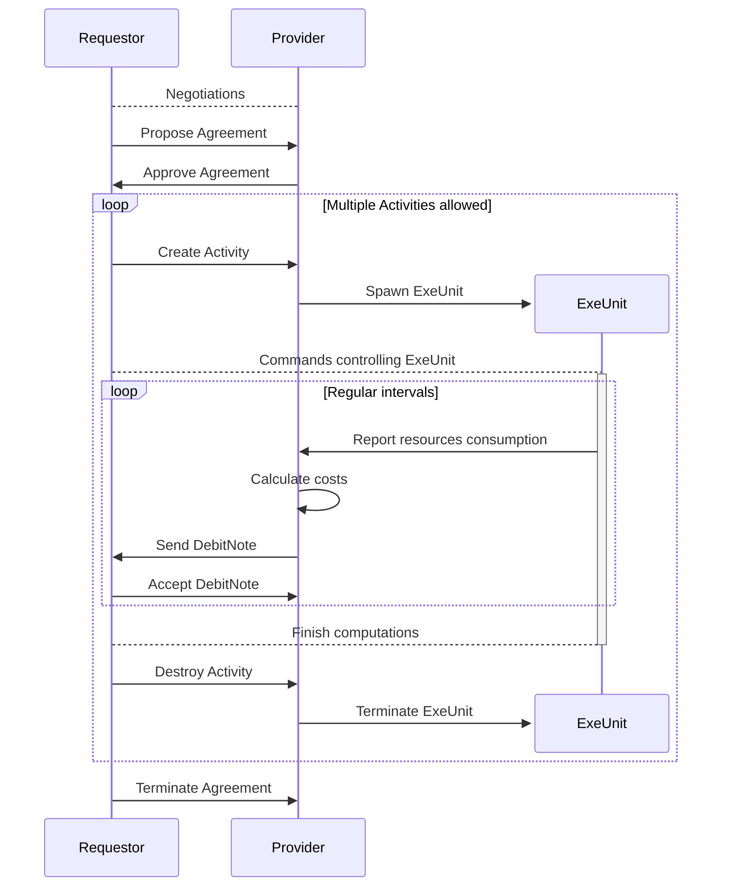
```mermaid
sequenceDiagram
  participant Requestor
  participant Provider
  Requestor-->Provider: Negotiations
  Requestor->>Provider: Propose Agreement 
  Provider->>Requestor: Approve Agreement
  
  loop Multiple Activities allowed
    Requestor->>Provider: Create Activity
    create participant ExeUnit
    Provider->>ExeUnit: Spawn ExeUnit
    Requestor-->ExeUnit: Commands controlling ExeUnit
    activate ExeUnit
    
    loop Regular intervals
      ExeUnit->>Provider: Report resources consumption
      Provider->>Provider: Calculate costs
      Provider->>Requestor: Send DebitNote
      Requestor->>Provider: Accept DebitNote
    end
    
    Requestor-->ExeUnit: Finish computations
    deactivate ExeUnit
    Requestor->>Provider: Destroy Activity
    destroy ExeUnit
    Provider->>ExeUnit: Terminate ExeUnit
  end
  Requestor->>Provider: Terminate Agreement
```

#### Generic ExeUnits
The most work has been directed into a generic ExeUnit bundled with Golem Node
installations that performs arbitrary computation. It has currently two modes
of operation, determined by a swappable *Runtime*.

- VM – the widely used Runtime offering VPS-like experience. One can deploy
  images built from a mostly Dockerfile-compatible GVMI format via
  [gvmkit-build](https://github.com/golemfactory/gvmkit-build-rs) and, if the
  image supports SSH, create a tunnel to the VM. See (VM runtime)(#VM-Runtime).
- WASM – [TODO: Never worked on it]. See (WASM runtime)(#WASM-Runtime).

#### Specialized ExeUnits
Some ExeUnits with much narrower applicability have been developed over
time.
- AI Inference ExeUnit designed for GamerHash –
  [ya-runtime-ai](https://github.com/golemfactory/ya-runtime-ai)
- Outbound Gateway which is limited to routing traffic through a provider --
  [ya-runtime-outbound](https://github.com/golemfactory/ya-runtime-outbound).
  Note that this kind of traffic is possible with the generic VM ExeUnit
  as well.
- Gateway between the Golem Marketplace and an HTTP-based service accessible
  over the Internet –
  [ya-runtime-http-auth](https://github.com/golemfactory/ya-runtime-http-auth).

#### Interaction between Requestor and ExeUnit
ExeUnits expose 4 GSB endpoints to be directly called by the Requestor:
- `Exec`
  - Executes the ExeScript on the ExeUnit, see [ExeUnit Commands](#exeunit-commands).
- `GetExecBatchResults`
  - Returns the results of the batch.
- `StreamExecBatchResults`
  - Streams the results of the batch as it progresses.
- `GetRunningCommand`
  - Returns the currently running command from the batch

#### Interaction between Provider and ExeUnit
- Periodic reporting of Counters' values to the Provider via GSB

#### ExeUnit Commands
The Requestor Agent does not control the ExeUnit by GSB, but by using
a dedicated REST API (exposed by their yagna) that maps user-friendly messages
to the `Exec` GSB message that is then sent directly to the ExeUnit.

The specification of the command (so-called `ExeScriptCommand`) can be found
in [ya-client OpenAPI Activity Specification](https://github.com/golemfactory/ya-client/blob/master/specs/activity-api.yaml).

Note regarding `Transfer` command: The destination of a transfer must always
implement a specific GSB-based interface, but the source can be either
a symmetric GSB-API *or* an HTTP resource. For the details of the GSB Transfer
APIs, see [gftp implementation](https://github.com/golemfactory/yagna/tree/master/core/gftp).

##### Batches
Commands are to be sent in *Batches* which are considered done after each
command has completed in order.

##### Results
The Requestor Agent can obtain the results of a Batch by sending the
`GetExecBatchResults` GSB message, which will be received directly by the
ExeUnit.

#### Before any Agreements
##### Offer Template
Before the Golem Node propagates any of its offers, it queries each of its
ExeUnits for so called *Offer Templates*. This template identifies the kind
of ExeUnit that will be invoked if this offer is chosen and the pricing model
that's configured for that ExeUnit. The Golem Node then only has to patch
some fields before broadcasting the Offer.

##### Self-Test
ExeUnits have the capability of verifying that they will be able to fulfil their
role by invoked a built-in test. For example, the VM ExeUnit will spawn a VM
with a simple image, assert some of its properties and then close it to verify
that virtualization works.

If the Self-Test fails, Offers regarding such ExeUnit will not be broadcasted.

#### VM Runtime
- Operates by running code within a virtual machine, which prevents malicious
  code submitted by the Requestor from negatively impacting the machine on which
  the Provider Agent runs. Currently utilizes QEMU with KVM.
- Functionalities:
  - Prevents the Task from consuming more resources than specified in the
    Agreement by setting VM configuration. The converse is not guaranteed,
    the task may *not* get the agreed-upon resources because the Provider can
    lie about CPUs or RAM capacity, or simply patch in a malicious ExeUnit.
  - There is no persistent storage. Rootfs is built using an overlay of `tmpfs`
    on top of the `squashfs` contained within the GVMI image.
  - The VM is controlled from the outside by passing messages to the `init`
    process. This is necessary for implementing the functionalities below this
    point. 
  - Outbound allows communicating with the internet via a virtual network
    interface that filters network traffic according to Provider's configuration
    as means of protection against illegal activities to the Provider.
  - VPN is also implemented using a virtual network interface so that various
    instances of the Runtime (from different Activities and possibly Providers)
    and the Requestor Agent can communicate using conventional networking
    solutions.
  - Process output capture allows the Requestor Agent to obtain standard output,
    standard error as well as the return code of the process.
- The images for the VM are built via gvmkit-build from a Dockerfile-like
  format to lower the steepness of the learning curve.

#### Forwarding Traffic to/from the VM
This is fundamental to the implementation of the VPN and Outbound.

Qemu offers the `-netdev socket` option, which creates a virtual Ethernet device
in the guest OS and forwards the traffic to a UNIX socket on the host device.
This mechanism is used by ExeUnit, which spawns the VM, binds to the socket,
and thus receives Ethernet frames generated by the guest OS. This also allows it
to ingest forwarded traffic into the VM.

##### IP Configuration of the VMs.
The only non-obvious part of the control plane is how the Requestor changes the
IP configuration of VMs (other clients require manual configuration). Once the
Requestor instructs the ExeUnits, they must be able to instruct the guest OS to
change its IP address based on directives from the Requestor Agent.

This is achieved by utilizing the  `init` process running in the guest OSes.
One of its key features is exposing an interface to the host OS. This is
achieved via qemu’s `-chardev` argument, which emulates a character device in
the guest VM. Essentially, this device acts as a bidirectional pipe to a
designated UNIX socket on the host OS. This mechanism facilitates an RPC system
between ExeUnit and the `init` process. One of these RPCs is an instruction to
change the IP address of the interface associated with the VPN, which the `init`
process executes using standard UNIX syscalls.

#### WASM runtime
[TODO]

### VPN

The VM runtime allows Requestors to spin up virtual machines (VMs). To enable
these VMs to act as a cluster, a VPN is essential for securely connecting them.
This component provides that functionality.

The VPN operates as a typical layer 3 VPN and was designed to meet the following
requirements:
- It must span guest OSes running in VMs, without the guest OSes being aware of
  the VPN.
- In the general case, guest OSes should not have access to the Internet.
- The networking on the host OS should remain unmodified, meaning:
  - No additional interfaces (e.g., TUN/TAP) should be created.
  - Routing tables should not be changed.
  - No rules should be added to `netfilter`.
- Traffic between VMs should not pass through centralized gateways; Golem
  Providers should communicate directly with each other, avoiding unnecessary
  hops whenever possible.

To meet these requirements, Golem designed its own VPN protocol.

#### Clients

Golem's VPN is not general purpose, not least because it is built on top of the
Net component and GSB for communication. There are however multiple ways of
connecting to it:
* VM (The ExeUnit interacts with the VM hypervisor to provide a virtual device
  to the guest OSes)
* TUN device (By using
  [ya-vpn-connector](https://github.com/golemfactory/ya-vpn-connector),
  a client which utilizes a [TUN](https://en.wikipedia.org/wiki/TUN/TAP), one
  gets a network interface, similar to what a typical VPN client offers)
* Websocket on Yagna (In order to be able to connect to a VPN without root
  privileges, Yagna runs a
  [userspace TCP implementation](https://docs.rs/smoltcp/latest/smoltcp/) which
  enables port forwarding to the VPN participants; the forwarded ports are made
  available by Yagna exposing a websocket, so typically users would use a tool
  called `websocat` to use it)
* Outbound Gateway (It is a [runtime](#exeunits) which connects to the VPN only
  to allow other VPN clients to route traffic to the outside world through it)

#### Operating the VPN

To ensure the VPN functions correctly, the following responsibilities must be
fulfilled:
* Every VM, optionally along with the Requestor, must be assigned an IP address.
* Network interfaces in the VMs must be configured accordingly.
* Each relevant ExeUnit must be updated with the IP-NodeId mapping.

These responsibilities need to be maintained continuously as VMs may be added or
removed.

The Requestor Agent acts as the source of truth for the IP configuration of
every VM in the VPN. SDKs simplify this process for users—they specify the
subnet for the VPN, and SDKs allocate consecutive IPs from that subnet as new
VMs are created. Whenever the IP allocations change, the Requestor updates the
ExeUnits with the new IP-NodeId mappings and addresses for the guest OSes.

#### Internals

##### Data Plane Internals

From a high-level perspective, the data flow is as follows:
1. The guest VM's virtualized Ethernet device is used by the guest OS.
2. The hypervisor forwards traffic to/from the virtualized Ethernet device to
   ExeUnit running on the host OS.
3. The ExeUnit tunnels traffic to/from other ExeUnits responsible for different
   VMs. The [Network](#networking) component is responsible for ensuring
   security and integrity.

###### Forwarding Traffic to/from the VM

The [VM runtime](#forwarding-traffic-tofrom-the-vm) encloses all the logic
responsible for that.

###### Tunneling Traffic Between ExeUnits

Tunneling traffic between ExeUnits is straightforward. ExeUnits interpret the
Ethernet frames to determine the destination IP address. The [control
plane](#control-plane-internals) ensures that every ExeUnit knows the mapping
between VPN IP addresses and the corresponding NodeIds to which traffic should
be tunneled.  Communication between nodes is handled by the Net component and,
directly where possible, and uses
[unreliable transport type](#reliable-unreliable-and-transfers-transport-types)
(essentially UDP) to avoid TCP-over-TCP tunneling. The packets flow to and from
the [Net component](#networking) via GSB.

##### Control Plane Internals

The only non-obvious part of the control plane is how the Requestor changes the
IP configuration of VMs (other clients require manual configuration). Once the
Requestor instructs the ExeUnits, they must be able to instruct the guest OS to
change its IP address based on directives from the Requestor Agent. This happens
by utilizing the mechanism described in the [VM runtime](#vm-runtime-1).

### Reputation
* a description of how it is evaluated, distributed and used

### SDK
* which of the logic useful to the user ends up in the SDK

## Technical view - deployment
Golem, as described in the [layers section](#layers), stacks functionalities on
top of each other. As a consequence, typically there are following processes
involved:
* Yagna – the process which implements the Core Network, i.e. the ability for
  nodes to find each other and trade
* ExeUnits are distributed as plugins for Yagna that can be invoked by the
  Provider Agent.
* Provider Agent – Software interacting with Yagna to publish Offers and
  execute tasks on behalf of Requestors via an appropriate ExeUnit.
* Requestor Agent – Software interacting with Yagna to search for Offers and
  run tasks on Providers. This is typically implemented by Requestors using
  SDKs.

The deployment is quite flexible – you can run a node that acts as a Provider,
as a Requestor, both or neither – the last of which is useful for e.g. collecting
Offers to produce statistics about the network.

### Components & Processes
* Yagna process contains all core components:
  * Identity
  * Networking
  * Market
  * Payments
    * Payment Drivers
* Requestor Agent is a separate process, usually implemented using an SDK
* Provider Agent is a separate process (ya-provider)
* ExeUnits are separate processes
  * Runtimes are separate proccesses
  * In case of VM Runtime, QEMU is a separate process

### Process trees
The lists below show the structure of processes run within a given deployment
type. All processes listed run on the machine hosting the node in the usual
case, with the exception of Requestor Agents, that can reasonably run on
a separate machine.

#### Bare Node
- Yagna
#### Requestor
- Yagna
- Requestor Agent
#### Provider
- Yagna
- Provider Agent
- Per each Activity running on the Provider:
  - ExeUnit
    - Runtime
    - QEMU if Activity is deployed and using VM Runtime.
    - Wasmtime if Activity is deployed and using WASM Runtime.

## Technical view - flows & algorithms
This section documents how control and responsibility flows through the listed
components to achieve Golem's functionalities. Any non-trivial algorithms
spanning more than one component are also described here.

### Starting a provider and publishing an offer
### Receiving and executing work
### Finding a provider and requesting work
### Starting a cluster of VMs
### Creating a custom image

PR: this is part of the business logic layer. you would need to think about how to add objects from this layer and SDK implementations in different versions to this document. and the concept of building various reputation methods.

PR: ya-provider is also from this layer and you could write down what configurations it supports. e.g. node attestation, authorization certificates, etc.

## Key architectural shortcomings
This section contains known shortcomings of the implemented architecture —
irrespective of whether they were intentional or unintentional.

### Lack of Network Decentralization

One of the key principles of Golem Network is decentralization, however the
current implementation of the Network lacks decentralization in two key areas:
* **Node Discovery**: How Nodes learn about other Nodes on the Network.
* **P2P Communication without Public IPs**: When neither of the two Nodes
  wishing to communicate has a public IP, they must relay their communication
  through a centralized relay.

This centralization is not due to architectural limitations; it simply has not
yet been decentralized.

### Insufficient Network Abstraction

The abstraction of the Network component currently lacks clarity and
separation of concerns. It introduces neighborhood concepts, which are tied to
a higher-level P2P broadcast algorithm inspired by Kademlia, implemented
directly in the marketplace. A more effective approach would involve
introducing three distinct layers:
* **Network Communication**
* **Efficient Broadcast Propagation**
* **Marketplace Offers**

This separation could potentially allow the reuse of
[libp2p](https://libp2p.io/) for the first two layers, reducing the need for
custom implementations.

### Lack of Protection Against Malicious Actors

The current implementation lacks mechanisms to protect against malicious
actors aiming to subvert or disable the Network. Key attack vectors include:
* **Network Partitioning**: Malicious Nodes can join the Network but ignore
  the propagation algorithm, potentially leading to Network partitioning or
  incomplete Offer distribution. At scale, this could render the Network
  unusable.
* **Network Overload with Fake Offers**: There is no restriction preventing
  malicious actors from flooding the Network with fake Offers. The propagation
  algorithm would attempt to distribute these Offers, overwhelming Nodes with
  excessive bandwidth and storage demands.

Other potential attack vectors likely exist as well.

### Vulnerability to Overloading from Broad Offers

In cases where a large number of Requestors are awaiting a Provider, a newly
available Provider may become swamped with connection attempts, resulting in
an effective DDoS that could overwhelm the Node. A similar issue has occurred
historically, where a Requestor’s Demand attracted too many Providers,
overloading the Node. A temporary solution was to make the market asymmetric
by propagating only Offers, with Requestors contacting Providers directly.
This approach has so far been effective, as Demand imbalances usually favor
supply over request volume.

### Limited Offer Query Language

Offers and Demands are structured data without a fixed schema. The existing
query language can only express simple boolean expressions comprising
comparisons of features to constant thresholds (e.g., at least 8GB of RAM and a
CPU with at least 4 cores).

While this may suffice for basic filtering, it is easy to envision more complex
use cases with today’s simple description of compute resources. For instance, it
is impossible to filter only for Providers who offer at least 2GB of RAM per
core.

These limitations become more pronounced when resources are described in greater
detail. For example, imagine a future scenario where the VM runtime specifies a
list of available storage devices in the following format:
```
[
  {
    "capacity": 2048G,
    "type": "ssd",
    "sector_size": 4k,
    "erase_block": 256K
   },
   {
    "capacity": 4096G,
    "type": "smr",
    "sector_size": 4k
   }
]
```

Below are some conditions that cannot be expressed with the current query
language:
* Providers offering an SSD with at least 100GB capacity
* Providers with a total of at least 1TB of storage across at most 3 devices
* Providers offering three distinct storage types

A more powerful query language (e.g., XPath) designed for structured data would
significantly enhance flexibility and expressiveness.

### Lack of Formalized Schemas for Offers and Demands

Offers and Demands are structured data, but Golem does not enforce a fixed
schema, allowing users to fork, modify, or create custom Offers. However, this
flexibility makes it difficult for parties to understand each other's
requirements and to verify compatibility between Offers and Demands. Using
schemas, such as JSON Schema, would greatly improve interoperability and
validation.
