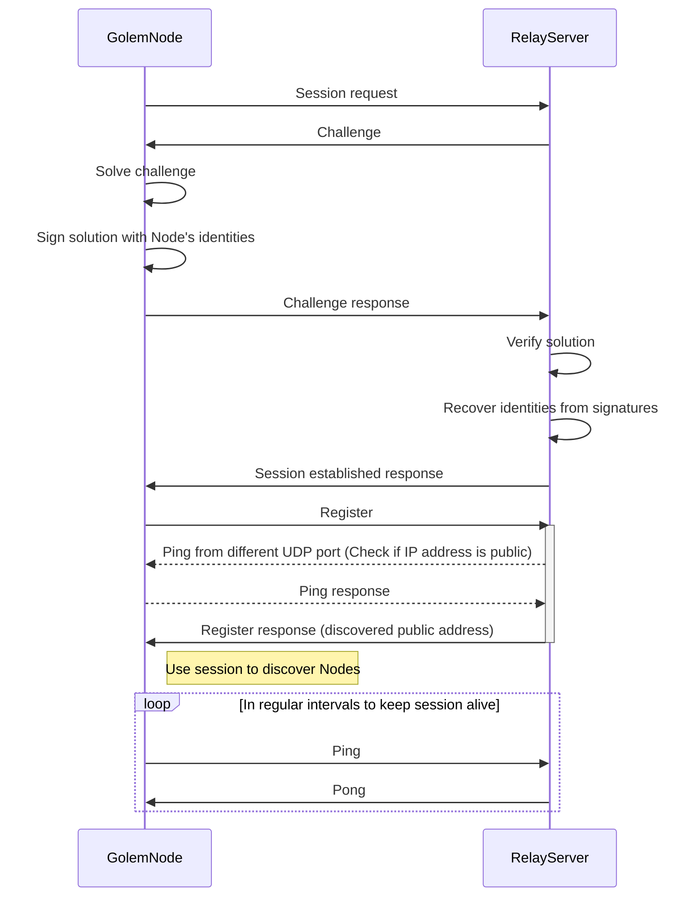

# Golem — current architecture
Authors: Witold Dzięcioł, Przemysław Rekucki, Marek Dopiera,
\<YOUR NAME GOES HERE\>\
Reviewers: Maciej Maciejowski, Paweł Burgchardt\
Status: WIP

# About this document
The goal of this document is to describe present Golem architecture in enough
detail for an outside person to understand how it works under the hood. The
intended audience is assumed to be technical but not necessarily have deep
expertise in the crypto world. The level of detail stops short of describing
code and its organization but describes key technologies used in order to
implement the needed functionalities.

The aim is not to dive deep into every integration, but to capture architectural
decisions and their consequences.

# Framework Concept

This section describes what comprises Golem network, namely the actors,
technical artifacts and activities they actors may perform on those activities.
The objective of this paragraph is to tie together all the terms and provide a
very high level description of what they are.

## What Golem is

## What Golem is not

## Actors
This section describes the actors using Golem Network and their role in the
system.
### Provider
### Requestor
Note: We use term Requestor not Requester.
### Developer
### End User
Consumer of resources can be different person than Requestor.
For example we can have web service which forwards computationally expensive jobs
to Golem Network. Example: [Deposits](https://github.com/golemfactory/golem-architecture/blob/master/specs/deposits.md)

#### Service Owner
#### Funder
#### Spender

## Activities
This section describes what actors can do to the system. The descriptions are
only as detailed as to explain how the actors control the artifacts. The goal is
to give the reader an overview of the terms introduced by Golem without any
details and establish a glossary to ensure consistency within the document.

### Selling on Golem platform

Golem Network allows buyers and sellers to connect and reach agreements. The market is designed to be asymmetrical:
the sellers ([Providers](#provider)) publish Offers, and the buyers ([Requestors](#requestor)) browse through these Offers.
When a Requestor finds a suitable Offer, they contact the Provider directly to negotiate the deal.

Typically, humans are not involved in the process of finding, matching, negotiating, or finalizing agreements. Instead,
users define their needs programmatically, allowing the [Provider Agent](#provider-agent) and [Requestor Agent](#requester-agent)
software to handle these tasks automatically.

The [Provider Agent](#provider-agent) is primarily responsible for implementing the logic needed to sell resources on
the Golem Network. From high level perspective, Provider Agent application should do following things: 
1. Describe Resources using property language to create an [Offer](#offer)
2. Publish the Offer on the market
3. Monitor incoming Proposals and negotiate an [Agreement](#agreement) with the most promising [Requestor](#requestor)
4. Allocate the promised Resources in accordance with the [Agreement](#agreement)
5. Monitor resources usage and charge Requestor Agent
6. Terminate the Agreement or await the Agreement termination event from the [Requestor](#requestor)
7. Send an [Invoice](#invoice) summarizing the total cost of the [Agreement](#agreement)
8. Wait until the payment for the [Invoice](#invoice) is settled and payment confirmed. 

#### 1. Describe Resources using property language to create an [Offer](#offer)

While Golem is currently used for trading computational resources, it was designed to support the exchange of any type of
[resource](#resource). This means the Marketplace does not enforce strict standards on the goods being traded.
To enable this flexibility, Golem uses a generic [property and constraints language](#discovery-and-offersdemand-matching)
to describe the resources being offered. The Core Network does not interpret the semantics of the properties in the Offer,
nor does its behavior depend on the negotiated Agreement. It is the responsibility of the Provider Agent application to
accurately interpret the semantics and implement the agreed-upon behavior between the parties.

In this chapter, the term ["resource"](#resource) is used in a generic sense. However, illustrating a generic
example can be challenging. Therefore, we will focus on selling computational power in a virtual
machine (VM) to provide the reader with a clearer understanding.

In this case, the Offer should include the following key aspects:
- The type of [Execution Environment (ExeUnit)](#execution-environment-exeunit) that will be used. (The [VM](#vm-runtime)
  is an example of an execution environment. [WASM runtime](#wasm-runtime) is another)
- [Hardware specifications](https://github.com/golemfactory/golem-architecture/blob/master/standards/cheat_sheet.md#goleminfcpu),
  including the number of CPU cores, RAM, and disk space.
- The price and the [pricing model](#payments-models) applied.
- The payment scheme, outlining how the agent application interacts with the payment system (e.g. in `pay-as-you-use` scheme,
  what is expected transaction frequency).
- The [Wallet](#wallet) address for receiving payments, along with the supported [payment platforms](#payment-platform).

#### 2. Publish the Offer on the market

Golem is a decentralized network of independent [Nodes](#yagna-node), with no central repository for [Offers](#offer) or any
central server to facilitate [Agreements](#agreement) between parties. As a result, offers must be propagated between nodes,
and transactions are conducted through direct communication.

Developers don’t need to worry about [offer propagation](#offer-propagation). The responsibility for propagating offers
lies with the Core Network. The only task for the Provider Agent is to publish the offer on the market and listen
for incoming [Proposals](#proposal).

#### 3. Monitor incoming Proposals and negotiate an Agreement with the most promising Requestor

The [Provider Agent](#provider-agent) plays a passive role in negotiations. Offers are propagated across the network and
received by [Requestors](#requestor). The offer is matched locally on the Requestor's node with a [Demand](#demand).
If the Requestor is interested, they respond by sending a [Proposal](#proposal) to the Provider Agent.

[Negotiation](#process-of-negotiations-and-making-an-agreement) is the process of exchanging Proposals and adjusting their
terms until the [Requestor Agent](#requester-agent) proposes an Agreement. The structure of a Proposal is identical to
that of an Offer or Demand, using the same [property and constraints language](#discovery-and-offersdemand-matching) to 
describe the Agreement's conditions. During negotiations, certain aspects of the Agreement can be modified. While Offers
and Demands represent the initial declaration of resources, terms, and conditions, the proposal exchange is a dynamic
process of refining these terms to reach an optimal [Agreement](#agreement) for both parties.

The negotiation stage serves several purposes:
- Ensures that the Provider Agent and Requestor Agent communicate before signing an Agreement (since offer propagation
  doesn’t require direct interaction between parties).
- Allows both the Provider Agent and Requestor Agent to implement different [strategies](#market-strategies) to maximize
  their benefits and select suitable partners.
- Provides an opportunity for the Provider Agent and Requestor Agent to negotiate additional terms that weren’t included
  in the initial [Proposals](#proposal). This is possible through protocols built on top of the property language.

Both the Provider Agent and Requestor Agent negotiate with multiple Agents simultaneously. The Requestor Agent initiates
the Agreement by proposing it to the Provider Agent, who can either accept or reject the Proposal. Once the Agreement is signed
by both parties, the Requestor Agent can begin using the resources. The Agreement remains valid until it is terminated by
either party. The terms of termination (e.g., duration of the Agreement and conditions under which it can be terminated) are
specified within the Agreement.

##### Example of negotiation

To better understand the [Negotiation](#process-of-negotiations-and-making-an-agreement) process, let’s consider an example 
involving the negotiation of a [payment platform](#payment-platform). This will illustrate how agents can use different
strategies and what negotiation protocols can be built on top of the [property and language](#discovery-and-offersdemand-matching).

When declaring a payment platform in an [Offer](#offer), the Provider Agent lists [wallet](#wallet) addresses for each
platform it supports. It is the Requestor Agent's responsibility to choose the platform by specifying the appropriate
[property](#property) in their demand. The Requestor Agent can approach negotiations in two ways:

###### 1. Static Negotiations
Suppose the Requestor Agent prefers payments on the Polygon network. In this case, they require the Provider Agent to support
Polygon and will not select a Provider Agent that doesn’t.

Since the Requestor has a specific requirement, multiple negotiation stages aren't necessary. They can simply add
a [constraint](#constraint) to their [Demand](#demand), instructing the matching algorithm to filter out Providers that
don’t meet this requirement. In their Demand, they set the chosen platform as a fixed value.

###### 2. Dynamic Negotiations
Now imagine a Requestor Agent that can pay on multiple platforms but prioritizes them based on transaction fees. In this
scenario, the Requestor Agent has a larger pool of potential Providers since they don’t restrict the platform by adding
a constraint to their demand.

Instead, the Requestor Agent collects Proposals from the market and evaluates them based on estimated costs. In later stages
of Proposal exchange, they choose the platform by setting the relevant [property](#property) according to the Providers' scores,
which are based on potential [transaction](#transaction-on-blockchain) costs.

#### 4. Allocate the promised Resources in accordance with the Agreement

Once the [Agreement](#agreement) is signed, the Provider Agent is expected to reserve the promised [resources](#resource) for the
Requestor’s use. During this time, the Provider Agent cannot sell these resources to anyone else and must be prepared
to start the [Activity](#activity). For instance, if the Provider Agent is selling computing power through a [Virtual Machine Execution
Environment](#vm), they declared in the Agreement a specific amount of RAM and a certain number of threads to be allocated for the VM.
The Provider Agent can only sell any remaining RAM and cores to other Requestors.

Making an Agreement reserves the Provider's resources. To actually use these resources, the Requestor Agent must take
an additional step by creating an [Activity](#activity). Most parameters are already included in the Agreement, but some
additional parameters may be required and will be specified later using Activity commands. For example, if the Requestor Agent
wants to utilize the Provider's resources by running a virtual machine, details like the [image](#vm-image) to run, RAM, and the
number of cores are taken from the Agreement. However, to allocate an IP address or transfer necessary files, Activity
[commands](#controlling-exeunit-basic-concepts) are used. Further details on controlling an Activity from the Requestor's
perspective can be found in the["Running something"](#running-something) section.

From the Provider Agent's perspective, the primary focus is to listen for incoming Activity events and create an Activity
when requested by the Requestor Agent. Upon receiving an Activity creation event, the Provider Agent should spawn an
[ExeUnit](#exeunits) process (and a Virtual Machine in consequence). Conversely, receiving an Activity destruction event should trigger
the termination of the ExeUnit processes.

The Requestor Agent is allowed to spawn multiple Activities consecutively. In general, multiple Activities running
simultaneously may be permitted; however, this does not apply in the case of a [Virtual Machine](#vm), as hardware
resources can only be allocated once.

#### 5. Monitor resources usage and charge Requestor Agent

The [ExeUnit](#exeunits) is directly controlled by the Requestor Agent, with no intervention from the Provider Agent.
Communication happens solely between the Requestor Agent and the ExeUnit. However, this doesn't mean the Provider
Agent is inactive during this time. The Provider Agent's responsibility is limited to calculating the cost of resource usage
based on the pricing model defined in the Agreement and informing the Requestor Agent accordingly.

There are two types of payment documents used in the Golem Network: [Debit Notes](#debit-note) and [Invoices](#invoice).

Debit Notes are sent at regular intervals during the execution of an activity to inform the Requestor Agent of the
accumulating costs of the Agreement. These notes act as building blocks that support various payment schemes.
The handling of Debit Notes by Agents is governed by the terms negotiated in the Agreement. Generally, Debit Notes
serve the following purposes:
- Informing the Requestor Agent about resource usage and activity costs, and obtaining explicit acceptance of these costs.
- Acting as a health check, allowing the Provider Agent to monitor if the Requestor Agent is still active and hasn’t
  abandoned the Agreement, helping avoid not getting paid.
- Facilitating [mid-agreement payments](#mid-agreement-payments).

Invoices are issued after the Agreement is terminated, providing a summary of the total costs. They allow the Provider
Agent to include any additional costs not covered in the Debit Notes, as the final Debit Note doesn’t have to be sent
immediately after the activity ends.

Both Debit Notes and Invoices can be either accepted or rejected by the other party. Acceptance signals that the
Requestor Agent agrees to pay the specified amount. Rejection, on the other hand, indicates refusal to pay the
non-accepted amount. However, it’s important to note that a rejection does not absolve the Requestor Agent from paying
for all previously accepted Debit Notes. The conditions under which rejection is allowed should be defined in the
Agreement. Currently, no payment scheme permits rejections.

Accepting a Debit Note or Invoice does not result in immediate payment for a few reasons.
Debit Notes can be classified as payable or non-payable, with payable Debit Notes identified by the due date included
in the document. While payable Debit Notes are scheduled for processing upon acceptance, this still does not necessitate
immediate payment. The payment mechanism allows for the [batching of payments](#payments-batching) or delaying them
to accommodate additional Debit Notes or [Invoices](#invoice), thereby reducing [transaction](#transaction-on-blockchain) costs on the blockchain.

The consequence of delaying payments is that they are not guaranteed. However, this design opens the possibility of
implementing mechanisms that can mitigate or eliminate the risk of non-payment. For instance, a payment platform
could be developed using a deposit or escrow contract, or by integrating payment channels into the Core Network.

It’s important to note that, regardless of the payment scheme or platform used, Golem Factory does not act as an
intermediary for payments. Since transactions occur on the blockchain, and due to the decentralized nature of blockchain
technology, Golem Factory has no control over these transactions.

#### 6. Terminate the Agreement or await the Agreement termination event from the Requestor Agent

The [Agreement](#agreement) can be terminated when either party chooses to end it. Core Network doesn't enforce any
specific termination rules, so the Agreement should clearly define the conditions under which termination is
permitted. Below is a non-exhaustive list of possible reasons for termination:
- The Agreement expires if it was established for a fixed duration.
- The Requestor Agent no longer needs the [resources](#resource) or has completed the computations.
- One of the parties violates the terms of the Agreement, such as:
  - The Requestor Agent fails to accept [Debit Notes](#debit-note) within the agreed timeframe.
  - The Provider Agent issues Debit Notes more frequently than agreed.
  - The Requestor Agent fails to make timely payments, particularly in cases involving [mid-agreement payments](#mid-agreement-payments).

It is the Agent—whether Requestor or Provider—who decides to terminate the Agreement. The Agent is also responsible for
detecting if the other party has terminated the Agreement and taking the appropriate action in response.

Provider Agent has the option to attach additional information outlining the reasons for termination when ending the
Agreement. While this is not mandatory, it is encouraged as it can provide valuable context for the other party,
serving as diagnostic information or for other purposes.

#### 7. Send an Invoice summarizing the total cost of the Agreement

Once the Agreement is terminated, the Provider Agent should send an [Invoice](#invoice) to the Requestor Agent summarizing
the total costs incurred throughout the Agreement. This Invoice should reflect the cumulative costs from all [Activities](#activity).
In response, the Requestor Agent must either accept or reject the Invoice. However, regardless of the acceptance status,
payment is mandatory for the total amount indicated by the accepted [Debit Notes](#debit-note), as their acceptance constitutes
a binding commitment to pay.

#### 8. Wait until the payment for the Invoice is settled and payment confirmed.

It's important for the Provider to monitor payments after the Agreement is completed. This is when the Provider Agent
should adjust its market strategy to ensure profitability. Since the Core Network doesn't guarantee payment delivery,
the Provider Agent should implement measures to prevent being exploited by Requestors. One example is rejecting
non-paying Requestors and prioritizing those with a good reputation. Lack of payment isn't the only reason for
declining a Requestor in the future. The Provider Agent may also choose to reject subsequent Agreements with
Requestors who break the Agreement conditions.

Payment confirmation is received by the Provider Agent from the Requestor once the transaction is confirmed on the
blockchain. This confirmation specifies which Activities and Agreements are covered by the transaction. There is no
1-to-1 relationship between transactions and Activities or Agreements. A single blockchain transaction can cover
multiple Activities or Agreements, while each Activity or Agreement may also be covered by multiple transactions.

### Searching on market

Providers or Requestors on Golem don’t always aim to buy or sell resources. Sometimes, they simply want to observe the market.
There are several possible reasons for this:
- Checking which resources are available on the network
- Estimating potential computation costs
- Gathering insights to better adjust negotiation strategies
- Collecting statistics about the network

The approach to observing the market is similar to the methods described in the chapters on buying and selling resources.
An agent specifies their Offer or Demand using a property and constraints specification language.
The key difference is that they are not required to negotiate with other agents, nor must they provide all necessary
information in their Offer or Demand. This is a more lightweight approach compared to going through the full negotiation
process.

### Buying on golem platform
### Running something

## Layers

decomposition into layers. responsibility of the layers.

### Golem Node

### Business logic

### Execution

## Functional modules

decomposition into functional areas and scopes of responsibility of these layers.

### Market
### Payment
### Activity
### Identity
### Net

## Applications/Exe-Units

a brief overview of sample applications.

### WASM Runtime

### VM Runtime

### GH/AI Runtime

### HTTP Auth Runtime 

## Artifacts

This section describes the artifacts, i.e. the terms introduced in Golem Network
on which actors can act. They are organized by respective aspects of Golem
Network. The descriptions describe their function rather than their
implementation.

Section should serve as dictionary to be linked by other chapters.

### Participating entities

#### Core Network
#### Yagna daemon
#### Yagna Node
#### Provider agent
#### Requester agent

### Marketplace
#### Offer
##### Property
##### Constraint
#### Demand
#### Subscription
This word is used to describe Offer/Demand put on market, so we should mention it.
#### Proposal
#### Negotiation
#### Agreement

### Execution system
#### Resource
#### Activity
#### Execution environment (ExeUnit)
##### ExeUnit Batch
##### ExeUnit Command
##### VM
##### VM Image
##### WASM
##### WASM image

### VPN
#### Network

### Payment System
#### Payment Driver
#### Payment Platform
#### Token
#### Wallet
#### Allocation
#### Debit Note
#### Invoice
#### Payment
#### Transaction (on blockchain)

## Key architectural decisions
### GLM is built on XYZ
### GLM is used for clearing
### No centralized offer matching rules
### Only providers' offers are propagated
### Agreements are not stored on the blockchain
### Offline requestors are not supported 
### Local storage (TODO: what role does the local DB play?)

## Technical view - components
This section describes key components of Golem Network, i.e. their
responsibilities, interfaces and which other components they utilize.

### GSB
* what it is, how it works and how it imposes a code structure and how
  addressing works

### Networking

The core networking component in Golem is the yagna Net module. It acts as a middleman between the other modules on 
the yagna daemon and the Golem Network by facilitating message exchange with [GSB (Golem Service Bus)](#gsb) and the 
network itself. The Net module provides a uniform interface that allows for different implementations of the 
networking layer.  

The [Net Module interface](#net-module-interface) chapter will focus on general networking concepts, while specific 
implementations will be covered in the [Hybrid net](#hybrid-net) and [Central net](#central-net) chapters. 

#### Net Module interface

The Network module offers the following functionalities:
- Sending messages to other Nodes
- Forwarding received messages to the appropriate modules
- Broadcasting messages to the network
- Receiving and processing broadcasted messages

##### Address translation

The Net module follows specific GSB address naming conventions to enable cooperation with other modules. Addresses 
prefixed with `/net/{NodeId}` are reserved for the Net module, where it listens for incoming messages and forwards 
them to the Golem Network. Conversely, addresses starting with `/public/...` are available for yagna modules to expose 
public methods that can be called from other Nodes.   

When the Net module receives a local incoming message, it extracts the NodeId from the address prefix and uses it to 
forward the message into the Golem Network. On the receiving end, messages coming from the Network are processed, 
and the address is checked to extract the NodeId. If the NodeId belongs to the recipient Node, the address is routed to 
the appropriate GSB handler registered under the `/public/...` address.   

##### Broadcasting

Message broadcasting in the Net module is organized around the concept of 'topics,' which can be thought of as 
message categories. Different modules can register a message handler with the Net module that gets triggered 
whenever a message for a specific topic is received. 

To send a broadcast, a module must send a GSB message to the Net module on the designated topic. The Net module then 
forwards this message to the network. Depending on the network's implementation, the message may be routed either to 
neighboring Nodes or to all Nodes across the network.  

##### Handling identities

Each Golem Node can have multiple identities, with one of them (the default identity) used to identify the Node 
within the network. However, operations on a Golem Node can also be performed in the context of secondary identities.
The Net module must be able to handle messages sent to and from any of these identities. For more information on 
identification, refer to the chapter about the [identity module](#identity). This section focuses solely on the Net 
module interface.

In addition to the GSB endpoints bound to the `/net/{NodeId}` prefix, as described in the [Address Translation 
chapter](#address-translation), there is another prefix: `/from/{LocalId}/to/{RemoteId}`. This enables messages to 
be sent from a specific identity on one Node to a specific identity on a remote Node.

Another important aspect is that the Net module always checks if the target identity belongs to the local Node. If 
it does, the message is routed back to the local GSB instead of being sent over the network. This mechanism allows 
GSB calls to be handled uniformly by the calling code, regardless of whether the target is local or remote.

##### Reliable, unreliable and transfers channels

The Net module supports multiple channels for message transmission. The basic channel provides reliable message 
delivery via GSB, which is used for most control messages between Nodes.

However, certain functionalities require different handling. For example, VPN embeds IP packets into GSB messages 
and routes them through the Golem Protocol. Although VPN users can choose any protocol, TCP is typically used 
because many higher-level protocols rely on it. Sending VPN messages through a reliable protocol would hurt 
performance, as this would essentially embed TCP within TCP (or another reliable protocol implemented in Net). To 
address this, the Net module also allows for sending messages in an unreliable manner without packet delivery 
guarantee.   

The third option is the transfer channel. Mixing transfers with GSB control messages can cause delays, as large file 
transfers can quickly fill the sender’s buffer queue. To avoid this, it is recommended to use a separate channel 
specifically for transfers.

#### Hybrid Net

Hybrid Net was developed as an intermediate step towards decentralization, enabling peer-to-peer (P2P) communication 
between Golem Nodes. However, since most of the network operates behind NATs, P2P cannot be the sole communication
method. To address this, the Net implementation supports communication forwarding through specialized Node known
as relay.  

An additional advantage of relay server is it's ability to expedite Node discovery. In a pure P2P network, Node
discovery can be slow, as no single Node has a complete view of the network, requiring multiple hops to find new Nodes.
Relay server can also facilitate P2P communication between Nodes when direct connections are not possible.

##### Relay server

The Relay server is a core component of the networking layer in the Golem Network. All newly connected Nodes 
register with the Relay server, providing the necessary information for discovery and connection. The Relay server:
- Maintains a list of Nodes present in the network.
- Stores each Node's identity, public key, and IP address.
- Assists in establishing peer-to-peer (p2p) connections when possible.
- Routes traffic between Nodes if a p2p connection cannot be established.
- Checks if connecting Nodes have public IP port exposed
- Offers functions for:
  - Discovering Nodes and querying their information.
  - Retrieving a Node's neighborhood.

Communication with the Relay server is handled through a custom protocol built on top of UDP, defined using Protocol 
Buffers (protobuf). UDP was chosen for its lightweight nature, as it does not require maintaining open connections, 
which would consume more system resources compared to TCP. This makes it possible to handle a large number of Nodes 
concurrently, ensuring decent scalability.

###### Connecting to relay server

##### Establishing connections between Nodes

##### Network Traffic

##### Virtual TCP

##### Node identification

#### Central net

### Offer / negotiation
A description of the component responsible for making offers, counter-offers,
negotiations, etc.

### Market interactions
#### Discovery and Offers/Demand matching
- Offer/Demand properties and constraint language
- Yagna is property agnostic - doesn't understand semantic of properties, only agent do
- Some examples of properties and constraints and how it works
- Links to more detailed docs for properties language and properties specification (?)
#### Offer propagation
- Link to design [decision](#only-providers-offers-are-propagated)
- Algorithm overview
#### Process of negotiations and making an agreement
- Initial Proposal
- Countering Proposal
- What can change in counter proposal (protocols based on property language)?
- Provider Agent possible Proposal responses (counter, reject)
- Requestor Agent possible Proposal responses (counter, reject, propose Agreement)
- Provider Agent possible Agreement responses (accept, reject)
- Requestor possibility of Agreement Proposal cancellation
- Restarting negotiations (who can, who can't and how?)

#### Market strategies

#### Agreement termination
- Who is allowed to terminate? In what situation?
- What is specified by protocol and what is left to future specifications?
- Termination reason concept

### Offer propagation
* a description of how it happens that offers are visible to reqestors
* Link to design [decision](#only-providers-offers-are-propagated)
* Algorithm overview

### Payments
* a description of current payment driver, its modes of operations and how it
  can be extended
#### Payments models
- Describe generic model which is open for new implementations
- Payment model specification in Offer/Demand language
- Linear Payment model as an example
#### Payments flow during Agreement
- Negotiating payment platform and other payment details
- Testnet(s) vs. mainnet(s)
- Tokens
- Partial payments vs. payments after Agreement finish
- DebitNotes/Invoices interactions (acceptance, rejection, cancellation)
- How DebitNote/Invoice acceptance relates to payment on blockchain?
- Payment settlement and payment confirmation for Provider

##### Mid-Agreement payments
##### Post-Agreement payments

#### Payment drivers
- Abstract concept (independance from underlying payment mechanisms)
- How payment platform relates to payment driver?
- Examples: erc20 driver, zksync (?)
#### Payments batching
#### Deposits payments
- Overview of the concept
- Link to external documentation describing details

### ExeUnits

### Activity
* How the actions on behalf of the requestor are performed
* We should dive into each important and general implementation, i.e. WASM and
  VM

#### Abstract concept
- ExeUnit concept is generic enough to sell any kind of computation resources
- Generic ExeUnits (for example VM, WASM etc.) vs. specialized ExeUnits for specific tasks like:
  - [GamerHash](https://github.com/golemfactory/ya-runtime-ai)
  - [outbound gateway](https://github.com/golemfactory/ya-runtime-outbound)
  - [http authentication](https://github.com/golemfactory/ya-runtime-http-auth)
  - SGX variant of ExeUnit
  - These points are not meant to document those ExeUnits, rather show possible variaty based
    on these examples
- Interaction with yagna through GSB
- Control flow between Requestor and ExeUnit
- Extensible commands list (ExeUnit implementation dependent)
##### Controlling ExeUnit (basic concepts)
- Spawning ExeUnit (contract between Provider Agent and ExeUnit)
  - Self-test
  - Offer template
- Binding to GSB (addressing based on activity id)
- Requestor state control
- Commands and batches:
  - Deploy, Start, Transfer, Run, Terminate
  - Querying command/batch state, receiving results
  - Transfer methods ([GFTP](#gftp), http)
##### Usage counters
#### ExeUnit Supervisor
- Why splitting Supervisor and Runtime?
- Common functionalities provided by Supervisor
#### ExeUnit Runtime
#### GFTP
#### VM runtime
- Virtual machine desciption (so the reader knows what is there, but not details)
- Functionalities (outbound, VPN, process output capturing)
- VM images, gvmkit-build etc
#### WASM runtime
- WASM supported execution engines
- WASM images

### VPN
* The component responsible for creating a VPN between VMs

### Reputation
* a description of how it is evaluated, distributed and used

### SDK
* which of the logic useful to the user ends up in the SDK

## Technical view - deployment
How the components are reflected in processes, where the processes are run, what
is their relation ship, etc.

## Technical view - flows & algorithms
This section documents how control and responsibility flows through the listed
components to achieve Golem's functionalities. Any non-trivial algorithms
spanning more than one component are also described here.

### Starting a provider and publishing an offer
### Receiving and executing work
### Finding a provider and requesting work
### Starting a cluster of VMs
### Creating a custom image

PR: this is part of the business logic layer. you would need to think about how to add objects from this layer and SDK implementations in different versions to this document. and the concept of building various reputation methods.

PR: ya-provider is also from this layer and you could write down what configurations it supports. e.g. node attestation, authorization certificates, etc.

## Key architectural shortcomings
This section contains known shortcomings of the implemented architecture —
irrespective of whether they were intentional or unintentional.

### Preexisting two categories of actors
The preexisting categories of actors (providers and requesters) and their
asymmetric roles are limiting in certain scenarios. FIXME FIXME FIME
### TODO

