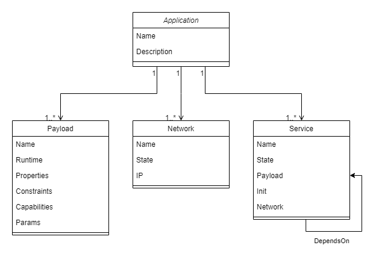

# Golem Application Object Model

This area contains specification and resources related to Golem Application Object Model. 

An application hosted on Golem can be described by a set of data structures, which specify and represent all components of the application which are relevant from Golem's point of view.

## GAOM Diagram

## GAOM Specification

[link](./gaom.schema.json) / [documentation](./gaom.schema.md)

## GAOM Release Process

(TBD) GAOM schema requires a release process, whereby subsequent versions of published schema follow a clear versioning pattern, and can thus be referenced by dependent applications.