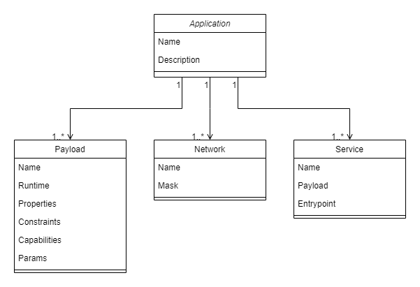
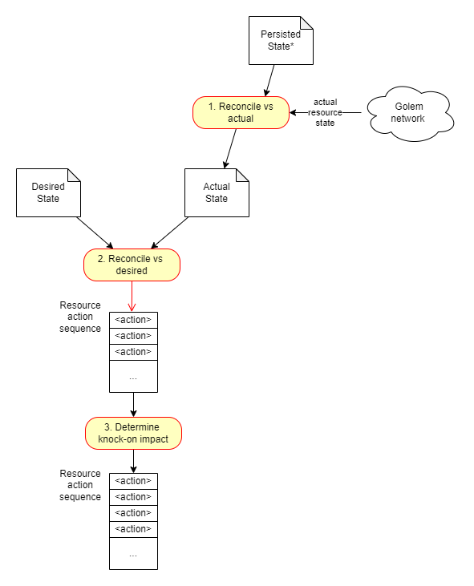
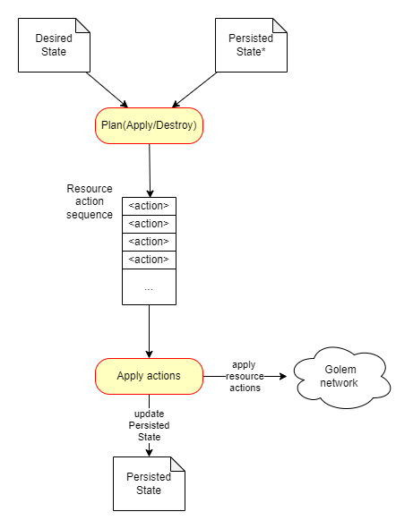

## Abstract
This GAP introduces a proposal for a language-agnostic layer of abstraction over the Golem VPN and its high-level APIs (`yapapi`, `yajsapi`).
The main element of this proposal is the introduction of an **application descriptor** file which can be used to describe a deployment of a set of services to be run within the Golem Network.
This application descriptor is intended to be used together with high-level APIs to enable deploying and managing the nodes described within the descriptor.

## Motivation
### Why?
The main motivation for this proposal is providing support for development of distributed applications (dApps) deployed within the Golem Network.
### Goals
- enable reusable application deployments through a version-control-friendly configuration format (descriptor files)
- simplify creating complex network topologies (adding a layer of abstraction over the existing Golem VPN functionality)
- allow for easily starting and tearing down multiple different payloads within the Golem Network

## Specification
### Golem Application Object Model
An application hosted on Golem can be described by a set of data structures, which specify and represent all components of the application which are relevant from Golem's point of view. The data structures are an Object Model of an application, which has following attributes:
- Object Model has a schema - it consists of object types (for example a `payload`, a `service`, a `network`), and each object type has a set of fields/attributes (eg. a `payload` includes a `runtime`, `capabilities` and runtime-specific `params`)
- Objects have relationships (eg a `services` is specified by a `runtime`, and may be part of a `network`)
- Object Model can be maintained in memory of an _engine_
- Object Model is dynamically updated as the state of represented objects changes (eg. as a result of provisioning resources on Golem network)

The _engine_ which is a host for an Object Model is responsible for:
- ingesting an initial application specification (a *descriptor*)
- provisioning Golem resources as per the _descriptor_
- maintaining the Object Model state (eg. as resources are provisioned)
- persisting the Object Model state

Golem Application Object Model (diagram): 


### Configuration descriptor file
An application descriptor specifies initial Golem Application Object Model. It must include all data required to provision Golem resources required by the application.
The proposed format is YAML. 

Here's an example of such a descriptor:
```
meta:
  name: "Sample-application"
  description: "A sample descriptor for a Golem application"
  author: "GolemFactory"
  version: "0.1.0"

payloads:
  web-server:
    runtime: vm
    constraints:
      - "golem.inf.cpu.cores=2"
      - "golem.inf.mem.gib>=4"
    capabilities:
      - "vpn"
    params:
      image_hash: "c37c1364f637c199fe710ca62241ff486db92c875b786814c6030aa1"

  db-server:
    runtime: vm
    constraints:
      - "golem.inf.storage.gib>10"
    capabilities:
      - "vpn"
    params:
      image_hash: "85021afecf51687ecae8bdc21e10f3b11b82d2e3b169ba44e177340c"

networks:
  default:
    ip: "192.168.0.1/24"

services:
  db-service:
    payload: db-server
    network: default
    init:
        - run:
            args: ["/bin/run_rqlite.sh"]

  web-server-service:
    payload: web-server
    network: default
    init:
        - run:
            args: ["/bin/bash", "-c", "cd /webapp && python app.py --db-address ${services.db-service.network_node.ip} --db-port 4001 initdb"]
        - run:
            args: ["/bin/bash", "-c", "cd /webapp && python app.py --db-address ${services.db-service.network_node.ip} --db-port 4001 run > /webapp/out 2> /webapp/err &" ]
```

#### JSON Schema for the descriptor: 
[link](./gaom.schema.json) / [documentation](./gaom.schema.md)

Notes:
- The descriptor YAML has a **strict format**, ie. it must follow YAML schema definition for defined elements. In other words, the YAML parser must follow a "strict reader" pattern - YAML with unknown attributes shall trigger errors. Note: as an extension, we would like to have also ability to explicitly "ignore" the schema errors.
- Once the format of the descriptor YAML is finalized, its schema can be published to https://www.schemastore.org/json/. This way, the YAML language server will provide support for schema validation and completion in IDEs and editors.

### Descriptor package formats
The Golem application descriptors may be published in two different formats. An application designer may choose the format which better suits their application.

#### Single-YAML descriptor packages
A package may consist of a single decriptor file in YAML format. Such a single file is most likely sufficient for applications of low complexity. This package type is called a **single-YAML** descriptor package. 

#### Multi-YAML descriptor package
Complex application descriptors may benefit from splitting the YAML content into multiple files, groupped by eg. areas of concern. Such multi-file descriptors can be published as ZIP-packages containing all the relevant YAML files, in flat directory structure (only file sin archive root shall be processed by the _engine_ when processing the descriptor). This package type is called a **multi-YAML** descriptor package. 

## Implementation Features

### Descriptor - "Apply" operation 
Running Golem Compose engine for a specific descriptor shall provision respective resources/services on Golem Network (as a one-off action).

### Single-YAML package support
The _engine_ (and corresponding CLI) shall support provisioning Golem application based on single-YAML descriptors.

### Merging descriptor files
Multiple descriptor files may be used within the scope of a single deployment. In such a case, the files are merged based on their ordering. The merging is performed using a deep merge strategy.
Here's an example of how this merging strategy is applied:

Base file:
```
meta:
  name: "Sample-application"
  description: "A sample descriptor for a Golem application"
  author: "GolemFactory"
  version: "0.1.0"

payloads:
  nginx:
    runtime: "vm"
    params:
      image: "image-hash"
    constraints:
      "golem.inf.cpu.cores": 2
    capabilities:
      - "vpn"
```

Override file:
```
payloads:
  nginx:
    params:
      repo: "repo-url"
    capabilities:
      - "gpu"
```

Resulting file:
```
meta:
  name: "Sample-application"
  description: "A sample descriptor for a Golem application"
  author: "GolemFactory"
  version: "0.1.0"

payloads:
  nginx:
    runtime: "vm"
    params:
      image: "image-hash"
      repo: "repo-url"
    constraints:
      "golem.inf.cpu.cores": 2
    capabilities:
      - "vpn"
      - "gpu"
```

A depth-first approach is used to determine the values which need to be added or updated to existing collections (lists and key-value maps).
For maps, keys from overriding files have precedence over the base ones.
In the case of lists, when merging lists from two files, the override values are simply concatenated to the base list. If required, this behaviour can be made configurable (e.g. to enable overriding the entire list instead).

### GAOM object state
The entities and resources in a Golem application follow a certain lifecycle - they get provisioned, they remain active, they get removed/terminated. The application elements represented by the object graph shall have their **state** represented in the _engine_. The **state** represents the stage of lifecycle in which an application element is at a given moment in time.
Following states are considered:
- Pending
- Active
- Terminated 

### GAOM object dependency graph
As the descriptor is processed by the _engine_, the Golem resources are provisioned, and their state in GAOM is updated by the _engine_. Some resources depend on other resources (eg. a `service` may need to be provisioned in a context of a `network`) which implies the sequence of resource provisioning. The _engine_ shall derive the dependency graph from the descriptor and based on this - determine the provisioning actions sequence.

### GAOM explicit dependency syntax
It is possible to specify explicit dependency between services. If a service A should only be provisioned after service B becomes active, the specification of service A shall include a `depends_on` attribute, pointing at the label of service B. Based on this information, the _engine_shall build an appropriate dependency graph.
**Note:** a service may depend on a number of other services, therefore the `depends_on` attribute must allow for multiple dependency labels. 

### GAOM state persistence 
The _engine_ persists the state of GAOM after the state of the model changes.  
#### File persistence
The GAOM state can be persisted to a local or remote file.
#### Distributed storage
The GAOM state can be persisted to a distributed storage system (choice of storage options to be selected for implementation).

### GAOM state synchronization
The _engine_ is able to load a persisted state of GAOM and reconcile its content versus actual state of Activities on Golem network. This reconciliation is required eg. when the _engine_ is disconnected from the network (goes _offline_) and then is reconnected to resume control over the Golem application. 

The synchronization may determine gaps between the persisted state (desired) and the current state (actual) on Golem network. The _engine_ is capable of resolving the gaps, by provisioning or terminating Activities as required. 

#### GAOM Model object types

A GAOM model object type includes all relevant attributes of a given resource, including:
- `Name` by which the resource can be identified in GAOM model (mandatory in the GAOM descriptor),
- `State` which indicates the current state of the resource, as recognized by the engine (so not specified in the GAOM descriptor, but maintained by the engine),
- Attributes by which the resource can be identified in Golem network. For example, a Service instance can be identified by respective `AgreementId` and `ActivityId`.

#### Engine
The _engine_ implementation shall follow generic logic which operates on resource abstractions, performing generic algorithms, as indicated below. 
A general rule is that every tangible resource on Golem network (`Service`, `Network`) can be manipulated by an abstraction called `ResourceAdapter`, which implements a set of generic operations related to provisioning and maintaining a resource for an application. An _engine_ implements a set of generic operations involving resources, their desired state (as per the GAOM descriptor), perceived state (as per GAOM model persisted by the engine) and actual state (as per the current state of resources on Golem network). 

The _engine_ operates on following GAOM model states:
- `desired state` - as described by the application descriptor, this is the composition of resources required by an application at a given moment in time. Note that the desired state may change over time - and it is the responsibility of the _engine_ to reflect those changes in the actual set of resources provisioned on Golem network.
- `persisted state` - the GAOM model snapshot which is persisted after the _engine_ performs any operation on Golem actual resources. Note that the persisted state should include also the 'physical' resource attributes, required to identify the actual resource instance on Golem network (eg. `AgreementId`/`ActivityId`).
- `actual state` - the GAOM model snapshot which represents the actual current state of resources as they operate on Golem network. The actual state should be obtained for a given moment in time by verifying the actual state of resources as recorded in the `persisted state`.

The fundamental operations of the engine are:
- `Plan` - based on the `desired state` and `persisted state` derive the `actual state`, and then determine the sequence of actions which need to be performed on Golem network to provision/update/destroy resources, in order to achieve the `desired state`. Note that `Plan` may be called in `Apply` or `Destroy` mode.  
- `Apply` - run `Plan(Apply)` and then execute the actions determined by the Plan operation. For each of the actions, as soon as it is complete, record the changes in `persisted state`.
- `Destroy` - run `Plan(Destroy)` and then execute the actions determined by the Plan operation. For each of the actions, as soon as it is complete, record the changes in `persisted state`.

NOTE: the `Apply` operation can be executed repeatedly, and each execution should bring the Golem application to a state as indicated by the application descriptor (the `desired state`). Even when the descriptor remains unchanged, repeated calls of `Apply` operation ensure the application is stable.

#### ResourceAdapter
A `ResourceAdapter` module is an abstraction over a specific type of resource, and implements low-level CRUD operations for the resources. Eg. a `ServiceResourceAdapter` implements logic specific to Create, Read, Update and Destroy operations on a service on Golem network. A generic implementation of each of those operations takes `<operation>Request` as parameter and returns `<operation>Response`, where both `...Request` and `...Response` contain the model (in GAOM sense) of the resource.

- `Read` operation
  - Input: `ReadResourceRequest { Resource model }`
  - Output: `ReadResourceResponse { Resource model }`
  - Logic:

    The purpose of this operation is to fetch the actual state of the resource as it exists on Golem network. In order to read the current state, the resource model must contain attributes which allow to identify the actual resource instance (if those attributes are missing from the request, the resource is assumed to not exist).
    - If `ReadResourceRequest.model` does not contain "identifying" attributes (eg. AgreementId for services) - return `ReadResourceResponse.model` = null
    - If `ReadResourceRequest.model` does include "identifying" attributes, fetch all available information re. the resource
      - If the resource does actually exist populate the `ReadResourceResponse.model` with returned attributes and state
      - If the resource does not exist (eg. Agreement or Activity have been terminated) - return the known attributes of `ReadResourceResponse.model`, but set state to `Terminated`

- `Create` operation
  - Input: `CreateResourceRequest { Resource model }`
  - Output: `CreateResourceResponse { Resource model }`
  - Logic:

    The purpose of this operation is to provision the specified resource on Golem network. The resource gets provisioned using the specification received in the request, then the resulting attributes (including the "identifying" attributes, like AgreementId/ActivityId) are populated into the model returned in the response.

- `Update` operation
  - Input: `UpdateResourceRequest { Resource model }`
  - Output: `UpdateResourceResponse { Resource model }`
  - Logic:
    
    The purpose of this operation is to perform an update (change of attribute values) on a resource existing in Golem network without rebuilding it.

    NOTE that update without recreating the resource may not be possible in every case. When updated attributes cannot be applied to a resource at runtime - the `Update` operation should flag this as an error, so that the _engine_ may decide to execute a rebuild (`Destroy` and `Create`) instead.

- `Destroy` operation
  - Input: `DestroyResourceRequest { Resource model }`
  - Output: `DestroyResourceResponse { Resource model }`
  - Logic:

    The purpose of this operation is to destroy/remove a resource from Golem network. The resource model in question must contain attributes which allow to identify the actual resource instance. 
    - If `DestroyResourceRequest.model` does not contain "identifying" attributes (eg. AgreementId for services) - return `DestroyResourceResponse.model` = null
    - If `DestroyResourceRequest.model` does include "identifying" attributes, fetch all available information re. the resource
      - If the resource does actually exist, destroy the resource (eg. terminate respective Activity and Agreement) and populate the `DestroyResourceResponse.model` with known attributes, setting the state to `Terminated`
      - If the resource does not exist (eg. Agreement or Activity have been terminated) - return the known attributes of `DestroyResourceResponse.model`, but set state to `Terminated`

#### Engine.Plan
The `Plan` operation is expected to reconcile the differences between:
- `Desired state`
- `Persisted state` 
- `Actual state` as actually observed on Golem network

in order to derive a sequence of actions to be applied on resources, which must be performed to bring the application (resources required by the application) from its current state to desired state. Possible actions are:
- `Create`
- `Update`
- `Rebuild`
- `Destroy`

A general flow of the `Plan` operation is as follows:



1. Reconcile vs actual state

    In this step, the `persisted state` (which indicates the current expected state of the application) needs to be reconciled against the actual state of the resources. This requires iterating over all recorded resources and verifying their current actual state (by calling respective `ResourceAdapter.Read()` operations). The resulting `actual state` becomes input for the second stage.

    *NOTE that the initial (ie. before the application is provisioned for the first time) `persisted state` is empty.  

2. Reconcile vs desired state

    Once the `actual state` is up to date, it can be reconciled against the `desired state` (as expressed by the application GAOM descriptor).

    Pseudo-logic of the reconciliation in `Plan(Apply)` mode is indicated below:
    - for each resource that is in `desired` but not in `actual` - add `Create` to the action list
    - for each resource that is in `desired` and in `actual` and has changed - check if update can be perfomed or a rebuild is required
      - if update can be performed - add `Update` to the action list
      - if update cannot be performed - add `Rebuild` to the action list
    - for each resource that is in `actual` but not in `desired` - add `Delete` to the action list

    Pseudo-logic of the reconciliation in `Plan(Destroy)` mode is indicated below:
    - for each resource that is in `actual` - add `Delete` to the action list

3. Determine knock-on impact

    As the previous step may have yielded updates/rebuilds to existing resources, and there may be other resources dependent on the changes - each `Update`/`Rebuild` action should also trigger follow-on `Update`/`Rebuild` actions on resources which are downstream in GAOM dependency graph. 

#### Engine.Apply/Engine.Destroy

The purpose of `Apply` and `Destroy` operations is to derive the action sequence and then to apply it via `ServiceAdapters`. As the actions are being applied, the resulting resource changes are recorded in the `persisted state`.

The high-level flow is as follows:




### Multi-YAML package support
The _engine_ (and corresponding CLI) shall support provisioning Golem application based on multi-YAML descriptors (ZIP-archived). 
Note: for the purposes of YAML file merging - the order of processing files within the ZIP-archive shall be undefined (ie. there is no guarantee which YAML file shall override the content of any other YAML file in the same archive). 

### GAOM reference syntax
The attribute values in descriptor may include references to the current state of the Object Model (to specify that `service` provisioning requires parameters which are dependent on another `service`'s state, eg. a web application service must be launched with connection details of a database service specified in the same descriptor). 
Note: that the reference syntax also indicates implicit resource dependency, ie. if `service B` launch depends on attributes of `service A` which are only known after `service A` is launched, the _engine_ must first provision `service A`, obtain its updated Object Model state, populate `service B` references to 'service A' state and then provision `service B`.

Proposed syntax is as follows:
A reference to Object Model must be enclosed in `${}`, for example:

```
init:
  - run:
      args: ["/bin/bash", "-c", "cd /webapp && python app.py --db-address *${services.db-service.network_node.ip}* initdb"]
```


## Rationale
#### File format
The file format of choice is **YAML**.
YAML is used in both Docker Compose and Kubernetes, both of which are widely-adopted deployment solutions. As such, it's become a de-facto standard
1. It's an established standard
2. It's more flexible compared to alternatives (e.g. TOML)
3. Users of the solutions mentioned above should find it easy to start using Golem Compose

A considered alternative is the HashiCorp HCL format, which is native to Terraform platform ecosystem. YAML however is deemed more widely-adopted.

#### Market strategy
In its current form, the deployment descriptor **does not** include support for specifying the market strategy which should be used by the requestor. There are two primary reasons for this:
1. A feasible approach which would allow for specifying/defining market strategies in a language-agnostic matter could not be found in this iteration of the proposal.
2. Including some form of support for market strategies at an early stage of development would unnecessarily increase complexity.
Market strategies will be addressed in a future GAP.

#### Inspirations
- [Docker Compose](https://github.com/compose-spec/compose-spec/blob/master/spec.md)
- [Terraform](https://www.terraform.io/language)
- [Kubernetes](https://kubernetes.io/docs/concepts/overview/working-with-objects/kubernetes-objects)

## Backwards Compatibility
Not applicable, the Golem Compose concept is designed as an "upper layer" on top of HL API libraries. There are no backwards compatibility concerns.

## Test Cases
The application descriptor examples which illustrate various Golem application use cases are attached below:
- [Simple Service](./examples/simple_service.gaom.yaml)
- [Web Application with Database](./examples/webapp.gaom.yaml)
- [Web Application with HTTP proxy over Golem VPN](./examples/webapp_with_local_proxy.gaom.yaml)

## Reference Implementation
An early reference implementation of the "golem compose" concept has been started in following set of projects:

- [dApp Manager](https://github.com/golemfactory/dapp-manager) / [dApp Runner](https://github.com/golemfactory/dapp-runner)


## Security Considerations
The "golem compose" concept is an abstraction layer defined above the Golem's standard Requestor/Provider model. It is assumed that a "golem compose" _engine_ acts as one or more Requestors, and therefore all Golem's security/permissions models apply. No dedicated enhancements to `yagna` security features are required.

**The "golem compose" operation requires the _engine_ to act as a Requestor Agent application, connecting to Golem daemons using Golem identities. Therefore an implementation of an _engine_ must consider proper, industry-standard credentials management.**

## Copyright
Copyright and related rights waived via [CC0](https://creativecommons.org/publicdomain/zero/1.0/).
