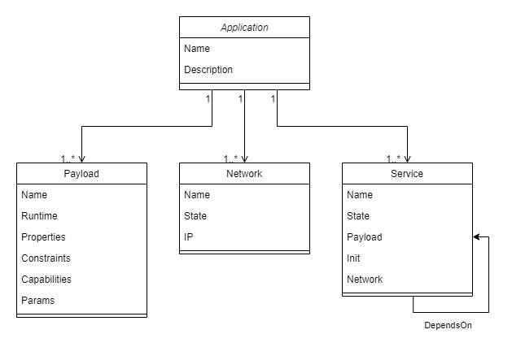

## Abstract
This GAP introduces a proposal for a language-agnostic layer of abstraction over the Golem VPN and its high-level APIs (`yapapi`, `yajsapi`).
The main element of this proposal is the introduction of an **application descriptor** file which can be used to describe a deployment of a set of services to be run within the Golem Network.
This application descriptor is intended to be used together with high-level APIs to enable deploying and managing the nodes described within the descriptor.
A concept of a repository of application descriptors (a **Dapp-store**) is also outlined.

## Motivation
### Why?
The main motivation for this proposal is providing support for development of distributed applications (dApps) deployed within the Golem Network.
### Goals
- enable reusable application deployments through a version-control-friendly configuration format (descriptor files)
- simplify creating complex network topologies (adding a layer of abstraction over the existing Golem VPN functionality)
- allow for easily starting and tearing down multiple different payloads within the Golem Network

## Specification
### Golem Application Object Model
An application hosted on Golem can be described by a set of data structures, which specify and represent all components of the applciationwhich are relevant from Golem's point of view. The data structures are an Object Model of an application, which has following attributes:
- Object Model has a schema - it consists of object types (for example a `payload`, a `service`, a `network`), and each object type has a set of fields/attributes (eg. a `payload` includes a `runtime`, `capabilities` and runtime-specific `params`)
- Objects have relationships (eg a `services` is specified by a `runtime`, and may be part of a `network`)
- Object Model can be maintained in memory of an _engine_
- Object Model is dynamically updated as the state of represented objects changes (eg. as a result of provisioning resources on Golem network)

The _engine_ which is a host for an Object Model is responsible for:
- ingesting an initial application specification (a *descriptor*)
- provisioning Golem resources as per the _descriptor_
- maintaining the Object Model state (eg. as resources are provisioned)

Golem Application Object Model (diagram): 


### Configuration descriptor file
An application descriptor specifies initial Golem Application Object Model. It must include all data required to provision Golem resources required by the application.
The proposed format is YAML. 

Here's an example of such a descriptor:
```
meta:
  name: "Sample-application"
  description: "A sample descriptor for a Golem application"
  author: "GolemFactory"
  version: "0.1.0"

payloads:
  web-server:
    runtime: vm
    constraints:
      - "golem.inf.cpu.cores=2"
      - "golem.inf.mem.gib>=4"
    capabilities:
      - "vpn"
    params:
      image_hash: "c37c1364f637c199fe710ca62241ff486db92c875b786814c6030aa1"

  db-server:
    runtime: vm
    constraints:
      - "golem.inf.storage.gib>10"
    capabilities:
      - "vpn"
    params:
      image_hash: "85021afecf51687ecae8bdc21e10f3b11b82d2e3b169ba44e177340c"

networks:
  default:
    mask: "192.168.0.1/24"

services:
  db-service:
    payload: db-server
    network: default
    entrypoint:
        - run:
            args: ["/bin/run_rqlite.sh"]

  web-server-service:
    payload: web-server
    network: default
    instances: 2
    entrypoint:
        - run:
            args: ["/bin/bash", "-c", "cd /webapp && python app.py --db-address ${services.db-service.network_node.ip} --db-port 4001 initdb"]
        - run:
            args: ["/bin/bash", "-c", "cd /webapp && python app.py --db-address ${services.db-service.network_node.ip} --db-port 4001 run > /webapp/out 2> /webapp/err &" ]
```

#### JSON Schema for the descriptor: 
[link](./gaom.schema.json) / [documentation](./gaom.schema.md)

Notes:
- The descriptor YAML has an **open format**, ie. it must follow YAML schema definition for defined elements, but may include other elements not covered by schema. In other words, the YAML parser must follow a "tolerant reader" pattern.
- Once the format of the descriptor YAML is finalized, its schema can be published to https://www.schemastore.org/json/. This way, the YAML language server will provide support for schema validation and completion in IDEs and editors.

### Dapp-store
The Golem application descriptors may be published in repositories from which they are available to Requestors. Dapp-stores may be public or restricted. Dapp-stores shall provide following capabilities:
#### Upload application descriptor package
Application designers shall be able to publish application descriptor packages via an API. New application descriptors and updated versions of pre-existing application descriptors can be uploaded. A Dapp-store shall maintain the version history of published application descriptors.

#### Application descriptor package indexing
A Dapp-store shall maintain an index of application descriptors where application descriptor `meta` attributes shall be used for indexing.

#### Search application descriptors
Golem Requestors shall have ability to search application descriptors published in a Dapp-store, using an API. Application descriptor index attributes can be referenced to search/filter the application descriptors.

#### Download application descriptor package
Golem Requestors shall have ability to download the content of application descriptor package using an API.

#### Single-YAML descriptor packages
A package may consist of a single decriptor file in YAML format. This package type is called a **single-YAML** descriptor package.

#### Multi-YAML descriptor package
Complex application descriptors may benefit from splitting the YAML content into multiple files, groupped by eg. areas of concern. Such multi-file descriptors can be published as ZIP-packages containing all the relevant YAML files, in flat directory structure (only file sin archive root shall be processed by the _engine_ when processing the descriptor). This package type is called a **multi-YAML** descriptor package. 

## Implementation Features

#### Single-YAML package support
The _engine_ (and corresponding CLI) shall support provisioning Golem application based on single-YAML descriptors.

#### GAOM Merging descriptor files
Multiple descriptor files may be used within the scope of a single deployment. In such a case, the files are merged based on their ordering. The merging is performed using a deep merge strategy.
Here's an example of how this merging strategy is applied:

Base file:
```
meta:
  name: "Sample-application"
  description: "A sample descriptor for a Golem application"
  author: "GolemFactory"
  version: "0.1.0"

payloads:
  nginx:
    runtime: "vm"
    params:
      image: "image-hash"
    constraints:
      "golem.inf.cpu.cores": 2
    capabilities:
      - "vpn"
```

Override file:
```
payloads:
  nginx:
    params:
      repo: "repo-url"
    capabilities:
      - "gpu"
```

Resulting file:
```
meta:
  name: "Sample-application"
  description: "A sample descriptor for a Golem application"
  author: "GolemFactory"
  version: "0.1.0"

payloads:
  nginx:
    runtime: "vm"
    params:
      image: "image-hash"
      repo: "repo-url"
    constraints:
      "golem.inf.cpu.cores": 2
    capabilities:
      - "vpn"
      - "gpu"
```

A depth-first approach is used to determine the values which need to be added or updated to existing collections (lists and key-value maps).
For maps, keys from overriding files have precedence over the base ones.
In the case of lists, when merging lists from two files, the override values are simply concatenated to the base list. If required, this behaviour can be made configurable (e.g. to enable overriding the entire list instead).

[TODO: describe how these files can be composed (CLI, file system hierarchy)]

#### GAOM object state
The entities and resources in a Golem application follow a certain lifecycle - they get provisioned, they remain active, they get removed/terminated. The application elements represented by the object graph shall have their **state** represented in the _engine_. The **state** represents the stage of lifecycle in which an application element is at a given moment in time.
Following states are considered:
- Pending
- Active
- Terminated 

#### GAOM object dependency graph
As the descriptor is processed by the _engine_, the Golem resources are provisioned, and their state in GOAM is updated by the _engine_. Some resources depend on other resources (eg. a `service` may need to be provisioned in a context of a `network`) which implies the sequence of resource provisioning. The _engine_ shall derive the dependency graph from the descriptor and based on this - determine the provisioning actions sequence.

#### GAOM explicit dependency syntax
It is possible to specify explicit dependency between services. If a service A should only be provisioned after service B becomes active, the specification of service A shall include a `depends_on` attribute, pointing at the label of service B. Based on this information, the _engine_shall build an appropriate dependency graph.
**Note:** a service may depend on a number of other services, therefore the `depends_on` attribute must allow for multiple dependency labels. 

#### Multi-YAML package support
The _engine_ (and corresponding CLI) shall support provisioning Golem application based on multi-YAML descriptors (ZIP-archived). 
Note: for the purposes of YAML file merging - the order of processing files within the ZIP-archive shall be undefined (ie. there is no guarantee which YAML file shall override the content of any other YAML file in the same archive). 

#### GAOM reference syntax
The attribute values in descriptor may include references to the current state of the Object Model (to specify that `service` provisioning requires parameters which are dependent on another `service`'s state, eg. a web application service must be launched with connection details of a database service specified in the same descriptor). 
Note: that the reference syntax also indicates implicit resource dependency, ie. if `service B` launch depends on attributes of `service A` which are only known after `service A` is launched, the _engine_ must first provision `service A`, obtain its updated Object Model state, populate `service B` references to 'service A' state and then provision `service B`.

Proposed syntax is as follows:
A reference to Object Model must be enclosed in `${}`, for example:

```
entrypoint:
  - run:
      args: ["/bin/bash", "-c", "cd /webapp && python app.py --db-address *${services.db-service.network_node.ip}* initdb"]
```


## Rationale
#### File format
The file format of choice is **YAML**.
YAML is used in both Docker Compose and Kubernetes, both of which are widely-adopted deployment solutions. As such, it's become a de-facto standard
1. It's an established standard
2. It's more flexible compared to alternatives (e.g. TOML)
3. Users of the solutions mentioned above should find it easy to start using Golem Compose

A considered alternative is the HashiCorp HCL format, which is native to Terraform platform ecosystem. YAML however is deemed more widely-adopted.
[TODO: consider writing the examples in HCL, for comparison]

#### Market strategy
In its current form, the deployment descriptor **does not** include support for specifying the market strategy which should be used by the requestor. There are two primary reasons for this:
1. A feasible approach which would allow for specifying/defining market strategies in a language-agnostic matter could not be found in this iteration of the proposal.
2. Including some form of support for market strategies at an early stage of development would unnecessarily increase complexity.
Market strategies will be addressed in a future GAP.

#### Inspirations
- [Docker Compose](https://github.com/compose-spec/compose-spec/blob/master/spec.md)
- [Terraform](https://www.terraform.io/language)
- [Kubernetes](https://kubernetes.io/docs/concepts/overview/working-with-objects/kubernetes-objects)

## Backwards Compatibility
All GAPs that introduce backwards incompatibilities must include a section describing these incompatibilities and their severity. The GAP **must** explain how the author proposes to deal with these incompatibilities.

## Test Cases
The application descriptor examples which illustrate various Golem application use cases are attached below:
- [Simple Service](./examples/simple_service.yaml)
- [Web Application with Database](./examples/webapp.yaml)
- [Web Application with HTTP proxy over Golem VPN](./examples/webapp_with_local_proxy.yaml)

## [Optional] Reference Implementation
An optional section that contains a reference/example implementation that people can use to assist in understanding or implementing this specification.  If the implementation is too large to reasonably be included inline, then consider adding it as one or more files in `./gaps/gap-draft_title/`.

## Security Considerations
All GAPs must contain a section that discusses the security implications/considerations relevant to the proposed change. Include information that might be important for security discussions, surfaces risks and can be used throughout the life cycle of the proposal. E.g. include security-relevant design decisions, concerns, important discussions, implementation-specific guidance and pitfalls, an outline of threats and risks and how they are being addressed. 

## Copyright
Copyright and related rights waived via [CC0](https://creativecommons.org/publicdomain/zero/1.0/).
