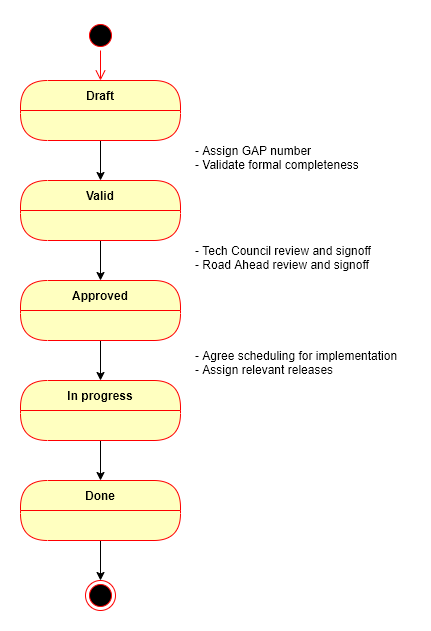

## Abstract
We are introducing a Golem Amendment Proposal process to establish governance over changes proposed, considered and implemented in Golem ecosystem.

## Motivation
The GAP process responds to a number of needs:
- Establish governance over features, specification/standards amendments and process improvements managed by Golem Factory.
- Ensure visibility of features in the Golem pipeline - this is especially valuable for interested parties outside of Golem Factory.
- Provide ability for Golem community to submit proposals for features in a controlled, systematic manner.

## Specification

### GAP content & format

- A GAP shall be raised as a ticket visible in `golem-architecture` repo in [GAP project](https://github.com/golemfactory/golem-architecture/projects/1).
- A GAP ticket shall be titled along the lines of `GAP-draft Title`.
- A GAP summary `gap-draft_title.md` shall be provided (following a [template](../gap-template.md)) in `./gaps/gap-draft_title/`.
- A pull request shall be raised with proposed GAP summary (and relevant artifacts) and attached to the GAP ticket.

### GAP workflow

## Rationale
The GAP process template has been designed on the basis of Ethereum's [EIP template](https://github.com/ethereum/EIPs/blob/master/eip-template.md) - as we feel that template ensures the right level of proposal specification details relevant for Golem ecosystem.

## Backwards Compatibility
As currently there is no (semi)formal process for governance of Golem feature and change proposals - no backward incompatibilities are introduced. 

## Test Cases
N/A

## Security Considerations
All GAPs must contain a section that discusses the security implications/considerations relevant to the proposed change. Include information that might be important for security discussions, surfaces risks and can be used throughout the life cycle of the proposal. E.g. include security-relevant design decisions, concerns, important discussions, implementation-specific guidance and pitfalls, an outline of threats and risks and how they are being addressed. 

## Copyright
Copyright and related rights waived via [CC0](https://creativecommons.org/publicdomain/zero/1.0/).