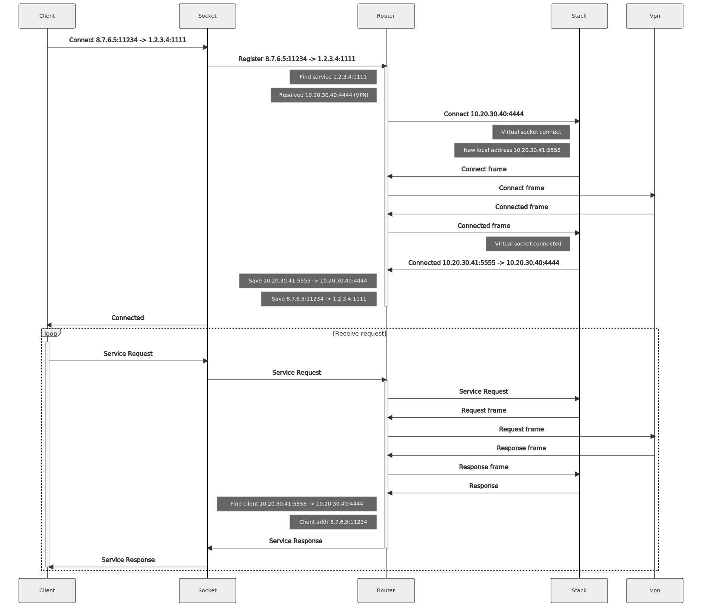
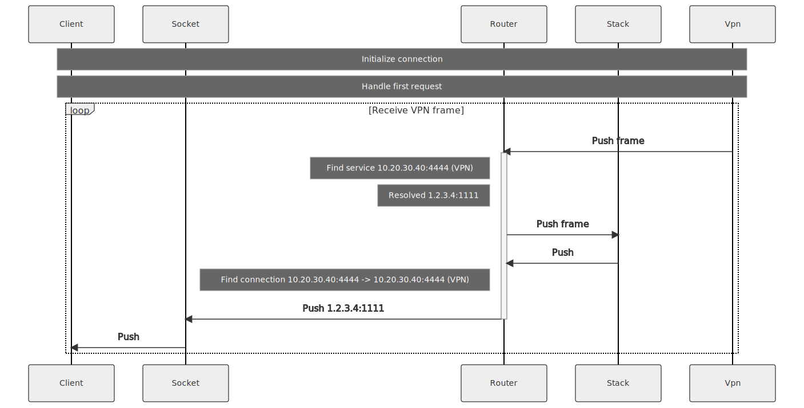
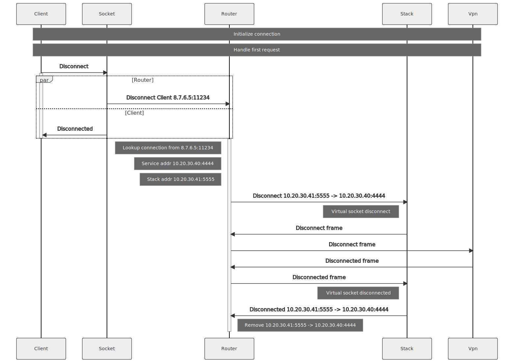
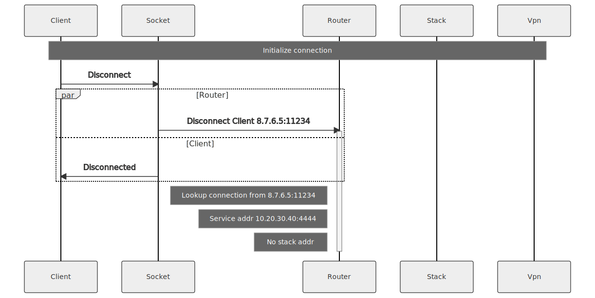
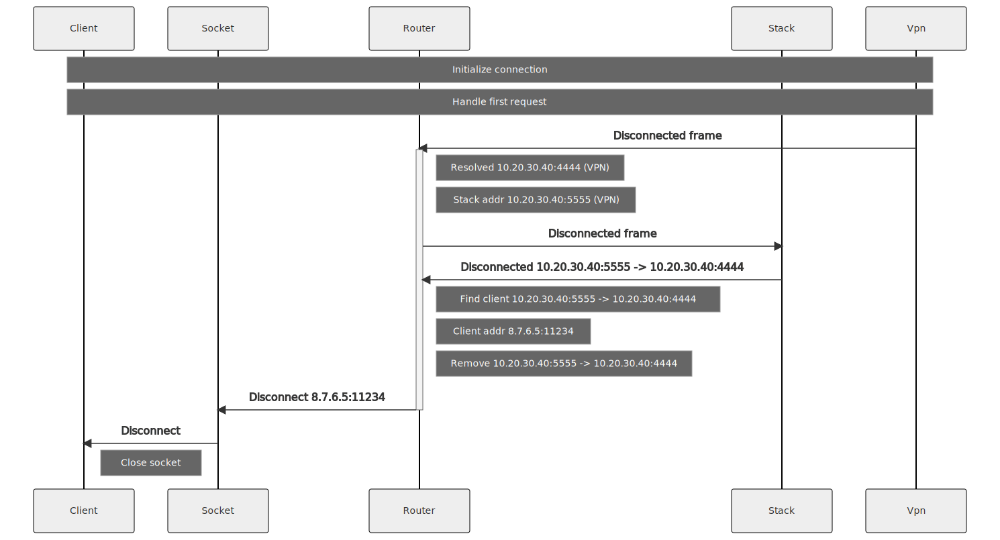

- [Abstract](#abstract)
- [Motivation](#motivation)
- [Specification](#specification)
  - [**Proxy**](#proxy)
  - [**Provider Agent and user interaction**](#provider-agent-and-user-interaction)
  - [**High-level overview**](#high-level-overview)
  - [**Forwarding in detail**](#forwarding-in-detail)
    - [**Service request**](#service-request)
    - [**Service push**](#service-push)
    - [**User connection teardown**](#user-connection-teardown)
    - [**Idle connection teardown**](#idle-connection-teardown)
    - [**VPN connection teardown**](#vpn-connection-teardown)
  - [**Management API**](#management-api)
  - [**Metrics**](#metrics)
- [Rationale](#rationale)
  - [**Inbound network access**](#inbound-network-access)
  - [**Proxy**](#proxy-1)
  - [**Public services**](#public-services)
- [Backward Compatibility](#backward-compatibility)
- [Test Cases](#test-cases)
- [Reference Implementation](#reference-implementation)
- [Security Considerations](#security-considerations)
  - [**Denial of Service attacks**](#denial-of-service-attacks)
  - [**Service authorization**](#service-authorization)
  - [**Management API authorization**](#management-api-authorization)
- [Copyright](#copyright)

## Abstract

This document describes the inbound network Proxy, an intermediary application
between a publicly-routable TCP / UDP socket and a remote node within the Golem Network.

The [Specification](#specification) section overviews the proposed high-level design
of the Proxy. Enclosed message sequence charts explain in detail how the data exchange
between a bound socket and a remote Golem Network node looks like. Finally,
an interoperability diagram with other yagna components is presented.

Readers are briefly introduced to the notion of "inbound network
access" and the role that Proxy serves in the design. Additionally, the document
reveals the motivation behind implementing a new yagna Runtime and the reason
for splitting it into two components - the Runtime and a Proxy server.

## Motivation

The "inbound network" feature can be briefly described as making Golem Network applications
accessible from the Internet. According to the [Rationale](#inbound-network-access),
a new runtime implementation is required to provide such functionality. Proxy is the central
component of that implementation.

## Specification

Runtime's logic can be split into the following parts:

1. ExeUnit Supervisor interface

    - conforming to the Runtime lifecycle imposed by the Supervisor
    - state and metric reporting
    - handling Requestor commands

2. Execution environment / computation execution

The "internet access" runtime is split into separate binaries - the Runtime (ExeUnit
interface) and Proxy (computation), due to different lifetime requirements of the two,
as pointed out in the [Rationale](#rationale).

### **Proxy**

Proxy fulfills the role of an intermediary between service clients (Internet users) and
services on the Golem Network. The forementioned is achieved by:

- binding a socket on a publicly-routable endpoint address
- receiving data from the socket, processing it and sending via VPN
- receiving data via VPN, processing it and returning the response to a socket

The service exposes a REST API for dynamic addition and removal of these "gateway" sockets.
The Gateway API is called by the Runtime on Requestor's command.

Additionally, Proxy provides a REST API for creating special-purpose endpoints used in
Marketplace negotiations, allowing Requestors to verify that the purchased endpoint
is indeed routable from the Internet. The Probe API supports creating temporary servers
that respond with one-time tokens issued by Requestors.

It is proposed to implement the Proxy as an autostart [YAGNA EXTENSION](),
since the application is executed as a long-living process and requires
connectivity configuration with the yagna daemon.

### **Provider Agent and user interaction**

Here, the Provider Agent is in process of negotiating offers on the Marketplace.
For verification purposes, it opens up multiple "probe sockets" via Proxy's Probe API.
When a Requestor and the Provider settle on an Agreement, the ExeUnit Supervisor
and the "inbound network" Runtime are started. The Runtime translates Requestor's
ExeScript `RUN` commands into Proxy's Gateway API calls.

Next, the Runtime removes the socket "probe" and creates a "gateway socket" in its place.
From now on, users can connect to that socket over the Internet. Received user payload
is forwarded to an endpoint in Golem Virtual Private Network, facilitating the
Service Bus exposed by a running yagna daemon.

The Runtime periodically queries bandwidth statistics via Proxy's Status API, to be
included in a usage vector reported to the ExeUnit Supervisor.

### **High-level overview**

- **probes**

    Public HTTP servers bound to endpoints to be tested during negotiations.
    Each probe can serve multiple tokens, differentiated by requestor's id specified
    in the query.

    Probes are created and destroyed on-demand by the Provider Agent.

- **public sockets**

    Gateway sockets are bound only after a successful negotiation has taken place. The
    traffic
    from each socket is designated to a single address within a Virtual Private Network
    (in the initial implementation).

    These sockets are created and destroyed on-demand by the runtime.

- **smoltcp**

    Embedded networking stack, allowing the Proxy to operate in a Virtual Private Network.
    The stack is injected with each incoming gateway socket payload, and produces data ready
    to be transmitted over VPN. In other words, the stack converts TCP / UDP payload into
    Ethernet frames containing Proxy's MAC and IP addresses.

- **Router**

    Redirects traffic from a public socket to the network stack

- **Management API**

    Proxy governing API. Described in more detail in the [Management API](#management-api)
    section.

### **Forwarding in detail**

The Message Sequence diagrams below detail connection initialization, teardown
and the forwarding process itself.

Please note that a simplification was made regarding TCP connections - each `Connect`,
including the one coming from the `smoltcp` stack, is an exchange of 3 TCP packets. It is
assumed that `Disconnect` implies 2 TCP packets exchanged.

#### **Service request**

The following diagram illustrates user connection initialization, the process of establishing
a new connection with the remote service and sending requests to that service.

#### **Service push**

The diagram below illustrates a scenario where the client is done sending requests and
awaits data to be pushed by the service.

#### **User connection teardown**

Presents connection teardown initiated by the user, where some service requests were made.

#### **Idle connection teardown**

Presents connection teardown initiated by the user, where no service requests were made.

#### **VPN connection teardown**

Presents connection teardown initiated by the service.

### **Management API**

The Management RESTful API serves as Proxy's governing API to the Provider Agent,
a set of execution endpoints to the "inbound network access" Runtime and a general
source of metrics / health status source of the Proxy. The final OpenAPI specification
will be published as a separate document within the implementation's repository.

In addition to the API endpoints, the Proxy will provide a command line interface,
facilitating API calls to proposed endpoints.

1. **Probe API**

    | root |   |
    |---|---|
    |`/probe-api/v1/`| Manages "probe" sockets used in Marketplace negotiations |

    | endpoint | method | data | response | description |
    |---|---|---|---|---|
    | `/` | GET | | `{ Protocol, Address, [{RequestorId, Token}, ] }` | Query registered probes |
    | `/{proto}/{addr}` | PUT | `{RequestorId, Token}` | | Opens a new probe socket or extends the existing handler with the input data. When a Requestor connects to the endpoint, she is required to provide the `RequestorId`, expecting a response containing the `Token` at that address |
    | `/{proto}/{addr}` | GET | | `[{RequestorId, Token}, ]` | Returns all probes registered at the address |
    | `/{proto}/{addr}/{RequestorId}` | GET | | `Token` | Get the token for the probe at address |
    | `/{proto}/{addr}/{RequestorId}` | DELETE | | | Deletes all probes associated with a `RequestorId` and a specific address. Unbinds the socket if no other tokens are registered within that probe. |
    | `/{proto}/{addr}/{RequestorId}/{Token}` | DELETE | | | Deletes a probe associated with the given parameters. Unbinds the socket if no other tokens are registered within that probe. |

    | param | description |
    |---|---|
    | `proto` | Transport protocol to use - TCP or UDP |
    | `addr` | Endpoint address |
    | `RequestorId` | Id of a Requestor the Provider is negotiating with |
    | `Token` | Single-use string provided by the Requestor during negotiations |

2. **Gateway API**

    | root |   |
    |---|---|
    |`/gateway-api/v1/`| Manages "gateway" sockets for forwarding user's packets to a service |

    | endpoint | method | data | response | description |
    |---|---|---|---|---|
    | `/` | GET | | `{ Address: [Entry, ]}` | Query registered sockets |
    | `/{proto}/{addr}` | POST | `Entry` | | Creates a new forwarding socket or replaces all probes on that address. Fails when a forwarding socket exists |
    | `/{proto}/{addr}` | GET | | `Entry` | Returns forwarding socket creation parameters |
    | `/{proto}/{addr}` | DELETE | | | Unbinds the forwarding socket at the address |

    | param | description |
    |---|---|
    | `proto` | Transport protocol to use - TCP or UDP |
    | `addr` | Endpoint address |

    - `Entry` consists of:
        - `RequestorId`
        - `ActivityId`
        - `VpnId`
        - `RemoteId` - service Provider id
        - `RemoteAddr` - service endpoint address (VPN)

3. **Status API**

    | root |   |
    |---|---|
    |`/status-api/v1/`| Provides metrics and general Proxy health status |

    | endpoint | method | data | response | description |
    |---|---|---|---|---|
    | `/status` | GET | | `{ .. }` | Query general Proxy health status, including the number of probe and gateway sockets and number of activities served so far |
    | `/metrics` | GET | | `{ .. }` | Query collective Proxy metrics  |
    | `/metrics/bandwidth` | GET | | `{ .. }` | Query bandwidth Proxy metrics  |
    | `/metrics/activity/{activity_id}` | GET | | `{ .. }` | Query collective metrics for a specific activity (now: bandwidth only) |
    | `/metrics/activity/{activity_id}/bandwidth` | GET | | `{ .. }` | Query bandwidth metrics for a specific activity |
    | `/metrics/vpn/{vpn_id}` | GET | | `{ .. }` | Query collective metrics for a specific VPN (now: bandwidth only) |
    | `/metrics/vpn/{vpn_id}/bandwidth` | GET | | `{ .. }` | Query bandwidth metrics for a specific VPN |

    | param | description |
    |---|---|
    | `activity_id` | Activity id |
    | `vpn_id` | Golem Virtual Private Network id |

### **Metrics**

The Proxy gathers the following statistics for each connection:

- total bytes sent
- total bytes received
- outbound and inbound connection data rates:
  - max
  - average
  - current, within a short time window

These values, along with their aggregates, can be retrieved via the Status API.

## Rationale

### **Inbound network access**

The motivation behind the "inbound network access" initiative is to make
services running on Golem Network accessible from the Internet. However,
opening services to public on one's machine is associated with the
following risks:

- most Providers in the network do not own a publicly-routable IP address
  or cannot forward ports in an automated manner
- hosting a public service opens several new attack vectors on Providers'
  machines and their local networks

which drastically decrease the number of nodes capable or willing to
provide such service. Treating the forementioned as an extra dimension
in node's capability vector, we would significantly decrease the number
of Providers that would meet Requestors' demands (e.g. next to hardware
requirements, geographical location, etc.).

This GAP, along with [GAP RUNTIME](), serves as a two-part solution of the issue.
The proposal is to separate the scarce resource of a publicly routable socket
from the rest of node's capability vector, i.e. to provide "inbound network
access" as a separate service, sold exclusively by capable and conscious
Providers on the Golem Network. In this case, Requestors would purchase
a publicly routable socket on that Provider's machine and pay for redirecting
traffic to specific node(s). The initial implementation
assumes that there exists a single forwardee and the traffic is sent over Golem
Virtual Private Network.

### **Proxy**

Although a Provider may offer "inbound network access" on the Golem Marketplace,
the scarcity of the "publicly routable" socket implies no guarantee that the
service will operate as advertised. Requestors need an additional form of
verifying those capabilities. E.g., a Requestor can initiate a connection
to the socket in question and expect a response with a previously-agreed
on token.

For that mechanism to work, there is a need for a long-running application,
capable of binding these "probe endpoints" during Marketplace
negotiations. This logic can be incorporated into the Proxy, whose lifetime
would exceed the lifetime of its Runtime counterpart (started only after
negotiations are concluded successfully).

The evident conclusion is that the Proxy is required to be running at
least as long as its managing component and to expose a flavor of
a management API to bind the mentioned endpoints on demand.

### **Public services**

Each service that needs to be accessed over the Internet must be connected
to a Golem Virtual Private Network. It's the Requestor's responsibility to:

- set up a Golem VPN
- purchase an "inbound network access" service from a Provider in the Network,
  with a correct VPN configuration
- start the service on another Provider node, with a correct VPN and routing
  configuration (with a gateway set to the "inbound network access" node)

Requestors may require more complex setups for their computation. The SDK
frameworks (yapapi, yajsapi) should aid the developer with network composition
processes.

## Backward Compatibility

Implementing the Proxy as a yagna extension provides a complete environment
configuration of the yagna daemon, including the Service Bus address. It is
required from the daemon to support the extension system.

The Provider Agent binary must implement a specialized negotiator to govern
Proxy configuration. Earlier versions of the Agent will not support the
"inbound network access" feature.

## Test Cases

N/A

## Reference Implementation

Available at https://github.com/golemfactory/ya-runtime-net-gateway
(work in progress)

## Security Considerations

### **Denial of Service attacks**

The proxy should be resistant to connection flooding and implement
rate limiting in future versions.

### **Service authorization**

No authorization mechanism is implemented within the Proxy; the exposed
service providers should provide authorization dedicated to their service
since the public socket will accept any incoming connection.

### **Management API authorization**

No authorization is implemented in the Management API. The server binds
to localhost by default.

## Copyright
Copyright and related rights waived via
[CC0](https://creativecommons.org/publicdomain/zero/1.0/).