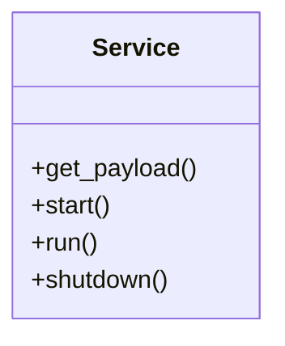
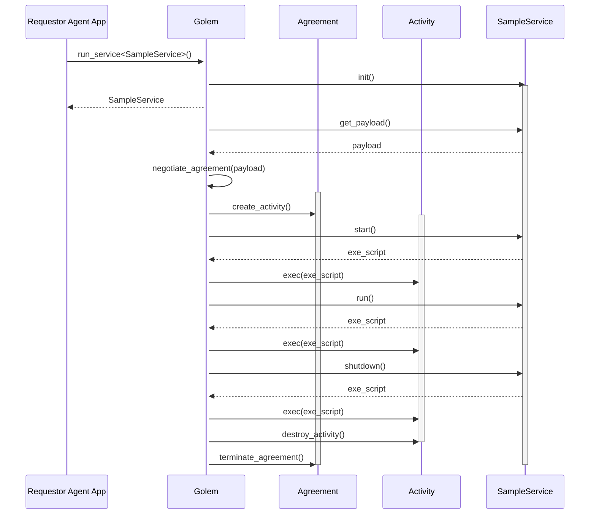

## Abstract
A generic high-level API is proposed to streamline writing Requestor Agent code to manage interactive services on Golem. The API includes a service development model based on an abstract service lifecycle, which is a scaffolding for management of service state via ExeScript commands.

## Motivation
Golem allows for launching and control of interactive services. A service is, in general, a process which runs on a node controlled by a Provider, based on the Agreement with a Requestor, and responds to requests (passed either via Golem network, or totally outside of Golem network's visibility), until it is explicitly stopped (usually by a Requestor).

The proposed service development model provides an abstraction layer over Golem Network mechanics which allows the developer to focus on service state transition logic - leaving the "logistics" of Provider and Agreement management to a high-level API library.

## Specification
This section summarizes the concept of Golem service execution model. 

### Service lifecycle
A Service is an abstraction over an Activity launched on a Provider node. A Service follows a state transition sequence, as indicated on the following diagram.

### Service execution model

To implement a Golem Service, a developer is expected to create a class containing code to provide:

- specification of the Golem 'payload' that shall be launched on a Provider node
- logic (via a sequence of ExeScript commands) to be executed as the Service follows a transition of states in its lifecycle

The execution of the service happens in the context of a `Golem` engine. The engine is a high-level API concept - an object which shields a developer from all the complex nuances of Golem's low-level APIs. All the market interaction, Agreement negotiation, Activity launch and ExeScript execution is encapsulated within the `Golem` engine object.

In the Service API execution model the initialization of the Service class and transition between states is controlled by the `Golem` engine. The developer is expected to provide a definition of Service class implementation of following interface:

Where:
- `get_payload()` - a method which returns a specification of a Golem 'payload' package (eg. indication of required runtime, VM image hash, specific Demand properties, etc.)
- `start()` - a "work generator" method which yields a sequence of ExeScript command batches to be executed on service start. Once the command sequence completes successfully - the service enters the `Running` state.
- `run()` - a "work generator" method which yields a sequence of ExeScript command batches to be executed while a service is running. Once the command sequence completes successfully - the service enters `Stopping` state, preparing for shutdown.
- `shutdown()` - a "work generator" method which yields a sequence of ExeScript command batches to be executed while a service is stopping. Once the command sequence completes successfully - the service terminates.

The execution sequence is indicated on the diagram below:

## Rationale
The Service API is an attempt to provide a high-level abstraction over Golem entities, in a way that corresponds to the "twin" Task API. Therefore the Service object implementation follows the pattern of "work generator" - all "state transition" methods are expected to yield-return ExeScript to be executed within the Activity by the `Gelem` engine object.

## Backwards Compatibility
The Service API is a high-level layer over the Golem daemon and REST APIs. Its introduction does not break any compatibility dependencies.

## Test Cases
TODO
Include test cases with attach/detach (ie. Agent reconnecting and "joining the service management" in-flight)

## Security Considerations
The Service API does not include any security-related features. It must comply with any security mechanisms implied by lower levels of Golem stack. 

## Copyright
Copyright and related rights waived via [CC0](https://creativecommons.org/publicdomain/zero/1.0/).