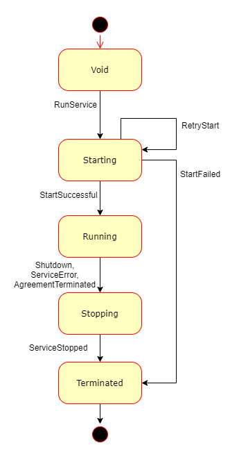
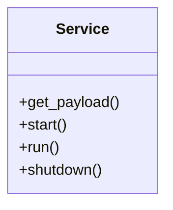
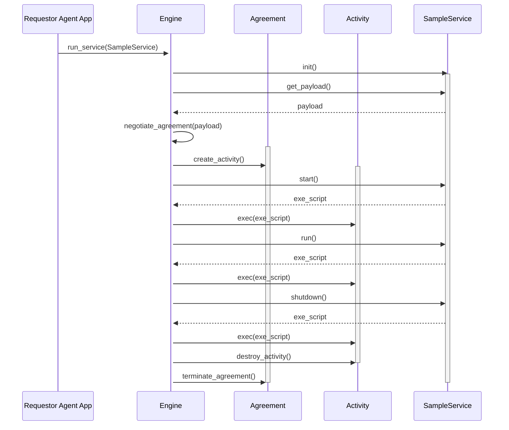

## Abstract
A generic high-level API is proposed to streamline writing Requestor Agent code to manage interactive services on Golem. The API includes a service development model based on an abstract service lifecycle, which is a scaffolding for management of service state via ExeScript commands.

## Motivation
Golem allows for launching and control of interactive services. A service is, in general, a process which runs on a node controlled by a Provider, based on the Agreement with a Requestor, and responds to requests (passed either via Golem network, or totally outside of Golem network's visibility), until it is explicitly stopped (usually by a Requestor).

The proposed service development model provides an abstraction layer over Golem Network mechanics which allows the developer to focus on service state transition logic - leaving the "logistics" of Provider and Agreement management to a high-level API library.

## Specification
This section summarizes the concept of Golem service execution model. 

### Service lifecycle
A Service is an abstraction over an Activity launched on a Provider node. A Service follows a state transition sequence, as indicated on the following diagram.

### Service execution model

To implement a Golem Service, a developer is expected to create a class containing code to provide:

- specification of the Golem 'payload' that shall be launched on a Provider node
- logic (via a sequence of ExeScript commands) to be executed as the Service follows a transition of states in its lifecycle

The initialization of the Service class and transition between states is controlled by the Golem Engine.

The execution sequence is indicated on the diagram below:

### Starting logic

### Running logic

### Stopping logic

## Rationale
TODO The rationale fleshes out the specification by describing what motivated the design and why particular design decisions were made. It should describe alternate designs that were considered and related work.

## Backwards Compatibility
TODO All GAPs that introduce backwards incompatibilities must include a section describing these incompatibilities and their severity. The GAP **must** explain how the author proposes to deal with these incompatibilities.

## Test Cases
TODO
Include test cases with attach/detach (ie. Agent reconnecting and "joining the service management" in-flight)

## [Optional] Reference Implementation
TODO 

## Security Considerations
TODO All GAPs must contain a section that discusses the security implications/considerations relevant to the proposed change. Include information that might be important for security discussions, surfaces risks and can be used throughout the life cycle of the proposal. E.g. include security-relevant design decisions, concerns, important discussions, implementation-specific guidance and pitfalls, an outline of threats and risks and how they are being addressed. 

## Copyright
Copyright and related rights waived via [CC0](https://creativecommons.org/publicdomain/zero/1.0/).