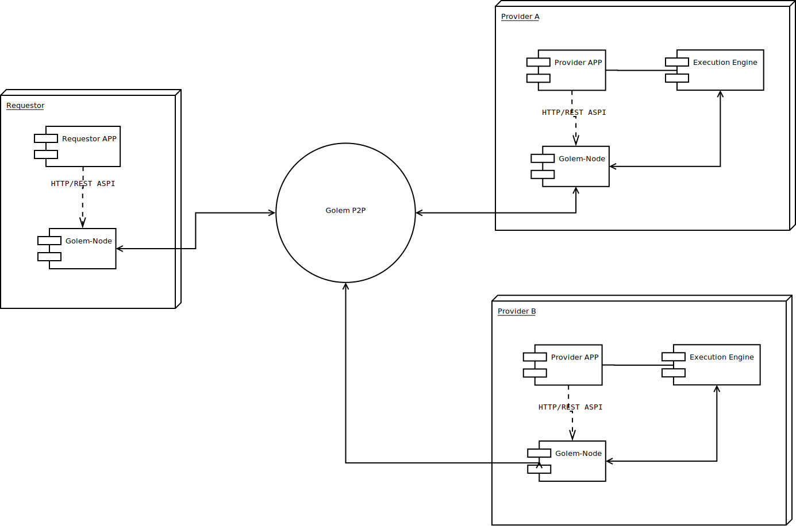
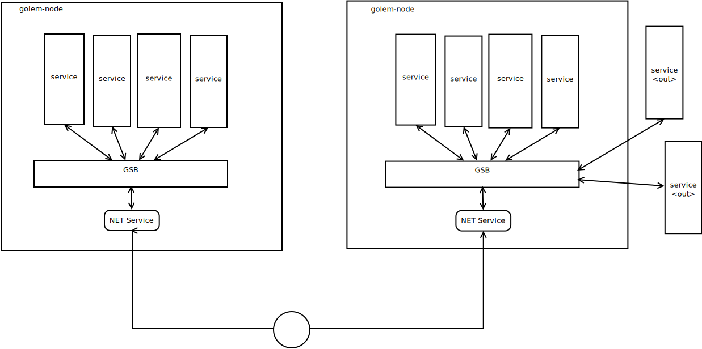
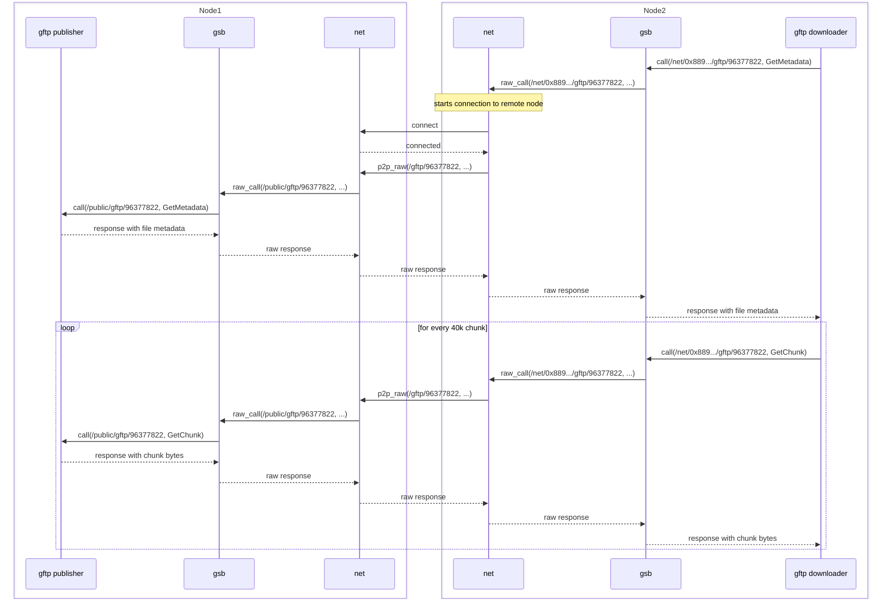
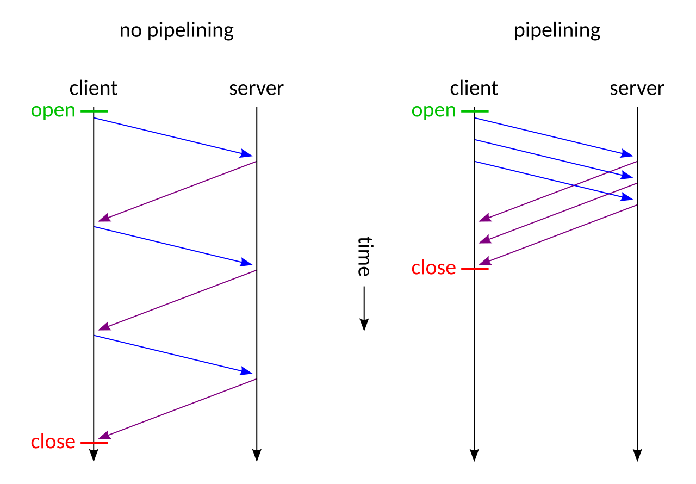
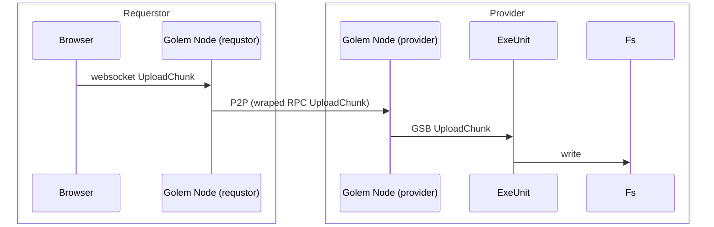

# Założenia konstrukcyjne

## Czym jest golem ?

Golem to freamwork to chandlu mocą obliczeniową w modelu P2P z rozliczeniami za tą moc na
sieciach Etherium i jej pochodnych. 

Framework składa się:

 - protokołów - sposób konukacji węzłów oraz komunikaty implemetnacji warstw.
 - API 
 - Bibliotek
 - Implementacji przykładowych komponentów.
 
Perspektywy:

 - requestor - węzeł sieci  P2P który chce korzystać z mocy obliczeniowej innych węzłów.
 - provider -  węzeł sioeci P2P który chce sprzedawać swoje  zasoby innym węzłom.
 - user - użytkownik końcowy 
 - developer - twórca aplikacji 

Architektura całego rozwiązania dyktowana jest poprzez następująca wizje requestora

Cele:
  - przenośność: requestora można uruchomić na możliwie wielu systemach operacyjnych. możliwość kompilacji
do wasm by móc uzywać bezpośrednio w przeglądarce. 
  - łatwość instalacji: 
    - wystarczy jedna nieduże binarka. 
    - nie trzeba mieć publicznego IP. apliakcja działa za NAT
    - nie trzeba mieć uprawnień administratora. aplikacja nie instaluje sterowników i nie psuje ustawień sieci.
  - elastyczność - API powinno pozwalwać wiele  różnych rodzajów usług.

**NOTE** Te założenia istotnie wpływają na wybór narzędzi ob jak słysze, że np. requestor mógłby się wpinać przez wireguard 
do sieci w porvierami lub by łączyć provieerów tunelem ssh do requestora. to by być takich requestorem trzeba mieć dużo bardziej 
skomplikowany deployment. łaczenie sieci na poziomie systemu operacyjnego powoduje że trudniej jest wyizolować ruch od niezaufanych 
węzłów. Takie rozwiązania sprawdzą się w klasycznym Cloud gdzie można udowa statyczne sztruktury i ufać zę operator 
clouda nie próbuje się do nas włamać. 

## Podstawowy deployment 



Gdzie 

- **Golem Node** aplikacja wystawiająca API sieci golem. (yagna)
- **Requestor APP** używa tego api by odnaleźć potrzebne mu zasoby. zamówić je i zapłacić.
- **Provider APP** używa API golema by sprzedać posiadane przez siebie zasoby.
- Abstrakcja **Execution Engine** odpowiada z realizację zamówienia.


# Golem jako system rozproszony

By zrozumieć dalszą część trzeba zacząć od podstawowego wzorca na którym golem jest zrobiony.
Widać wyraźnie, że tego typu aplikacja będzie miała całościowo skomplikowany protokół z duża liczbą róznych 
komunikatów przesyłanych między węzłami.  





## Typowy komponent

Typowy komponent skłąda się:

- (opt) **REST API** 
- (opt) **Local Services**: zbiór końcówek dostępnych w ramach węzła. nie mogą być wołąne z zdalnych węzłów.
- (opt) **CLI** - interfejs command line. zwykle komunikuje się z **Local Services** komponentu.
- (opt) **Public Services**: zbiór końcówek dostępnych z innych węzłów.
- (opt) **DB**: Komponenty w ramach GolemNode zapisują do embadowanej bazyu danych sqlite.

**TODO**: Spisać standardowy stack bibliotek. 


## Przykład GFTP

Jest to minimalistyczny prosty protokół przesyłu plików bo RPC golem-a.

Komponent uruchamiany jest jako oddzielny process. 

Na jednej maszynie robimy

```
$ gftp publish index.html
gftp://0x889ff52ece3d5368051f4f8216650a7843f8926b/96377822"
```

A na drugiej:

```
$ gftp download gftp://0x889ff52ece3d5368051f4f8216650a7843f8926b/96377822 d.htm
$ ls 
d.html
```

Co robi publish:

- losuje id pliku = 96377822
- na szynie pod adresem /public/gftp/96377822 rejestrujemy dwie usługi
  - GetMetadata  - zwraca inforemacje np. o wielkości pliku 
  - GetChunk - wołanie zwraca blok bajtów o zadanej długości i przesunięciu względem początku pliku.

Co robi download:


 
Oczywiście wołania GetChunk jakimś z pewnym poziomem równoległości (Pipeline). 

Tak by czekanie na wynik miało mniejszy wpływ na wydajność. 



## (to be moved) GFTP z przeglądarki



