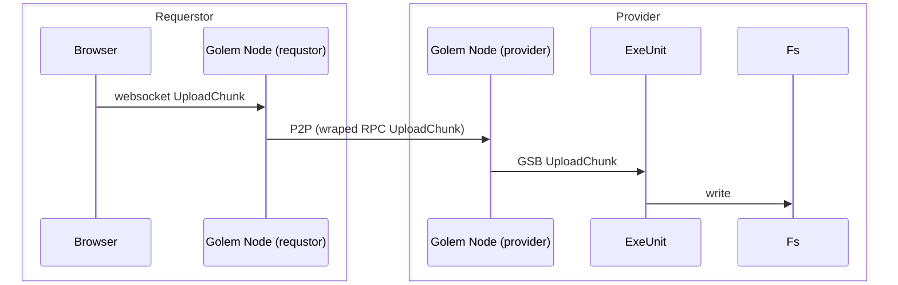

# Załorzenia konstrukcyjne

## Czym jest golem ?

Golem to freamwork to chandlu mocą obliczeniową w modelu P2P z rozliczeniami za tą moc na
sieciach Etherium i jej pochodnych. 

Framework składa się:

 - protokołów - sposób konukacji węzłów oraz komunikaty implemetnacji warstw.
 - API 
 - Bibliotek
 - Implementacji przykładowych komponentów.
 
Perspektywy:

 - requestor - węzeł sieci  P2P który chce korzystać z mocy obliczeniowej innych węzłów.
 - provider -  węzeł sioeci P2P który chce sprzedawać swoje  zasoby innym węzłom.
 - user - użytkownik końcowy 
 - developer - twórca aplikacji 

Architektura całego rozwiązania dyktowana jest poprzez następująca wizje requestora

Cele:
  - przenośność: requestora można uruchomić na możliwie wielu systemach operacyjnych. możliwość kompilacji
do wasm by móc uzywać bezpośrednio w przeglądarce. 
  - łatwość instalacji: 
    - wystarczy jedna nieduże binarka. 
    - nie trzeba mieć publicznego IP. apliakcja działa za NAT
    - nie trzeba mieć uprawnień administratora. aplikacja nie instaluje sterowników i nie psuje ustawień sieci.
  - elastyczność - API powinno pozwalwać wiele  różnych rodzajów usług.

**NOTE** Te założenia istotnie wpływają na wybór narzędzi ob jak słysze, że np. requestor mógłby się wpinać przez wireguard 
do sieci w porvierami lub by łączyć provieerów tunelem ssh do requestora. to by być takich requestorem trzeba mieć dużo bardziej 
skomplikowany deployment. łaczenie sieci na poziomie systemu operacyjnego powoduje że trudniej jest wyizolować ruch od niezaufanych 
węzłów. Takie rozwiązania sprawdzą się w klasycznym Cloud gdzie można udowa statyczne sztruktury i ufać zę operator 
clouda nie próbuje się do nas włamać. 

## Podstawowy deployment 

Gdzie 

- **Golem Node** aplikacja wystawiająca API sieci golem. (yagna)
- **Requestor APP** używa tego api by odnalźć potrzebne mu zasoby. zamówić je i zapłacić.
- **Provider APP** używa API golema by sprzedać posiadane przez siebie zasoby.
- Abstrakcja **Execution Engine** odpowiada z realizację zamówinia.

# Golem jako system rozproszony

By zrozumieć dalszą cześć trzeba zacząć od podstawowego wzorca na którym golem jest zrobiony.
Widać wyrażnie że tego typu aplikacja będzie miała całościowo skomplikowany protokół z duża liczbą róznych 
komunikatów przesyłanych między węzłami.  

## GFTP

