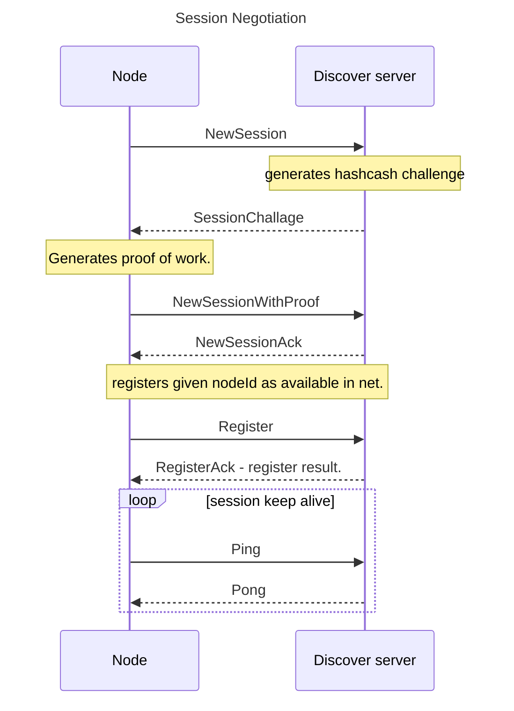

# Komunikacja między węzłami

## Etap0: CentalNet

Golem w wersji na MVP miał prostą implementację komunikacji sieciowej.
Wystarczającej dla 1000 węzłów.

Podstawowe założenia to:

- Łatwość implementacji
- Musi umieć przebijać firewall'a. 
- Nie musi byś wydajne
- Nie musi być zdecentralizowane.
- Nie musi wspierać szyfrowania e2e. 

Wszystkie węzły łączą się do jednego centralnego serwera. Po TCP. Komummikacja jest klienta serwer.

Protokół w najprostszym wydaniu wygląda tak:

- Klient łaczy się od serwera
- Klient wysyła hello ( z wersją bibliotek). -> hello.
- Klient wysyła commend register (po to, by móc odbiera komunikaty wysyłanie do niego)
- Serwer odpowiada
- Serwer co jakiś czas wysyłała ping / na który klient odpowiada pong.
- jak trzeba wysłać do jakiegoś węzła wołanie to jest w komunikat CallRequest.

```protobuf
message CallRequest {
  string caller = 1;
  string address = 2;
  string request_id = 3;
  bytes data = 4;
  bool no_reply = 5;
}
```

Komunikacja do proxy używa TLS1.3. Brak szyfrowania e2e.

Market do rozgłaszania ofert wykorzystuje 

## Zauważone problemy

- using a non-stream packet format requires a memory allocation for each packet.
- there is no message size limit.
- using tcp causes that kernel must allocate the buffer for incoming packets for each connection separately.
- Connection Spamming - there is no cost to connect and query the server.
-  Data spamming - forwarding messages is for free, you can generate any costs for Golem Factory.

## Skalowanie

Może być więcej niż jeden węzeł proxy. 
Węzeł rejestruje się do tego którego ID jest najbliżej klucza węzła. 
Wywołać zdalną procedurę na konkretnym węźle wystarczy wyliczyć które proxy 
jest dla niego najbliższe. 

## HA

Serwery proxy są bezstanowe. Restart powoduje że zostaną zerwane wszystkie aktualnie wykonujące
się operacje 

## Etap 1

### Testy P2P

Zaimplementowano klasyczny stack p2p: https://github.com/golemfactory/ya-net-p2p 

Zalety:
 - fully decentralized
 - secured with encryption and signatures

Cons:
 - does not work behind NAT
 - DHT algorithms are slow
 
Solution: Hybrid P2P.

### Hybrid

Założenia:
 - Central Net server for node registration and discovery.
 - possibility of sending a small amount of data to other nodes, approx. 300kb per minute
 - if node have publicly available tcp / udp port, it can ask other nodes to connect to, using the central server ability to send some data.
 - If nodes does not have publicly available tcp / udp port they can use central net to coordinate NAT hole punching

Discovery server should accept:
 - UDP / TCP unencrypted communication.
 - In distant future websocket / https://webrtc.rs/ - for browser compatibility.





