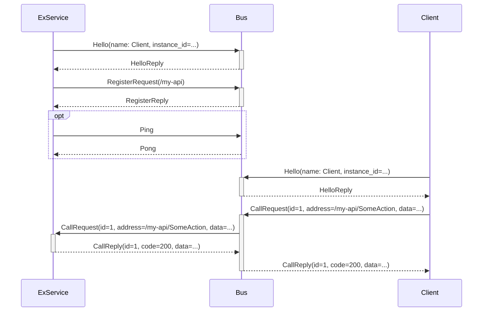

# GSB

```mermaid
sequenceDiagram
    ExService->>+Bus: Hello(name: Client, instance_id=...)
    Bus-->>-ExService: HelloReply
    ExService->>+Bus: RegisterRequest(/my-api)
    Bus-->>-ExService: RegisterReply
    opt
        ExService->>Bus: Ping
        Bus-->>ExService: Pong
    end
    Client->>+Bus: Hello(name: Client, instance_id=...)
    Bus-->>-Client: HelloReply
    Client->>+Bus: CallRequest(id=1, address=/my-api/SomeAction, data=...)
    Bus->>+ExService: CallRequest(id=1, address=/my-api/SomeAction, data=...)
    ExService-->>-Bus: CallReply(id=1, code=200, data=...)
    Bus-->>-Client: CallReply(id=1, code=200, data=...)
    
```
