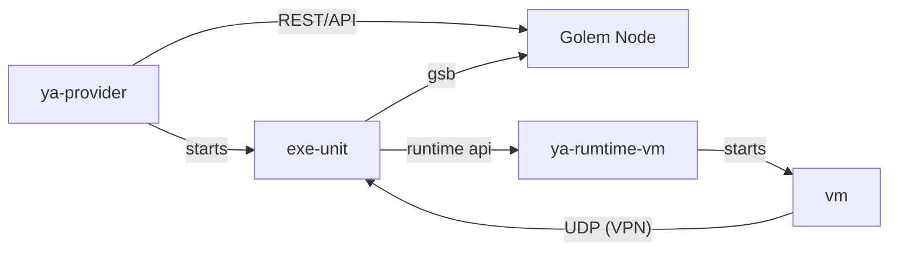
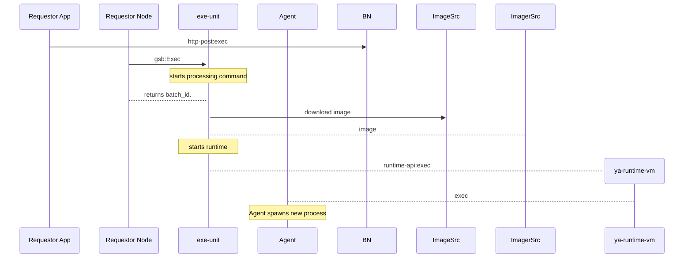

# VM Provider

### Communication

| From               | To                 | Protocol                                           |
| ------------------ | ------------------ |----------------------------------------------------|
| Provider Agent     | Yagna daemon       | REST API                                           |
| Provider Agent     | ExeUnit Supervisor | No communication (process is only spawned)         |
| Yagna daemon       | ExeUnit Supervisor | GSB (Unix socket / TCP depending on configuration) |
| ExeUnit Supervisor | ExeUnit Runtime    | Unix socket, UDP or TCP (UDP by default)           |

There are 3 communication channels between ExeUnit Supervisor and Runtime:
- Status and stdout/stderr channel output
- Outbound networking
- VPN traffic

### VM Agent

**TODO**: Potrzebuje dobrego diagramu  pokazującego budowe i przepływ komunikacji między 

Komponent startuje jako pierwszy process wewnątrz VM. 
Przy starcie:
- konfiguruje filesystem
- ładuje potrzebne sterowniki (w szczególności do GPU)
- 