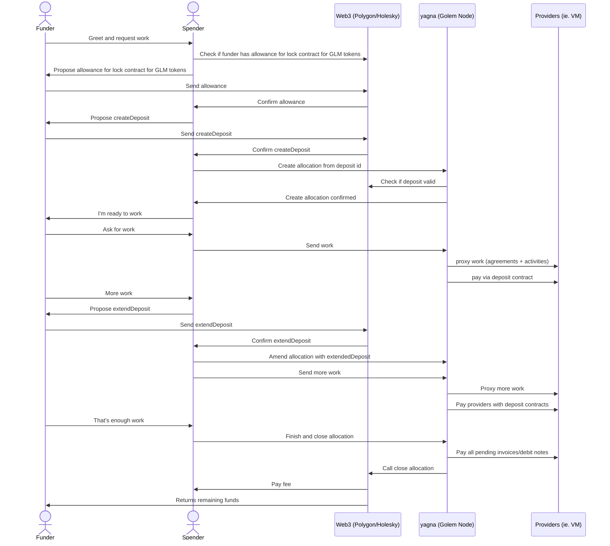
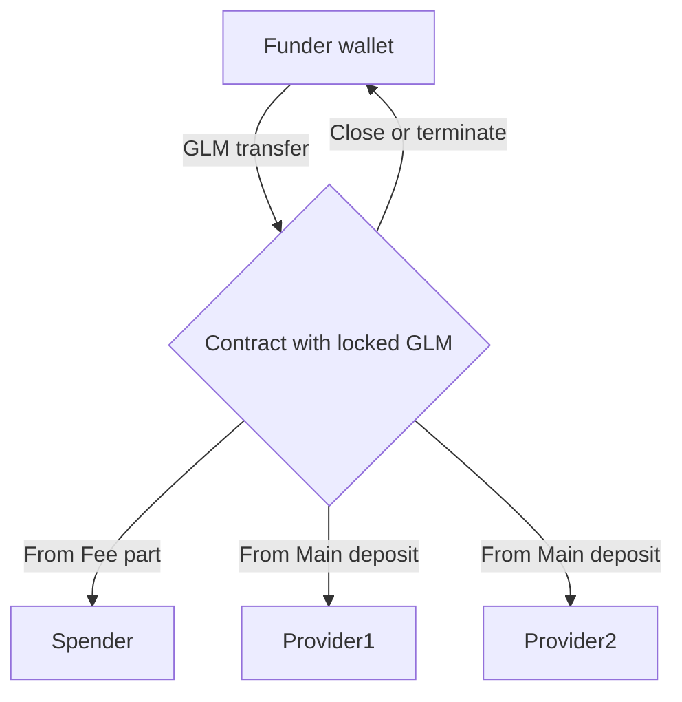

# Specification for deposits functionality.

### Motivation

We want solution for the following problem:

1. User A wants to use the Golem Network to perform a computation, but doesn't want to run yagna.
2. User A wants person B to run yagna on their behalf.
3. User A wants to give allowance for spending his funds to person B.
4. Person B wants to be sure that User A will pay for the computation.
5. Person B wants to be paid for being middle man (for example cover gas costs and/or earn some money)

Funder (User A) - Person that is funding the deposit and requesting job from the Spender service


Spender (Person B) - Service based on yagna


### Solution attempt allowance

The simple solution is to use ERC20 allowance to person B's funds, but this solution has some drawbacks:
Point 4 is not satisfied, because User A can revoke allowance at any time.
Point 5 can be satisfied by taking funds beforehand.
With allowance it is impossible to separate funds for different task for the same spender.

### Solution 

Contract that will hold funds until specified time. 
The contract gives spender guarantee that funds will be available for the computation period.
The contract gives funder guarantee that funds will be returned if the computation is not performed.
The contract holds logic for fee claim by spender.
The contract assumes good will (portal implemented on top of Golem) on spender side and bad will (external anonymous user) on funder side.


### General idea of the solution

1. Twórca serwisu chce świadczyć usługi dla swoich użytkowników i (ewentualnie) zarabiać na tych usługach.
2. Serwis nie chce być pośrednikem płatności, żeby uniknąć problemów (prawnych i księgowych) z tym związanych. 
3. Chcemy dostarczyć serwisowi rozwiązanie, które pozwoli na to, że użytkownik zapłaci za usługi na golemie, a
serwis otrzyma prowizję za pośredniczenie w tej usłudze.
4. Jednocześnie serwis chce zabezpieczyć się przed sytuacją, w której użytkownik nie zapłaci za wykonaną usługę.
5. Serwis może stworzyć swój kontrakt ze zdefiniowanym modelem pobierania prowizji (lub użyć gotowego).


### Flow


1. Funder creates deposit using createDeposit function getting deposit ID.
2. Funder sends deposit ID to Spender.
3. Spender uses deposit ID to create allocation on yagna.
4. Spender start processing tasks (agreements with Providers)
5. Funder can extend deposit using extendDeposit function.
6. Spender can amend allocation using deposit ID.
7. Spender when finished can close deposit using closeDeposit function. It is done by yagna after allocation bound to deposit is released.
8. Alternatively if Spender fail to close allocation Funder can terminate deposit using terminateDeposit function after validTo date elapses.

#### Example usage flow chart



#### Chart explaining the flow of GLM tokens




### Interface of the contract

``` solidity
struct Deposit {
    address spender; //address that can spend the funds provided by customer
    uint128 amount; //remaining funds locked
    uint128 feeAmount; //fee amount locked for spender
    uint64 validTo; //after this timestamp funds can be returned to customer
}

struct DepositView {
    uint256 id;     //unique id
    uint64 nonce;  //nonce unique for each funder
    address funder; //address that can spend the funds provided by customer
    address spender; //address that can spend the funds provided by customer
    uint128 amount; //remaining funds locked
    uint128 feeAmount; //fee amount locked for spender
    uint64 validTo; //after this timestamp funds can be returned to customer
}

interface ILockPayment {
    // Spender can close deposit anytime claiming fee and returning rest of funds to Funder
    function closeDeposit(uint256 id) external;
    // Funder can terminate deposit after validTo date elapses
    function depositSingleTransfer(uint256 id, address addr, uint128 amount) external;
    function depositTransfer(uint256 id, bytes32[] calldata payments) external;
    function depositSingleTransferAndClose(uint256 id, address addr, uint128 amount) external;
    function depositTransferAndClose(uint256 id, bytes32[] calldata payments) external;
    function getDeposit(uint256 id) external view returns (DepositView memory);
}

```

#### How to find my deposits (solidity events)

Additional events emitted by the contract (for easier web3 integration). There is no need for
extra options emitted by the contract, because additional information can be extracted using getDeposit(id) function.
Deposit contract cannot list deposits, so we add these events to make deposit tracking easier (using web3 logs)

``` solidity
    event DepositCreated(uint256 id, address spender);
    event DepositExtended(uint256 id, address spender);
    event DepositClosed(uint256 id, address spender);
    event DepositTerminated(uint256 id, address spender);
```

Deposits are stored in the contract using deposit ID:
```solidity
    // deposit is stored using arbitrary id
    mapping(uint256 => Deposit) public deposits;
```

#### Preventing deposit id collisions

Deposit ID consists of funder address and nonce merged together into U256 id:
Nonce is chosen by funder when creating deposit.

```solidity
    function idFromNonce(uint64 nonce) public view returns (uint256) {
        return idFromNonceAndFunder(nonce, msg.sender);
    }
    function idFromNonceAndFunder(uint64 nonce, address funder) public pure returns (uint256) {
        return (uint256(uint160(funder)) << 96) ^ uint256(nonce);
    }
    function nonceFromId(uint256 id) public pure returns (uint64) {
        return uint64(id);
    }
    function funderFromId(uint256 id) public pure returns (address) {
        return address(uint160(id >> 96));
    }
```

### Sample implementation of the contract

[Sample implementation](deposit_assets/full_contract_code.md)

### Additional open questions that need to be answered ASAP


* Should yagna adjust allocation to the data returned in deposit view? 
* Should yagna allocation be for full amount or only for amount - fee?

Additional notes from Witek:
https://www.notion.so/golemnetwork/Specifications-f664c647d3d541b1aa2ad0fa98624ed9#20246ad4207b46b0a94d6110a56107c4

### How it works with yagna?


#### Step 1. Create deposit. 

The simplest way is to use erc20_processor (you need to have secret key added with account founded)

```
erc20_processor deposit create -c holesky --spender 0xc6b6818d452e4c821d32423677092316a6b705e7 --amount 10 --fee-amount 1 --block-for 10000000
erc20_processor run
```

You can see tx, where the deposit is created:
https://holesky.etherscan.io/tx/0xfe1dc09e6d0cacecfe3c752d8d18d432cdac79e86a1be6e5203da88db0f05c71

We are interacting with contract "0xfe1B27Bac0e3Ad39d55C9459ae59894De847dcbf"
and created deposit with ID: "0x1111a27323e8fba0176393d03714c0f7467e2b0000000013117f26391a6424"

The funder of the deposit is 0x001111a27323e8Fba0176393d03714c0F7467e2b (note first two zero are cur in id, it's only representation)

#### Step 2. Create allocation on yagna using deposit
```
POST payment-api/v1/allocations
{
    "totalAmount": 1,
    "makeDeposit": false,
    "paymentPlatform": {
        "network": "holesky",
        "driver": "erc20",
        "token": "tglm"
    },
    "deposit": {
        "id": "0x1111a27323e8fba0176393d03714c0f7467e2b0000000013117f26391a6424",
        "contract": "0xfe1B27Bac0e3Ad39d55C9459ae59894De847dcbf"
    },
    "timeout": "2024-05-10T08:32:49.899Z"
}
Response 201
{
    "allocationId": "bf1bbf80-3d70-49e9-804d-cb032b163374",
    "address": "0xc6b6818d452e4c821d32423677092316a6b705e7",
    "paymentPlatform": "erc20-holesky-tglm",
    "totalAmount": "1",
    "spentAmount": "0",
    "remainingAmount": "1",
    "timestamp": "2024-05-07T08:48:04.390Z",
    "timeout": "2024-05-10T08:32:49.899Z",
    "deposit": {
        "id": "0x1111a27323e8fba0176393d03714c0f7467e2b0000000013117f26391a6424",
        "contract": "0xfe1B27Bac0e3Ad39d55C9459ae59894De847dcbf"
    },
    "makeDeposit": false
}
```

(optional) You can get your allocation details again:

```
GET payment-api/v1/allocations/bf1bbf80-3d70-49e9-804d-cb032b163374
Response 200
{
    "allocationId": "bf1bbf80-3d70-49e9-804d-cb032b163374",
    "address": "0xc6b6818d452e4c821d32423677092316a6b705e7",
    "paymentPlatform": "erc20-holesky-tglm",
    "totalAmount": "1",
    "spentAmount": "0",
    "remainingAmount": "1",
    "timestamp": "2024-05-07T08:48:04.390Z",
    "timeout": "2024-05-10T08:32:49.899Z",
    "deposit": {
        "id": "0x1111a27323e8fba0176393d03714c0f7467e2b0000000013117f26391a6424",
        "contract": "0xfe1B27Bac0e3Ad39d55C9459ae59894De847dcbf"
    },
    "makeDeposit": false
}
```

#### Step 2.1 (optional). Amend allocation by changing totalAmount (and possibly timeout)
```
PUT payment-api/v1/allocations/bf1bbf80-3d70-49e9-804d-cb032b163374
{
    "totalAmount": 1.1,
    "makeDeposit": false,
    "paymentPlatform": {
        "network": "holesky",
        "driver": "erc20",
        "token": "tglm"
    },
    "deposit": {
        "id": "0x1111a27323e8fba0176393d03714c0f7467e2b0000000013117f26391a6424",
        "contract": "0xfe1B27Bac0e3Ad39d55C9459ae59894De847dcbf"
    },
    "timeout": "2024-05-10T08:32:49.899Z"
}
Response 200
{
    "allocationId": "bf1bbf80-3d70-49e9-804d-cb032b163374",
    "address": "0xc6b6818d452e4c821d32423677092316a6b705e7",
    "paymentPlatform": "erc20-holesky-tglm",
    "totalAmount": "1.100000000000000",
    "spentAmount": "0",
    "remainingAmount": "1.100000000000000",
    "timestamp": "2024-05-07T08:48:04.390Z",
    "timeout": "2024-05-10T08:32:49.899Z",
    "deposit": {
        "id": "0x1111a27323e8fba0176393d03714c0f7467e2b0000000013117f26391a6424",
        "contract": "0xfe1B27Bac0e3Ad39d55C9459ae59894De847dcbf"
    },
    "makeDeposit": false
}
```

#### Step 3. Create agreements.

Agreements are created using specified allocation like in normal flow. Yagna will use deposit as payment source.

Payment driver will use following methods

```
depositSingleTransfer(id, ...
depositTransfer(id, ...
```

#### Step 4. Release allocation

```
DELETE payment-api/v1/allocations/bf1bbf80-3d70-49e9-804d-cb032b163374
Response 200
```
That resulted yagna to release allocation and close deposit:
https://holesky.etherscan.io/tx/0xcb8c4e3f78be1575b93a4ff93e2ff59a79b32302ffdcffc63ba086c6af7f5313

Driver will use one of following methods to close deposit
```
depositSingleTransferAndClose(id, ...
depositTransferAndClose(id, ...
closeDeposit(id, ...
```

## Fee claim


Fee is claimed when deposit is close by spender. Fee amount depends on implementation of the contract implementation.
For example it can be flat fee, percent fee or combination of both.

The fee schema is entirely determined by the contract and service implementation. Yagna doesn't care really,
we should probably provide some API exposing gas costs so the service can calculate fee based on that.

## Additional safety for Funder


* If Spender fails to close the allocation due to some kind of service failure, 
Funder can terminate deposit after validTo date elapses taking back remaining funds and fee.
* Spender can do whatever he wants with the locked funds, so the Funder has to trust the Spender.
* Spender doesn't have to trust the Funder, which is the most important part of the solution.

## Contract interface validation

Yagna provides a way to check if the user created deposit with proper arguments. 

TODO


TODO - work in progress
```solidity
    TODO

```


## Benefits for providers


Unfortunately we don't know yet how providers can benefit from this feature.
They are not notified about deposit ID, because we don't see how can it benefit them.
We are open for suggestions, but this solution was designed to solve other problem.

To benefit providers we need to implement something like locking funds for every provider separately.

