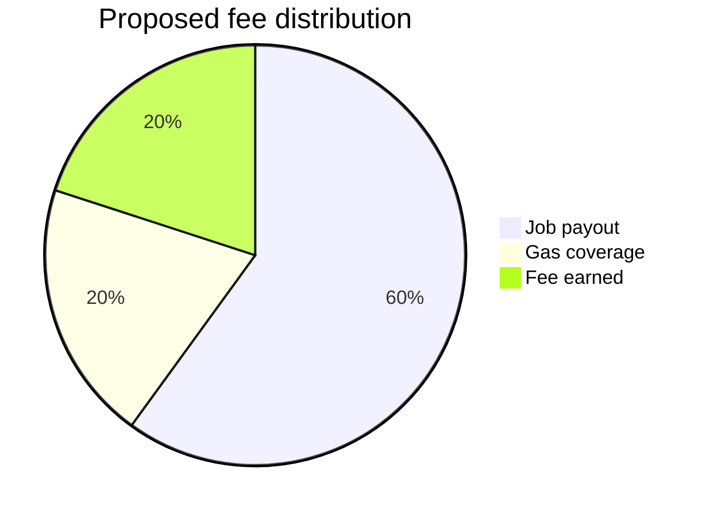

# Specification for deposits functionality.

Motivation.

We want solution for the following problem:

1. User A wants to use the Golem Network to perform a computation, but don't want to run yagna.
2. User A wants person B to run yagna for them.
3. User A wants to give allowance for spending his funds to person B.
4. Person B wants to be sure that User A will pay for the computation.
5. Person B wants to be paid for being middle man (for example cover gas costs and/or earn some money)

Funder (User A) - Person that is funding the deposit and requesting job from the Spender service


Spender (Person B) - Service based on yagna


### Solution attempt allowance

The simple solution is to use ERC20 allowance to person B funds, but this solution has some drawbacks:
Point 4 is not satisfied, because User A can revoke allowance at any time.
Point 5 is not satisfied, because Person B can't be sure that User A will pay for the computation.

### Solution 

Contract that will hold funds until specified time.


We are using following interface:

``` solidity
struct Deposit {
    address spender; //address that can spend the funds provided by customer
    uint128 amount; //remaining funds locked
    uint128 feeAmount; //fee amount locked for spender
    uint64 validTo; //after this timestamp funds can be returned to customer
}

struct DepositView {
    uint256 id;     //unique id
    uint64 nonce;  //nonce unique for each funder
    address funder; //address that can spend the funds provided by customer
    address spender; //address that can spend the funds provided by customer
    uint128 amount; //remaining funds locked
    uint128 feeAmount; //fee amount locked for spender
    uint64 validTo; //after this timestamp funds can be returned to customer
}
interface ILockPayment {
    // createDeposit - Customer locks funds for usage by spender
    //
    // id - unique id (build from Funder address and nonce)
    // spender - the address that is allowed to spend the funds regardless of time
    // amount - amount of GLM tokens to lock
    // flatFeeAmount - amount of GLM tokens given to spender (non-refundable). Fee is claimed by spender when called payoutSingle or payoutMultiple first time.
    // percentFee - percent fee as percent of amount (given in parts/per million), so 1000 gives 0.1 %.
    //              if given negative it is deducted from flatFeeAmount
    // blockNo - block number until which funds are guaranteed to be locked for spender.
    //           Spender still can use the funds after this block,
    //           but customer can request the funds to be returned clearing deposit after (or equal to) this block number.
    function createDeposit(uint64 nonce, address spender, uint128 amount, uint128 flatFeeAmount, int64 percentFee, uint64 validToTimestamp) external returns (uint256);
    function extendDeposit(uint64 nonce, uint128 additionalAmount, uint128 additionalFlatFee, uint64 validToTimestamp) external;
    // Spender can close deposit anytime claiming fee and returning rest of funds to Funder
    function closeDeposit(uint256 id) external;
    // Funder can terminate deposit after validTo date elapses
    function terminateDeposit(uint64 nonce) external;
    function depositSingleTransfer(uint256 id, address addr, uint128 amount) external;
    function depositTransfer(uint256 id, bytes32[] calldata payments) external;
    function depositSingleTransferAndClose(uint256 id, address addr, uint128 amount) external;
    function depositTransferAndClose(uint256 id, bytes32[] calldata payments) external;
    function getMyDeposit(uint64 nonce) external view returns (DepositView memory);
    function getDeposit(uint256 id) external view returns (DepositView memory);
    function getDepositByNonce(uint64 nonce, address funder) external view returns (DepositView memory);
}

```

Additional events emitted by the contract:

``` solidity
    event DepositCreated(uint256 id, address spender);
    event DepositExtended(uint256 id, address spender);
    event DepositClosed(uint256 id, address spender);
    event DepositTerminated(uint256 id, address spender);
```

Deposits are stored in the contract using deposit ID:
```solidity
    // deposit is stored using arbitrary id
    mapping(uint256 => Deposit) public deposits;
```

Deposit ID consists of funder address and nonce merged together into U256 id:
Nonce is chosen by funder when creating deposit.

```solidity
    function idFromNonce(uint64 nonce) public view returns (uint256) {
        return idFromNonceAndFunder(nonce, msg.sender);
    }
    function idFromNonceAndFunder(uint64 nonce, address funder) public pure returns (uint256) {
        return (uint256(uint160(funder)) << 96) ^ uint256(nonce);
    }
    function nonceFromId(uint256 id) public pure returns (uint64) {
        return uint64(id);
    }
    function funderFromId(uint256 id) public pure returns (address) {
        return address(uint160(id >> 96));
    }
```

### Yagna implementation

Deposit
```rust
#[derive(Clone, Debug, PartialEq, Serialize, Deserialize)]
pub struct Deposit {
    pub id: String,
    pub contract: String,
}
```
Deposit view (read from contract given)
```rust
#[derive(Clone, Debug, PartialEq, Serialize, Deserialize)]
pub struct DepositView {
    pub id: String,
    pub nonce: u64,
    pub funder: String,
    pub spender: String,
    pub amount: u128,
    pub fee_amount: u128,
    pub valid_to: u64,
}
```

### Flow


1. Funder creates deposit using createDeposit function getting deposit ID.
2. Funder sends deposit ID to Spender.
3. Spender uses deposit ID to create allocation on yagna.
4. Spender start processing tasks (agreemets with Providers)

Providers - greedy bunch of machines that want to earn some money


5. Funder can extend deposit using extendDeposit function.
6. Spender can ammend allocation using deposit ID.
7. Spender can close deposit using closeDeposit function.
8. Alternatevily if Spender fail to close allocation Funder can terminate deposit using terminateDeposit function after validTo date elapses.

## Benefits for providers


Unfortunately we don't know yet how providers can benefit from this feature.
They are not notified about deposit ID, because we don't see how can it benefit them.
We are open for suggestions, but this solution was designed to solve other problem.

To benefit providers we need to implement something like locking funds for every provider separatly.


