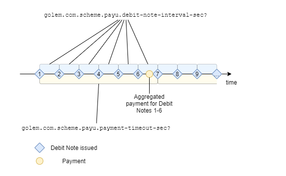

# Payment Schemes
Payment schemes, which describe the "protocols" of payment for services/resources published on Golem Network. The purpose of the standardized schemes is to put structure into typical scenarios of payment for consumed resources - these scenarios define de facto "protocols" of Provider-Requestor interaction in the aspect of paying for a Golem service. 

## `golem.com.scheme : String`

### Describes: Offer

Scheme of payments made for computing resources consumed.

### Value enum
| Value    | Description                                                                              |
| -------- | ---------------------------------------------------------------------------------------- |
| "payu"   | "pay-as-you-use" - payments are expected in regular intervals while Activity is ongoing. |

### **Examples**
* `golem.com.scheme="payu"` - The Provider declares the "pay-as-you-use" payment scheme.

## `golem.com.scheme.payu.interval_sec : Number`

### Describes: Offer

For "pay-as-you-use" payment scheme, indicates interval of invoices issued during the service usage.

### **Examples**
* `golem.com.scheme.payu.interval_sec=3600` - The Provider expects the Requestor to pay for the usage in 1 hour intervals.

## `golem.com.scheme.payu.debit-note-interval-sec? : Number` [[Negotiable, Experimental]](/standards/README.md#fact-vs-negotiable-properties)

### Describes: Demand/Offer

For "pay-as-you-use" payment scheme, indicates interval of Debit Notes issued during the service usage.

### **Examples**
* `golem.com.scheme.payu.debit-note-interval-sec?=60` - The Provider will be sending the Debit Notes in 60 second intervals.

## `golem.com.scheme.payu.payment-timeout-sec? : Number` [[Negotiable, Experimental]](/standards/README.md#fact-vs-negotiable-properties)

### Describes: Demand/Offer

For "pay-as-you-use" payment scheme, indicates the maximum payment delay allowed after Debit Note or Invoice is issued. 

## "Pay as you use" payment flexibility properties

Note that the two properties:
- `golem.com.scheme.payu.debit-note-interval-sec?`
- `golem.com.scheme.payu.payment-timeout-sec?`
determine the boundary conditions within which the payer may select the optimal payments strategy. 

It is natural for the Provider to expect payments as quickly as possible, on the other hand the Requestor will want to defer 
as much as allowed. Therefore the `golem.com.scheme.payu.payment-timeout-sec?` negotiation must find an accepted "middle" 
value. 

In typical "payu" scenarios the Debit Notes will be issued fairly frequently, as the Provider will want the ensure their 
income is earned even for small "quants" of the service. However frequent Debit Notes with low payment timeout may imply frequent payments - and this may become sub-optimal (due to transaction cost). Therefore it is possible to negotiate 
Agreements with `golem.com.scheme.payu.payment-timeout-sec?` significantly larger than `golem.com.scheme.payu.debit-note-interval-sec?`, which allows the Requestor to "batch" payments for multiple Debit Notes in a single transaction, 
as per the diagram:

### **Examples**
* `golem.com.scheme.payu.payment-timeout-sec?=60` - The Provider will be expecting payments within 1 hour of the Debit Note issue.

